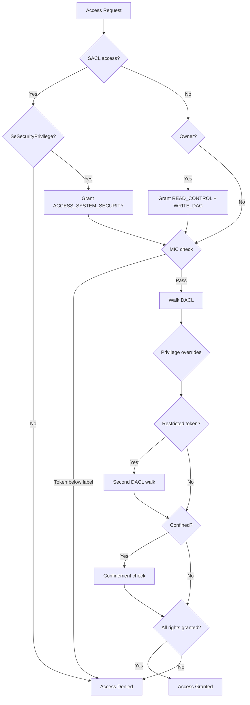

Every access decision on Peios passes through a single kernel function called **AccessCheck**. Whether a thread is opening a file, reading a registry key, connecting to a service, or sending a signal — the same evaluator runs, applying the same logic.

## What AccessCheck evaluates

At its core, AccessCheck considers:

- The thread's **token** — the identity requesting access
- The object's **security descriptor** — the policy governing the object
- A **desired access mask** — the specific rights being requested

It also receives additional context depending on the operation — such as which object type is being accessed and what privilege intent the caller has declared. But the fundamental question is always the same: given this identity and this policy, are the requested rights granted?

The answer is either a set of granted rights or a denial.

## The evaluation pipeline

AccessCheck does not simply walk the DACL. It runs a series of checks in a defined order, each of which can grant rights, deny the request, or pass through to the next stage.



### 1. SACL access gate

If the caller requests `ACCESS_SYSTEM_SECURITY` (the right to read or modify the SACL), AccessCheck checks whether the token holds `SeSecurityPrivilege`. If it does, the right is granted. If not, the request is denied immediately. This check happens before anything else.

### 2. Owner implicit rights

If the token's user SID matches the object's owner SID, AccessCheck grants `READ_CONTROL` and `WRITE_DAC` by default. This ensures the owner can always read the security descriptor and modify the DACL.

These implicit grants can be overridden by an OWNER RIGHTS ACE in the DACL — a mechanism for restricting or expanding what the owner gets automatically.

### 3. Integrity check (MIC)

AccessCheck compares the token's integrity level against the object's mandatory label (if present in the SACL). If the token's integrity level is below the object's label, write access is denied — regardless of what the DACL says.

Integrity enforcement sets a floor. It cannot grant access, only deny it. If the integrity check passes, evaluation continues.

### 4. DACL walk

This is where most access decisions are resolved. AccessCheck walks the DACL from top to bottom, comparing each ACE's SID against the token's user SID and group SIDs:

- If an ACE's SID matches and it is a **deny ACE**, any requested rights in the ACE's mask are denied immediately
- If an ACE's SID matches and it is an **allow ACE**, the rights in the ACE's mask are accumulated into the granted set

The walk continues until every requested right has been resolved — either granted by an allow ACE or denied by a deny ACE. If the walk completes without granting all requested rights, the remaining rights are denied.

### 5. Privilege overrides

Certain privileges can grant rights that the DACL did not. These are checked after the DACL walk:

- `SeTakeOwnershipPrivilege` grants `WRITE_OWNER` — the right to change the object's owner
- `SeBackupPrivilege` grants read access when the caller has declared backup intent
- `SeRestorePrivilege` grants write access when the caller has declared restore intent

Privilege overrides are narrow. They grant specific rights for specific purposes — they do not bypass the DACL wholesale.

### 6. Restricted token check

If the token is a restricted token (a token with an additional set of restricting SIDs), the DACL is evaluated a second time against only the restricting SIDs. Access is granted only if both the normal evaluation and the restricted evaluation agree. This is covered in the token restriction documentation.

### 7. Confinement check

If the token is confined (the application confinement model), additional checks are applied. Confinement inverts the default — a confined process has no access unless explicitly granted through confinement-specific ACEs. This is covered in the application confinement documentation.

## A walkthrough

Consider a file with this DACL:

```
Deny   S-1-5-21-...-1028 (bob)            FILE_WRITE_DATA
Allow  S-1-5-21-...-513  (Domain Users)   FILE_READ_DATA | FILE_WRITE_DATA
Allow  S-1-5-32-544      (Administrators) FILE_ALL_ACCESS
```

**Alice requests FILE_READ_DATA.** Alice is a member of Domain Users. AccessCheck walks the DACL:
1. The deny ACE targets Bob — doesn't match Alice. Skip.
2. The allow ACE targets Domain Users — matches. `FILE_READ_DATA` is granted.

All requested rights are granted. Access succeeds.

**Bob requests FILE_READ_DATA | FILE_WRITE_DATA.** Bob is a member of Domain Users. AccessCheck walks:
1. The deny ACE targets Bob — matches. `FILE_WRITE_DATA` is denied immediately.

The request included `FILE_WRITE_DATA`, which is now denied. The entire request fails. Bob does not get `FILE_READ_DATA` either — the request is evaluated as a whole.

**An administrator requests FILE_ALL_ACCESS.** The administrator is a member of Administrators and Domain Users. AccessCheck walks:
1. The deny ACE targets Bob — doesn't match. Skip.
2. The allow ACE targets Domain Users — matches. `FILE_READ_DATA | FILE_WRITE_DATA` accumulated.
3. The allow ACE targets Administrators — matches. Remaining rights in `FILE_ALL_ACCESS` accumulated.

All requested rights are granted. Access succeeds.

## MAXIMUM_ALLOWED

Instead of requesting specific rights, a caller can request `MAXIMUM_ALLOWED`. This asks AccessCheck to determine the maximum set of rights the token would be granted on this object. The kernel returns the computed mask, and the caller can then use whatever subset it needs.

This is useful when a process does not know in advance which operations it will perform — it asks for everything it could get and works within that.
