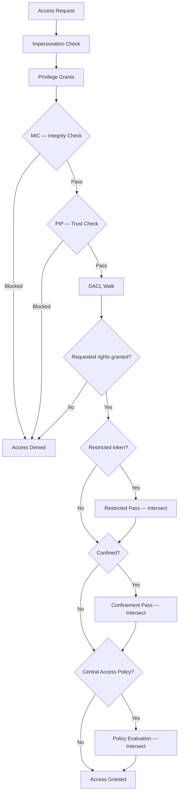

Peios has a single, unified security model. Every access decision — whether a process is opening a file, connecting to a service, reading a registry key, or sending a signal — flows through the same evaluation pipeline using the same concepts.

This page is the map. It shows how all the pieces fit together before you dive into the details.

## The three ingredients

Every access decision has three inputs:

| Input | What it is |
|---|---|
| **Subject** | The thread's token — who is asking |
| **Object** | The object's security descriptor — the policy on the thing being accessed |
| **Request** | The desired access mask — what the caller wants to do |

The kernel takes these three inputs and runs them through a layered evaluation pipeline called **AccessCheck**. The result is either a set of granted rights or an access denial.

## The token (subject)

A **token** is a kernel object carried by every thread. It contains everything the kernel needs to know about the caller:

- **User SID** — who you are
- **Group SIDs** — what groups you belong to
- **Privileges** — system-wide rights (backup, restore, take ownership, etc.)
- **Integrity level** — your trust tier (Untrusted, Low, Medium, High, System)
- **Impersonation state** — whether you're acting as yourself or as someone else

The token is a snapshot created at authentication time. The kernel never consults an external directory during access decisions — the token is self-contained.

## The security descriptor (object)

A **security descriptor (SD)** is the policy attached to every secured object. It contains:

- **Owner** — the principal who owns the object
- **DACL** — the discretionary access control list: an ordered list of rules (ACEs) defining who can do what
- **SACL** — the system access control list: audit rules, integrity labels, trust labels, and central policy references

The DACL is where most access policy lives. Each entry (ACE) says "allow principal X to do Y" or "deny principal Z from doing W."

## The evaluation pipeline

When a thread requests access to an object, the kernel evaluates the request through multiple layers in a fixed order. Each layer can deny access, but no layer can override a denial from an earlier layer.

### Layer 1: Mandatory Integrity Control (MIC)

Before the DACL is even consulted, the kernel compares the token's integrity level against the object's mandatory label. The core rule is **no-write-up**: a process at Medium integrity cannot modify an object labeled High, regardless of what the DACL says.

MIC acts as a floor. Even if the DACL grants you full access, MIC can block writes to objects above your trust tier.

### Layer 2: Process Integrity Protection (PIP)

PIP protects critical system processes and their objects from interference — even from administrators. It uses two independent dimensions: **type** (None, Protected, Isolated) and **trust level** (determined by binary signing).

A caller can only access a PIP-protected target if it dominates the target in both dimensions. Privileges cannot bypass PIP. This is what prevents a compromised high-privilege process from tampering with the security subsystem itself.

### Layer 3: The DACL

This is where most access decisions are resolved. The kernel walks the DACL's ACE list sequentially, matching each entry against the token's SIDs:

- **Deny ACEs** remove rights from consideration
- **Allow ACEs** add rights to the granted set
- First-writer-wins: once a right is decided by an ACE, later ACEs cannot change it

The object's owner implicitly receives READ_CONTROL and WRITE_DAC (the ability to read and modify the security descriptor), unless Owner Rights ACEs override this.

### Layer 4: Token restrictions

If the token carries **restricting SIDs**, a second DACL walk runs using only those SIDs. The result is intersected with the normal DACL result — you only get rights that both passes agree on. This is how reduced-privilege sandboxes work.

### Layer 5: Application confinement

**Confinement** inverts the default permission model. A confined process has zero access to anything unless the object's DACL explicitly grants access to the confinement's capability SIDs. A third DACL walk runs, and the result is intersected — with no privilege bypass. This is the strongest restriction layer.

### Layer 6: Central Access Policy (CAP)

Organizations can define central policies that apply to objects based on their attributes. When a CAP applies, the kernel evaluates a separate DACL from the policy and intersects the result. This enables attribute-based access control at scale without modifying individual object DACLs.

### Auditing

Throughout the pipeline, the kernel tracks which privileges were exercised and which rules were evaluated. After the access decision, it walks the SACL to emit audit events — recording who accessed what, how, and whether it succeeded or failed.

## Privileges are not access rights

Privileges and access rights are separate systems that interact at specific points:

- **Access rights** are on the object (in the DACL). They say "user X can read this file."
- **Privileges** are on the token. They say "this process can back up any file" or "this process can take ownership of objects."

Some privileges influence AccessCheck — SeBackupPrivilege lets a process read any object when backup intent is declared, and SeTakeOwnershipPrivilege grants WRITE_OWNER after the DACL walk. But most privileges gate specific operations outside of AccessCheck entirely (shutting down the system, loading kernel modules, etc.).

## One model, everywhere

The same AccessCheck pipeline evaluates access to files, registry keys, processes, services, IPC endpoints, and network bindings. The same tokens, SIDs, security descriptors, and ACEs apply everywhere. Learning how one object type is secured teaches you how all of them work.

This is the core design principle: **one security vocabulary, one evaluation path, one set of tools.** The sections that follow dive into each layer in detail.
