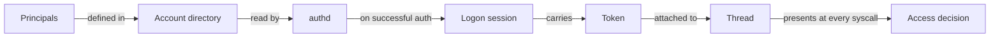

Every action on a running Peios system happens on behalf of a **principal** — a user, a service, a machine, or a well-known system actor. Identity is the unit of policy: every access decision starts with "who is asking?", and the kernel answers that question the same way for files, registry keys, processes, sockets, and tokens themselves.

This page is the map. It shows what an identity is, how it gets into the kernel, and where the rest of the identity topic takes you.

## The shape of an identity

Identity in Peios has four layers, each with a clear job.

| Layer | Role |
|---|---|
| **Principal** | The thing being identified — a user account, a group, a service, a machine. |
| **SID** (Security Identifier) | The unique name for a principal. SIDs are hierarchical strings like `S-1-5-21-...-1001`. |
| **Token** | The runtime object that carries an identity into the kernel. Every thread has one. |
| **Logon session** | The authentication event a token belongs to. Sessions link tokens back to "who logged in, when, and how". |

You will see these four words throughout the Peios docs. They are not interchangeable. A principal is the long-lived thing in the directory; a SID is its name; a token is its instance for one run; a session is what produced that token.

## How an identity gets into the kernel

When a user signs in, **authd** (the authentication daemon) does three things in order:

1. Looks up the principal in the local account directory — or in Active Directory on a domain-joined machine.
2. Creates a **logon session**: a kernel object that records the authentication event (who, how, when).
3. Mints a **token** carrying the user's SID, group SIDs, integrity level, privileges, and a reference to the session. The token becomes the user's runtime identity.

That token is attached to the first process of the session, and every child process inherits it across fork. Threads that need to act on behalf of someone else (a service handling a user request, say) can temporarily swap in an **impersonation token** while keeping their original — see [Impersonation](~peios/impersonation/overview).

The token is the authoritative carrier. Any other identity values a process can observe — including the numeric IDs that surface through standard Linux system calls — are derived from the token, never the other way around. See [Linux compatibility](~peios/linux-compatibility/overview) for how that projection works.

## Identity vs authorization

An identity by itself grants nothing. A token says **who** a thread is; KACS decides **what** it can do, by comparing the token against each object's security descriptor. The same token will see different rights on different objects, and the same object will grant different rights to different tokens.

This separation is load-bearing across the rest of these docs. Topics that look like they should be one thing are actually two:

- **Identity says "who".** This topic, plus [Tokens](~peios/tokens/overview) and [Logon sessions](~peios/logon-sessions/overview).
- **Authorization says "what".** [Security descriptors](~peios/security-descriptors/overview) and [Access decisions](~peios/access-decisions/overview).

If a request fails unexpectedly, you almost always need to look at both sides: which identity made the request, and which access rule rejected it. Pages in both halves cross-link where the two meet.

## What identity does *not* include

A few things often get bundled with identity that are kept deliberately separate in Peios:

- **Privileges** are not identity. A token carries a set of privileges, but a privilege gates a specific operation (loading a driver, taking ownership of an object), independent of who you are. See [Privileges](~peios/privileges/overview).
- **Integrity level** is not identity. It is a separate axis on the token that controls write-up restrictions. Two users at different integrity levels are still two distinct identities; the integrity level is an additional constraint on top.
- **Process integrity (PIP)** is not identity at all. PIP is a property of the binary the process is running, set by the kernel from the binary's signature. It controls who can inspect or signal the process, independent of who the process is acting as. See [Process integrity protection](~peios/process-integrity-protection/overview).

These distinctions matter because they fail in different ways. An "access denied" caused by the integrity level looks like an identity problem but is not.

## Where to start

If you want to understand how SIDs are constructed and what the built-in principals are, read [SIDs and well-known principals](~peios/identity/sids).

If you want the runtime mechanics — how a token is composed, how it survives fork and exec, and how it gets adjusted — read [Tokens](~peios/tokens/overview).

If you are debugging an unexpected denial, the [Inspecting tokens, sessions, and processes](~peios/inspecting/overview) topic shows how to see the identity attached to any running thread.
