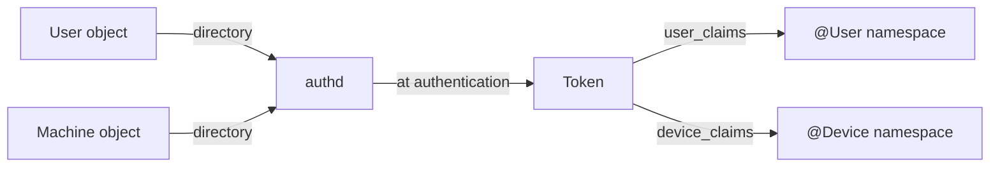

A **claim** is a typed key-value attribute that carries information about a principal beyond its identity. The user's department, the machine's compliance status, the time-of-day window for which a session is valid — all of these are claims. They are the raw material that conditional ACEs use to make access decisions about more than just "who is this".

Tokens carry two sets of claims:

- **User claims** — attributes about the user. Populated at authentication time by authd from the user's directory object.
- **Device claims** — attributes about the machine. Populated similarly from the machine's directory object.

Both sets are read-only after the token is minted. Adjusting a token's privileges or groups does not touch its claims; only re-authentication does.

## What a claim looks like

A single claim has three things:

- A **name** — a string. Convention is `Namespace.Attribute`, like `Department` or `Clearance`.
- A **value** — typed (see below). May be a single value or an array of values.
- A set of **flags** that control how the claim participates in access checks.

### Value types

A claim's value is always one of:

| Type | Notes |
|---|---|
| `INT64` | A signed 64-bit integer. |
| `UINT64` | An unsigned 64-bit integer. |
| `STRING` | A UTF-16LE string. |
| `SID` | A binary SID. |
| `BOOLEAN` | TRUE or FALSE. |
| `OCTET` | A raw byte string. |

Mixed-type arrays are not allowed. A claim either holds one `STRING`, three `STRING`s, or one `INT64` — never two strings and an integer.

### Claim flags

Each claim carries flags that change how it behaves during access evaluation.

| Flag | Effect |
|---|---|
| `DISABLED` | The claim is invisible to all conditional expressions. Effectively, the attribute does not exist. |
| `USE_FOR_DENY_ONLY` | The claim is invisible to conditions on **allow** ACEs, but visible to conditions on **deny** ACEs. This is the conservative downgrade — the claim cannot grant new access but can still trigger denials. |
| `MANDATORY` | The claim cannot be removed or modified without the `SeTcbPrivilege`. Used for claims that the system itself depends on. |
| `CASE_SENSITIVE` | String and octet comparisons against this claim are case-sensitive. Default is case-insensitive. |

The first two flags (`DISABLED`, `USE_FOR_DENY_ONLY`) are the security-relevant ones. They give administrators a way to neutralise a claim — for a logon at a lower trust level, say — without rewriting the user's directory object.

## How claims get onto a token

When a user authenticates, authd reads:

- The user's directory object — name, group memberships, any attributes the directory schema defines. Anything the schema marks as a claim attribute is copied into the token as a **user claim**.
- The machine's directory object — same, but for the device. Anything the schema marks as a device claim is copied into the token as a **device claim**.

Both sets travel with the token for its entire lifetime.

The directory schema decides what is and is not a claim. A claim that is defined in the schema but absent from a specific user object becomes a missing claim on that user's token — not an empty one, not a default value. Conditional expressions distinguish between the two.

## Where claims get used

Claims do nothing by themselves. They are inputs to **conditional ACEs** — ACEs whose grant or deny is gated by an expression that references attributes.

A conditional expression refers to a claim by namespace and name:

- `@User.Department` — a claim on the caller's token, user-claims set.
- `@Device.Compliance` — a claim on the caller's token, device-claims set.
- `@Resource.Classification` — an attribute on the object being accessed.
- `@Local.Time` — a per-request attribute supplied by the caller of AccessCheck.

The first two come from this page — they are identity claims. The last two are different things that share the same expression syntax:

- **`@Resource`** values come from resource attributes in the object's SACL, not the caller's token. See [Resource attributes](~peios/security-descriptors/resource-attributes).
- **`@Local`** values are supplied by the caller as a per-access-check parameter. They never live on a token. They exist for runtime context that does not fit into a directory.

The full grammar of conditional expressions — comparison operators, the three-valued logic (TRUE / FALSE / UNKNOWN), the way missing claims affect the outcome — lives in [Conditional ACEs](~peios/security-descriptors/conditional-aces).

## The three-valued model in one paragraph

The thing worth knowing about claims here, before you get to the conditional ACEs page: a missing claim is not a failure. A conditional expression that references a claim the token does not carry evaluates to `UNKNOWN`. `UNKNOWN` on an allow ACE means "skip this ACE"; `UNKNOWN` on a deny ACE means "treat this as deny". So a missing claim never accidentally grants access — it can only fail closed.

This is why `USE_FOR_DENY_ONLY` exists. It is the deliberate version of the same idea: take a claim that grants access and demote it to a claim that can only revoke access.

## What claims are *not*

A few things claims look like at a glance but are not:

- **Claims are not groups.** A group is a SID in the token's group list; group membership is presence-or-absence. A claim is a typed attribute with a value. The two appear in different parts of the token and are matched by different parts of an ACE.
- **Claims are not privileges.** Privileges are a fixed system bitmask gating specific operations. Claims are administrator-defined attributes with arbitrary names.
- **Claims are not the audit log.** Claims describe the principal; the audit log describes what the principal did. The audit-event subject record does include the principal's claims (so audit consumers can write rules over them), but a claim is not itself an event.
