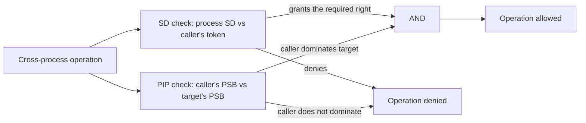

When one process wants to act on another — to signal it, debug it, read its memory, change its priority, or open its tokens — the kernel runs two checks. The **SD check** asks "is the caller allowed by the target's process SD?". The **PIP dominance check** asks "is the caller's PIP label at least the target's?". The operation proceeds only if both checks pass. Either one failing is enough to deny.

The two-check rule is the rule that gives PIP its bite. Without it, an administrator's token would let any administrator-run code reach into a TCB daemon and read its memory; with it, the calling binary's trust level becomes a separate gate that no identity, no group, no privilege can bypass.

This page covers the rule itself: what each check looks at, how the dominance comparison works, what privileges can and cannot bypass, and how specific kernel operations map onto the rule.

## The two checks, side by side



Both checks run at the entry point of the operation. They are not sequenced — there is no "first the SD check, then PIP". The kernel reads both inputs and computes both results; the operation proceeds only on both passing.

| Check | Reads | Compares | Decides |
|---|---|---|---|
| **SD check** | Target's process SD; caller's effective token | Standard AccessCheck pipeline against the SD's DACL | Which process rights the caller has on the target. |
| **PIP dominance** | Caller's PSB (`pip_type`, `pip_trust`); target's PSB | All-or-nothing comparison: caller's type ≥ target's type AND caller's trust ≥ target's trust | Whether the caller is trusted enough to act on the target. |

Each check is independent. A caller can pass one and fail the other. The operation result is `pass_SD AND pass_PIP`.

## The dominance comparison

PIP dominance is **two-axis, conjunctive**. The caller's PSB carries `pip_type` and `pip_trust`. The target's PSB carries the same fields. The caller **dominates** the target if and only if:

```
caller.pip_type   >= target.pip_type   AND
caller.pip_trust  >= target.pip_trust
```

Both inequalities must hold. Both holding is dominance. Either failing is non-dominance.

A few non-dominance cases worth pinning:

- **Same type, lower trust.** A Protected/1024 caller does not dominate a Protected/8192 target. Same trust kind, but the target is more trusted.
- **Higher trust, lower type.** A None/8192 caller (which would be weird in v0.20 but legal in principle) does not dominate a Protected/0 target. The trust level is higher numerically, but the type is lower; both have to dominate independently.
- **Different types, neither higher.** A Protected/4096 caller does not dominate an Isolated/0 target. Protected (512) is less than Isolated (1024), so the type comparison fails. Even though the trust number is higher, the type fails the AND.

The comparison is **not** ordered. There is no "single PIP score" that says "you are more trusted than that other process". A caller can be more trusted on one axis and less on another, and the dominance check declines to compare further — without dominance on both axes, the operation is denied.

This two-axis structure is what lets the model distinguish "Authenticode-signed third-party app" from "Antimalware tool" — both are Protected type, but one's purpose is different from the other's, and they need not be ordered. The trust tier reflects the role; the type reflects the kind of authority.

## The non-dominance default

A caller with `pip_type = None` (the unsigned, default state) dominates only targets that also have `pip_type = None`. They cannot reach any Protected or Isolated target. Most user-mode processes are in this state — they can interfere with each other freely, but not with the TCB daemons.

A caller with `pip_type = Protected` dominates other Protected processes at the same or lower trust tier, and dominates None processes entirely. But not Isolated.

A caller with `pip_type = Isolated` (none in v0.20) dominates everything — Protected and None at any trust level, plus other Isolated processes at the same or lower trust.

The most common protective barrier is the None-to-Protected boundary. User-mode applications (`pip_type = None`) cannot signal, debug, inspect, or modify the running TCB processes (`pip_type = Protected`). This is the practical security boundary PIP creates.

## What SeDebugPrivilege bypasses

`SeDebugPrivilege` is the closest thing to an override for the SD check, but it does **not** override PIP.

The privilege, when present and enabled on the caller's token:

- **Bypasses the SD check** for cross-process operations. A caller holding the privilege does not need the target's SD to grant them the required process rights; the SD check is treated as passing regardless of what the DACL says.
- **Does not bypass the PIP dominance check.** A caller holding the privilege still must dominate the target's PIP. If they do not, the operation fails.

This is the most important rule about `SeDebugPrivilege`. The privilege gives the holder the ability to debug arbitrary user processes, but it does not give them the ability to reach into the TCB. A debugger with `SeDebugPrivilege` can attach to any user-mode process they can find; it cannot attach to a TCB daemon. The privilege handles identity-based gating; PIP handles trust-based gating, and the privilege has no power over the trust axis.

Tools that need to debug TCB processes need a different mechanism — typically running as a TCB binary themselves (i.e., a debugger signed at TCB level). There is no privilege that opens this door. The signature is the only path.

## What other privileges do not bypass

A few other privileges are worth noting:

- **`SeTcbPrivilege`** does not bypass PIP either. The privilege grants a lot — token creation, mount-policy administration, central-policy distribution — but it operates within the PIP boundary. A TCB caller (holding `SeTcbPrivilege`) is typically also a TCB-trust-level process anyway, so the dominance is satisfied by virtue of the binary, not the privilege.
- **`SeBackupPrivilege` and `SeRestorePrivilege`** do not bypass PIP. A backup tool granted access to read another process's memory via the SD check still needs to dominate PIP.
- **`SeImpersonatePrivilege`** does not bypass PIP. Impersonation changes the effective token; it does not change the PSB. A high-trust client's impersonation token does not promote the impersonating server's PIP level.

The pattern: no privilege in the catalog bypasses PIP dominance. PIP is the trust ceiling that operates above the privilege model. It is the answer to "what if a malicious administrator gets a privileged token?" — the answer is "they still cannot reach the TCB, because the TCB is at a higher PIP level than any binary they could run".

## The operations the rule applies to

The two-check rule fires on every cross-process operation. The full list of kernel surfaces it covers:

| Operation | Process right needed | Notes |
|---|---|---|
| `kill`, signal delivery | `PROCESS_TERMINATE` or `PROCESS_SIGNAL` (depending on signal class) | PIP dominance also required. SIGTERM, SIGKILL, etc. need TERMINATE; SIGCHLD, SIGURG need SIGNAL. |
| `kill -STOP`, `kill -CONT` | `PROCESS_SUSPEND_RESUME` | PIP dominance required. |
| `ptrace(PTRACE_ATTACH)`, `ptrace(PTRACE_POKE*)` | `PROCESS_VM_WRITE` | PIP dominance required. SeDebug bypasses the SD; not PIP. |
| `ptrace(PTRACE_PEEK*)` | `PROCESS_VM_READ` | Same. |
| `PTRACE_TRACEME` | `PROCESS_VM_WRITE` on caller's SD; PIP dominance of the nominated tracer over the calling process | Reverse-flavoured of the others. |
| `pidfd_open` | `PROCESS_QUERY_LIMITED` | PIP dominance required. |
| `pidfd_getfd` | `PROCESS_DUP_HANDLE` | PIP dominance required. |
| `process_vm_readv`, `process_vm_writev` | `PROCESS_VM_READ`, `PROCESS_VM_WRITE` | Route through the ptrace check. |
| `/proc/<pid>/mem` read/write | `PROCESS_VM_READ` / `PROCESS_VM_WRITE` | Same. |
| `/proc/<pid>/` basic reads (`stat`, `comm`, `wchan`) | `PROCESS_QUERY_LIMITED` | PIP dominance required. |
| `/proc/<pid>/` detailed reads (`cmdline`, `status`, `io`, `limits`, `sched`, `mounts`) | `PROCESS_QUERY_INFORMATION` | PIP dominance required. |
| `/proc/<pid>/` writes (`sched`, `oom_adj`, `coredump_filter`) | `PROCESS_SET_INFORMATION` | PIP dominance required. |
| `sched_setaffinity` (cross-process) | `PROCESS_SET_INFORMATION` | PIP dominance + `SeIncreaseBasePriorityPrivilege`. |
| `setpgid` (cross-process) | `PROCESS_SET_INFORMATION` | PIP dominance required. |
| `getpgid`, `getsid` (cross-process) | `PROCESS_QUERY_LIMITED` | PIP dominance required. |
| `perf_event_open` (target-specific) | `PROCESS_QUERY_INFORMATION` | PIP dominance required + `SeProfileSingleProcessPrivilege`. SeDebug bypasses SD only. |
| `capget(pid)` (cross-process) | `PROCESS_QUERY_INFORMATION` | PIP dominance required. |
| `kacs_open_process_token` | `PROCESS_QUERY_INFORMATION` on the process AND the rights on the token | PIP dominance required. |
| `kacs_open_thread_token` | Same | PIP dominance required. |

In every case, two checks: process SD grants the right, and caller's PIP dominates target's. Failing either denies.

## Same-process operations

The two-check rule applies only to **cross-process** operations. When a thread acts on its *own* process — opening its own token, reading its own memory, signalling itself — neither check fires. A process can always operate on itself.

This is what makes the model usable. PIP is a boundary between processes, not a constraint on what a process can do internally. A TCB daemon can read its own memory, signal itself, modify its own token state without going through the two-check rule.

## What happens on failure

When the two-check rule denies an operation, the failure mode depends on the operation:

- **Signal delivery** returns `-EPERM`.
- **ptrace** returns `-EPERM` (or `-ESRCH` in some no-trust-revealing paths).
- **pidfd_open**, `pidfd_getfd` return `-EACCES`.
- **/proc/<pid>/*** reads return `-EACCES` or, in some cases, hide the directory entry entirely (the kernel does not reveal information about processes a caller cannot reach).
- **kacs_open_process_token** returns `-EACCES`.

The kernel deliberately does not always distinguish "you do not have the right" from "this process does not exist" — for some sensitive operations, returning the same error in both cases prevents a low-trust caller from learning about the presence of high-trust processes.

## Why both checks exist

It is reasonable to ask: why not collapse the two checks into one? Either the SD knows about the trust level, or PIP knows about the SD; pick one.

The answer is that the two checks model different things and have different administrators:

- The **SD** says "who, by identity, can act on this process". An object owner adjusts this DACL like any other. The rights are operationally meaningful (signal vs read vs debug) and are the natural unit for fine-grained access control.
- **PIP** says "what kind of binary can act on this process". The kernel sets this based on the binary's signature; no administrator can adjust it directly.

If you only had the SD, every binary that ran with the right token could reach any process. Privilege isolation would not exist; an administrator's debugger could attach to the TCB. Conversely, if you only had PIP, fine-grained per-process access control would be impossible; the TCB would be all-or-nothing.

The two together give you both: identity-based control with PIP as a hard ceiling above it. The combination is the security model.
