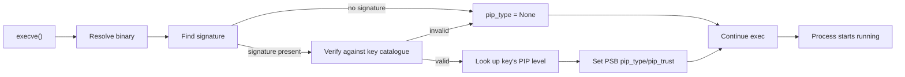

When a process execs, the kernel runs the signing layer between resolving the binary and starting the new program. The flow is: find the signature, verify it, set the new PSB's PIP fields based on the result, then proceed with the exec. If the binary verifies, the resulting process is PIP-protected at the level the catalogue says; if not, it runs as `pip_type = None`.

This page covers the verification flow, the stable-snapshot rule that handles concurrent writes during verification, what happens to the binary's inode after a successful verification, how scripts and interpreters work, and the symlink resolution rule.

## The verification flow

In order:

1. **The kernel resolves the path.** Standard exec resolution — symlinks followed, mount-policy honoured — produces the target file. The resolution rules for symlinks are covered below.
2. **The kernel looks for a signature.** For ELF binaries, it scans the section header table for `.peios.sig`. For non-ELF binaries, it reads the `security.peios.sig` xattr. If neither is present, the binary is unsigned.
3. **The kernel computes the content hash.** SHA-256 over the binary, following the rules from [Signature format](~peios/binary-signing/signature-format) — section contents zeroed for ELF, full file for non-ELF.
4. **The kernel verifies the signature.** Ed25519 verification of the 64-byte signature against the 32-byte hash, using each of the public keys in the catalogue in turn. If any key verifies the signature, the kernel records which key matched.
5. **The kernel looks up the key's PIP level** in the catalogue. The catalogue entry says `pip_type = X, pip_trust = Y`. These values are written to the new process's PSB.
6. **Or, on any failure**, the PSB's PIP fields are set to `pip_type = None, pip_trust = 0`. The exec proceeds.
7. **The exec continues.** The new program starts running.

Note that step 6 also fires for any of: signature absent; signature present but version byte unrecognised; signature present but no key in the catalogue verifies; signature present and verifies, but the catalogue entry is somehow malformed. The kernel does not distinguish these cases in the result — they all produce `pip_type = None`.

## The stable-snapshot rule

A subtle case the kernel handles: what if the binary is being written to *during verification*?

The kernel reads the binary's content twice during exec — once to compute the hash, once (potentially) when mapping the binary into the new process's address space. If the file size or content changes between these reads, the hash computed in the first read might not match the bytes that end up executed in the second.

The kernel addresses this with a **stable snapshot**: the file's size is recorded at the start of verification, and the kernel only hashes bytes within that size. If the file size changes during verification, the kernel detects the change and treats the binary as unsigned (the hash was computed over a state that may no longer be valid). The resulting process runs at `pip_type = None`.

This is the "invalid or unstable = unsigned" case. The kernel does not retry; it does not block until the file stabilises; it simply gives up on verification for this exec. The same binary, exec'd a moment later when writes have stopped, will verify normally.

The rule applies only to the read side of the snapshot. Once the kernel has the hash and has verified the signature, the file is pinned (see below) and further writes are rejected — there is no window after verification where the binary's bytes can drift.

## Scripts and interpreters

A script — a text file starting with a shebang line — is not a signed binary. Scripts are interpreted by another program (the interpreter named in the shebang); they themselves carry no executable code that the kernel verifies. So how does signing interact with them?

The answer: **the process's PIP comes from the interpreter, not the script**. When you exec a script, the kernel actually execs the interpreter, passing the script as an argument. Verification runs on the interpreter binary. The resulting process's PIP is whatever the interpreter's signature says.

The consequence:

- A signed-at-TCB interpreter (say, a Python signed at TCB level) running an untrusted script runs that script as a TCB process. The script's content is irrelevant; PIP comes from the interpreter.
- An unsigned interpreter running a signed script runs as None — there is nothing to verify on the script.
- Two scripts running under the same interpreter run at the same PIP level, regardless of what the scripts do.

In v0.20 **no interpreter is signed at the TCB level**. The TCB binaries (peinit, authd, etc.) are compiled binaries, not interpreters. This is intentional: signing an interpreter at TCB level would trivially give every script running under it TCB authority, which is exactly the wrong tool. If a future Peios version signs interpreters, they will be signed at lower trust tiers (App, perhaps) where the script content is also trusted.

For administrators: do not assume scripts are protected by PIP. They run at the interpreter's level, which in v0.20 is None for every common interpreter. If you need a script to run as a trusted process, compile it into a binary (or run it under a future Peios-blessed interpreter, when one exists).

## Symlink resolution

When exec is given a path that is a symlink, the symlink is followed *before* the signing check runs. The kernel resolves the symlink chain to the final target file, then runs verification on that file. The signature on the target is what counts; signatures on intermediate symlinks are ignored.

Specifically:

- A symlink itself does not carry a signature. Symlinks are filesystem metadata, not executable content.
- A signature xattr on a symlink is **not** consulted by the kernel.
- The verification runs on the target's bytes, with the target's signature (xattr or ELF section).

This is the natural behaviour — exec follows symlinks anyway, and the signature is a property of the binary, not the path. But it has one implication worth noting: replacing a binary by changing a symlink's target is *also* changing what the kernel will verify. A symlink that currently points at a signed TCB binary, redirected to point at an unsigned attacker-controlled binary, will cause exec to run the latter and assign `pip_type = None`. The signing layer does not detect that the symlink target changed; it only verifies whatever the resolution lands on.

This is the right place for protection to come from elsewhere — typically the DACL on the symlink (denying writes by non-administrators) plus the DACL on the target directory. Signing is a content check; path integrity is the filesystem's job.

## Content pinning

Once a binary has been successfully verified and the resulting process has been assigned a non-zero `pip_type`, the kernel **pins** the binary's inode. From that moment on:

- **Writes are rejected.** Any attempt to `write()` to the file (via any open fd) is denied.
- **Truncation is rejected.** `truncate()`, `ftruncate()` on the file are denied.
- **fallocate is rejected.** Anything that would mutate the file's data or size, including hole-punching and zero-fill operations.
- **xattr mutation of `security.peios.sig` is rejected.** The signature itself cannot be modified once verified. Other xattrs may be touchable (depending on FACS policy), but the signature xattr is part of the pinning.

The pin is on the *inode*, not the path. A file with the same name created at the same location with a new inode is not pinned; it is a separate file with a separate signature.

This is the "update by inode replacement" pattern. To update a verified binary:

1. Place the new (signed) binary at a different path.
2. Rename it to overwrite the old path. The rename creates a new inode at the target name; the old inode (still pinned) is no longer reachable by name.
3. Once no process is holding the old inode open, it gets reclaimed.

The new binary at the new inode is unverified until something execs it. The first exec triggers verification, and if successful, that new inode is pinned in turn.

This is also the deletion pattern for a verified binary: the file can be deleted via `unlink()` (the name goes away; the inode stays alive as long as anyone has it open), but the file cannot be modified in place. Atomic replacement is the only update path.

## Why pin?

Pinning exists because verification is a snapshot. The kernel verified the bytes at one moment; later modifications to those bytes would mean the running process's PIP no longer matches what is on disk. Pinning prevents that drift.

Consider the alternative: a verified TCB binary whose bytes are modifiable. An attacker who can write to that file could change its contents to inject malicious code. Future execs of the same path would still verify (the signature is over the old bytes; the section/xattr still says it is signed), but the actual bytes running would be the modified ones. The kernel would unwittingly grant TCB authority to malicious code.

Pinning closes the gap. After verification, the bytes are locked. The next exec re-reads the bytes and re-verifies — same bytes, same signature, same result. There is no window in which the on-disk file differs from what was verified.

The pin is in-kernel state, not a filesystem flag. A reboot loses all pins; the next exec of each binary verifies again from scratch. This is fine because the pins are operationally short-lived — they exist for the duration of a binary's use after first exec, which is typically the lifetime of the kernel.

## A subtle case: pinning before exec completes

A binary that is being verified has not yet finished exec'ing. The pin happens after verification completes; before that, the binary is just a file. If verification fails (returns "unsigned"), the file is not pinned — there is nothing to pin, since the resulting process has `pip_type = None` and no other process has gained a TCB-relevant interest in this inode.

But if verification succeeds and exec then fails for unrelated reasons (out of memory, mmap failure, etc.), the PIP values are not committed to the PSB. The pin, however, has been applied. A subsequent exec of the same file will re-verify and re-pin (or rather, find the pin already in place), but the original failed exec does not roll back the pin.

This is consistent with the pin being about the inode's bytes, not about any specific process. Once an inode has been verified, the kernel knows what those bytes are and will not let them change, independent of whether any specific exec succeeded in using them.
