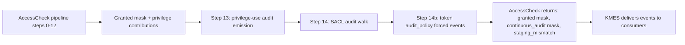

**Auditing** is the access check's record-keeping layer. Where the DACL and the rest of the pipeline decide whether access is granted, auditing decides what to *remember* about that decision. An audit event records an access attempt — who made it, what they wanted, what they got, what triggered the recording — and ships the event through KMES to whatever userspace consumer is listening.

Auditing runs *after* the access decision is made. By the time an audit event fires, the granted mask is already final; the audit walk is not part of the gate, only of the record. This means audit events are observational, not decisional: a fired audit event reports what already happened; it does not affect whether the access happens.

This page covers the model — what kinds of audit exist, where each one fires in the pipeline, and what they have in common.

## What auditing is for

Auditing answers questions of the form "did this happen?". It does not answer "is this allowed?" — that is the access check's job, and it has already been done by the time audit runs.

The questions audit handles well:

- "Who accessed this sensitive file in the last hour?"
- "Did this principal exercise SeDebugPrivilege today?"
- "How many failed write attempts were there against this object since Monday?"
- "Which sessions are currently writing to this directory?"

The questions audit does not handle well:

- "Should this access have been allowed?" — that is policy, not audit.
- "Will this access succeed?" — audit is post-decision, not predictive.
- "What rights does this user have on this object?" — audit observes events; computing rights requires the access check.

Auditing is most valuable for compliance and incident-response purposes. A regulated environment may need to log every access to certain classes of data; an incident-response team needs to reconstruct what happened in the moments before a compromise. Auditing produces the raw record those use cases consume.

## The three audit categories

Peios produces three categories of audit event from the access pipeline:

| Category | Triggered by | When it fires |
|---|---|---|
| **Object-access audit** | `SYSTEM_AUDIT*` ACEs in an object's SACL, **or** the calling token's `audit_policy` bitmask | At AccessCheck completion (one event per matching audit ACE per access) |
| **Continuous audit** | `SYSTEM_ALARM*` ACEs in an object's SACL | Per-operation on an open handle (every operation whose required mask overlaps the handle's continuous-audit mask) |
| **Privilege-use audit** | A privilege contributed to the granted mask, and the token's `audit_policy` requested it | At AccessCheck completion (one event per privilege that fired) |

Plus a fourth, tangentially-related category produced by session lifecycle:

| Category | Triggered by | When it fires |
|---|---|---|
| **Session destruction** | A logon session loses its last token reference | When the session is destroyed |

Object-access and continuous audit are covered in [Audit ACEs](~peios/auditing/audit-aces). Privilege-use audit and the token-forced subset of object-access audit are covered in [Policy-forced auditing](~peios/auditing/policy-forced-auditing). Event schemas and the KMES transport are in [Events and transport](~peios/auditing/events-and-transport).

## Where audit fits in the pipeline

Step 13 fires privilege-use events for privileges that contributed bits. Step 14 walks the object's SACL (plus any CAAP effective SACLs collected during step 12) looking for audit and alarm ACEs that match the access. Step 14b checks the calling token's `audit_policy` bitmask for forced events that should fire regardless of any SACL ACE.

Each of these steps can produce zero or more events. A single access check might produce no events (no audit ACEs matched, no privileges used, no token-forced auditing); or it might produce many (multiple matching audit ACEs, multiple privileges, multiple forced events).

The events are sent through KMES — Peios's kernel-to-userspace event transport — to whichever consumer is subscribed. The kernel does not retain them, does not buffer them past the transport, does not retry them; KMES is fire-and-forget at the kernel-to-userspace boundary, and reliable delivery is KMES's concern, not the audit layer's.

## What an audit event records

Every audit event includes:

- **The subject** — who was making the access. The token's user SID, group SIDs, integrity level, PIP type and trust, projected UID.
- **The object context** — a caller-supplied opaque blob identifying the object being accessed. Audit consumers use this to correlate events with the objects they cover.
- **The access** — what was requested, what was granted, whether the access succeeded.
- **The trigger** — which ACE matched (for SACL-driven events), which privilege fired (for privilege-use events), or which audit-policy bit (for token-forced events).
- **The process context** — pid, name, executable path. Useful for correlating events with running processes.

The exact field set varies by event type and is covered in [Events and transport](~peios/auditing/events-and-transport).

## What audit does not do

A few clarifications:

- **Audit is not the access decision.** An audit event firing does not mean access was granted; an event for a denied access is just as legitimate. Read the success flag in the event to know what happened.
- **Audit is not retroactive.** An audit ACE added to an SACL after some accesses have happened does not generate events for those past accesses. Auditing observes the present; the past is the past.
- **Audit does not survive crash.** An event in flight when the kernel crashes is lost. KMES is designed for the typical case where the kernel keeps running; for crash-resilient audit, a userspace consumer that persists events to disk is what provides durability.
- **Audit does not authenticate.** The recorded subject is whatever the calling token says they are. If the token has been issued correctly, the audit record reflects reality. The audit layer does not independently verify the principal's identity beyond what the token provides.

## Where audit lives

A handful of components are involved in producing and consuming audit:

- **The kernel** runs the audit walk during AccessCheck and produces the events.
- **KMES** transports the events from the kernel to userspace.
- **`eventd`** is the userspace daemon that subscribes to KMES and writes events to wherever they should go (a local file, a remote log collector, a SIEM endpoint).
- **Audit consumers** are tools that read what `eventd` has captured — query interfaces, dashboards, alerting systems.

This separation is what lets the kernel stay simple. The kernel's only job is generating events; everything else — buffering, persistence, querying, alerting — is userspace. A failure in the audit-storage layer does not affect the access check; the access decision happens regardless of whether the corresponding event was ever recorded.

## Auditing is best-effort

The audit layer aims to record every meaningful event, but it is **not** "every event is guaranteed to be recorded". The reasons:

- An event in flight when the kernel crashes is lost.
- A consumer that has fallen behind may have its KMES backlog dropped (KMES's flow control is a per-consumer concern; the kernel does not block the access check on consumer back-pressure).
- A misconfigured SACL or `audit_policy` may simply fail to generate the events that would have been useful for forensics.

Best-effort means audit is a *signal*, not a *proof*. A deployment that needs cryptographic non-repudiation of every access would need additional infrastructure on top of the audit layer. For the typical use cases — compliance, alerting, incident response — best-effort is enough.

The model deliberately puts performance ahead of guaranteed delivery. An access check that has to block until its audit event has been written to disk would be intolerably slow. The kernel chooses to record what it can and not slow down the actual work; the userspace audit pipeline is responsible for getting the events from the transport buffer to whatever destination they need to land at.

## Where to start

If you want to understand audit ACEs — how they work, the difference between standard (`SYSTEM_AUDIT`) and continuous (`SYSTEM_ALARM`) ACEs, audit polarity, and the conditional audit case — read [Audit ACEs](~peios/auditing/audit-aces).

If you want privilege-use audit and the token-forced audit policy — events that fire independent of any SACL ACE — read [Policy-forced auditing](~peios/auditing/policy-forced-auditing).

If you want the wire-level details — event schemas, what each field means, how KMES delivers events to consumers — read [Events and transport](~peios/auditing/events-and-transport).
