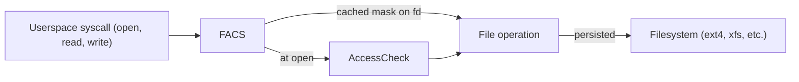

**FACS** — the File Access Control Shim — is the kernel layer that applies KACS access control to files. Where the kernel's access pipeline runs against any protected object, FACS is the specific bridge between the file system (inode, dentry, page cache) and the access check. Every read, write, open, and metadata operation on a file goes through FACS at some level; FACS decides whether the operation proceeds and, when relevant, what flags or rights apply.

The model FACS uses is the **handle model**: AccessCheck runs once at `open` time, the granted mask is cached on the file descriptor that comes back, and every subsequent operation through that fd reads from the cache rather than re-running the access check. The implications of this single design choice ripple through every page in this topic.

This page covers the model at a conceptual level. Later pages cover the handle model in detail, the syscalls for opening files (native and legacy), the SD management operations, and the special cases that the model has to accommodate.

## The handle model in one sentence

**Access is decided at the moment a file descriptor is opened; from then on, the descriptor carries an immutable "granted access mask" that gates every operation.**

That sentence is the whole model. Once a file is open, the kernel knows what the caller is allowed to do with this file via this handle. Reads, writes, metadata queries, mmaps — each operation has a required access mask (what it needs to do its work) and succeeds only if the required mask is a subset of the cached granted mask.

The mask does not change. Adjustments to the file's DACL, to the calling token, or to anything else after the open do not affect the cached mask. The handle is a snapshot of what the access check said at open time.

The full mechanics — what gets cached, what operations consult the cache, what is and is not subject to the model — are in [The handle model](~peios/file-access/the-handle-model).

## Why the handle model

Two main reasons:

**Performance.** Re-running AccessCheck on every read or write would be expensive. The DACL walk plus narrowing layers plus possibly CAAP evaluation is non-trivial work. Caching the result on the handle reduces operations to a single bitmask comparison — orders of magnitude cheaper.

**Consistency.** A long-running operation should not change behaviour halfway through because the DACL was modified. A file being read for backup should not start failing midway because an administrator tightened the DACL; either the backup tool has the right at the start (in which case it should complete) or it doesn't (in which case it shouldn't have been able to open in the first place).

The trade-off is that an open handle survives a policy change. If you tighten a file's DACL, processes that already have the file open keep their existing access. New opens get the new policy; old handles are unchanged.

This is the **check-at-open** principle — covered for CAAP in [Central access policies](~peios/central-access-policies/overview) and applied uniformly here. The kernel does not retroactively revoke open handles.

## Where FACS sits

FACS lives between the file system and the rest of KACS. The arrangement:

At `open`, FACS calls AccessCheck and caches the result on the fd. At every subsequent operation, FACS reads the cached mask and decides. The filesystem itself doesn't see KACS; it sees only operations that FACS has already vetted.

This means:

- **The DACL and the filesystem are decoupled.** FACS is what enforces KACS on files; the filesystem stores the SD as metadata (an xattr, typically) but does not interpret it.
- **A filesystem can be FACS-managed or not.** Mount policy determines whether FACS applies to a given mount; see [Mount policies](~peios/mount-policies/overview).
- **Different filesystems can store SDs differently.** ext4, XFS, NTFS — each has its own xattr or native mechanism for persisting the SD. FACS handles the abstraction; the access check works the same way regardless.

## Two open syscalls

The kernel exposes two ways to open a file:

| Syscall | Mode | Common use |
|---|---|---|
| `kacs_open` | KACS-native — caller specifies an explicit desired access mask | New code; programmatic file access by services |
| `openat` / `open` | Legacy — caller specifies POSIX flags (O_RDONLY, O_WRONLY, etc.) that map to access masks | Existing Linux applications |

`kacs_open` is the native interface. The caller specifies exactly which rights it wants and either gets all of them or fails. `openat` and friends are the POSIX-compatibility interface — they use the same FACS machinery internally but with a different mapping from input flags to access mask and with split "core" and "compat" semantics for handling partial grants.

Both paths converge in FACS. The cached mask on the resulting fd is the same shape regardless of which syscall produced the open.

The two interfaces are covered in detail in [Opening files](~peios/file-access/opening-files).

## What FACS reads from where

A summary of the data sources that feed into a FACS access check at open:

| Source | What it provides |
|---|---|
| Calling thread's effective token | Identity for AccessCheck — user SID, groups, integrity, privileges, etc. |
| File's inode | The owner SID, primary group, DACL, SACL (read via xattr or filesystem-native channel) |
| Mount policy | Whether FACS applies at all, how missing SDs are handled, the mount-level SD template |
| Process PSB | PIP fields for the dominance check during AccessCheck |
| Caller's `kacs_open` parameters | The desired access mask, the create disposition, optionally a creator-supplied SD |

These come together at `open`. AccessCheck runs over them and produces the granted mask that goes on the fd.

## What FACS does *not* do

A few clarifications:

- **FACS does not store SDs.** The filesystem stores SDs; FACS reads them. Different filesystems use different mechanisms (xattrs on ext4 / XFS / Btrfs, native security streams on NTFS, mount-level synthesis on FAT/exFAT, in-memory on tmpfs).
- **FACS does not validate SDs at boot.** The first access to a file is when its SD is first read and validated; the kernel does not pre-scan filesystems looking for problems.
- **FACS does not propagate DACL changes.** Modifying a file's DACL affects future opens, not existing handles. This is the check-at-open rule.
- **FACS does not gate operations that bypass the file system.** A process that has a file mapped into memory via mmap can read or write that memory without going through FACS for each access — the access check happened at mmap time (or at open, then at mmap), and after that the kernel has no efficient way to intercept memory accesses. Mitigations like LSV apply at the mmap call; runtime memory access is governed by the page-table permissions the kernel set when the mapping was created.

## Where to start

If you want the handle model in detail — what is cached, what operations check the cache, when the cache can be stale, how fd transfer works — read [The handle model](~peios/file-access/the-handle-model).

If you want the open syscalls — `kacs_open` for KACS-native, `openat` for legacy compatibility, the differences in semantics and the rules for each — read [Opening files](~peios/file-access/opening-files).

If you want to read or modify a file's SD — `kacs_get_sd`, `kacs_set_sd`, the security_information bitmask, the rules for setting owner/DACL/SACL/label — read [Managing file security](~peios/file-access/managing-file-security).

If you want the edge cases — O_PATH, the exec dual gate, append-only files, sticky bit, POSIX ACLs that no longer work, NFS dual authority — read [Special cases](~peios/file-access/special-cases).
