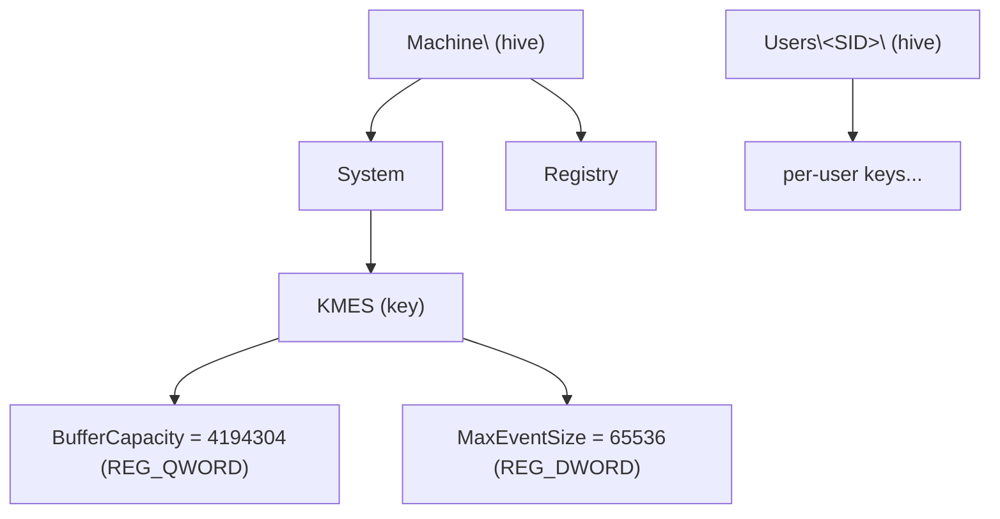

The **registry** is the structured configuration store for a Peios system. It is a hierarchy of named **keys**, each holding **values** — typed pieces of data. Subsystems read their operational settings from it, services keep their definitions in it, and policy is delivered through it. Where a [file](~peios/file-access/overview) holds an opaque stream of bytes, a registry value holds a small, named, typed datum that some part of the system knows how to act on.

It is also kernel-mediated. There is no file under `/etc` you edit and no daemon socket you talk to directly. Every registry operation — opening a key, reading a value, writing configuration, watching for change — goes through a dedicated set of system calls. Userspace never touches the store underneath; the kernel is always in the path, which is what lets the registry carry the same access control, the same identity model, and the same auditing as every other protected object in Peios.

This page is the map. It sketches the shape, names the handful of ideas that make the registry its own thing, and points at the pages that cover each one.

## The registry in one sentence

**The registry is a tree of keys and typed values, reached only through kernel system calls, where every key is an access-controlled object — and every value you read is the *effective* result of resolving a stack of layered writes.**

Ignore that last clause for now. For almost everything in this topic you can picture the registry as a plain hierarchical store: one key per path, one value per name, the value you wrote is the value you read. That simpler picture is correct as far as it goes, and it is the right way to learn the model. The layering underneath — what "effective" really means — is the deepest idea here, and it gets its own page once the rest is solid.

## The shape

Three entities make up the namespace.

| Entity | What it is |
|---|---|
| **Hive** | A top-level namespace — the first component of every path. `Machine\` holds system-wide configuration; `Users\<SID>\` holds per-user configuration. In practice a running system exposes just a few. |
| **Key** | A node in the tree. Keys are containers: they hold child keys (forming the hierarchy) and values (holding data). Every key is a secured object with its own [security descriptor](~peios/security-descriptors/overview). Keys are roughly the registry's directories. |
| **Value** | A named, typed datum living inside a key — a `REG_DWORD` number, a `REG_SZ` string, and so on. A key can hold many values, each with a distinct name. Values are roughly the registry's files. |

Paths are written with backslashes — `Machine\System\KMES` — and compared case-insensitively while preserving the case you wrote. A handful of well-known roots anchor everything: `Machine\` for the machine, `Users\<SID>\` per principal, and `CurrentUser\` as a convenience alias the kernel rewrites to the caller's own `Users\<SID>\`.

We will return to one subtree throughout this topic as a running example: the KMES event subsystem reads its tuning parameters from values under `Machine\System\KMES`. It is small, real, and exercises every idea — types, meaning, security, and change notification.

## What the registry is *not*

The registry borrows a familiar shape, and the familiarity is a trap. Three wrong mental models attach themselves immediately; clearing them is most of understanding what the registry actually is.

**It is not a filesystem.** It looks like one — hierarchical paths, separators, containers and leaves — but it behaves differently in ways that matter. You reach it through dedicated registry system calls, not the file API. Values are typed data, not byte streams. Access is checked once, against the single key you open, with **no traversal check** on the keys above it — a process can read `Machine\System\Services\Jellyfin` without any access to `Machine\System\Services`. And security is attached per key; there is no such thing as a per-value permission.

**It is not a dumping ground of opaque settings.** Every key is a first-class secured object and every value is typed, access-controlled, and watchable. Nothing in the registry is unmanaged or hidden — there is no "miscellaneous junk" tier. It is a deliberate, governed surface, not a place things accumulate.

**It is not self-describing.** The registry stores a value's *type tag* but never interprets its bytes. It does not know that `BufferCapacity` must be a power of two, what its default is, or which subsystem reads it. That knowledge — the *meaning* of a value — lives entirely outside the registry: in the subsystem that owns the value, and, for a human looking it up, in [`regman`](~peios/registry/regman), the registry's manual. `regman` is the `man` of the registry — give it a path and it tells you a value's type, default, valid range, when a change takes effect, and what the setting is for. The registry cannot describe itself, so its manual is shipped beside it. This separation of storage from meaning is the first idea worth slowing down for, and it has consequences — a write the registry accepts can still be refused by the subsystem that reads it — so it gets its own page.

**It is not flat.** Underneath the single value you read, the registry keeps a *stack* of writes, each tagged with a **layer**, and resolves the winner on every read. That is what makes configuration revert cleanly, role install and uninstall work, and domain Group Policy apply and lift without residue. It is powerful and it is the one idea worth deferring — the [Layers](~peios/registry/layers) page pulls the curtain back once the rest of the model is clear.

## One registry, built from two parts

When precision matters, "the registry" is really two cooperating components: a kernel subsystem that owns the data model, path resolution, access control, change notification, and layer resolution; and a userspace store that persists the data on disk. They talk over a private protocol, and the kernel is the only authority — the store never sees who is asking and never makes a security decision.

For the conceptual model you do not need that split, and this topic mostly treats the registry as one thing. The division becomes useful only when you care about how the registry is backed, swapped, or recovered — so it is the subject of the last page, [LCS and sources](~peios/registry/lcs-and-sources), not the first.

## Where to start

If you want the data model — hives, keys, the value types, case rules, and why a value is "typed but opaque" — read [Keys, values, and types](~peios/registry/keys-values-and-types).

If you want the idea that the registry stores values it does not understand — what reject-or-keep means, and why the value the registry shows and the value a subsystem is actually using can legitimately differ — read [Configuration, not storage](~peios/registry/configuration-and-meaning).

If you are ready for the layered truth under the effective view — precedence, the base layer, how deleting a layer automatically reverts its changes, and how roles and Group Policy ride on it — read [Layers](~peios/registry/layers).

If you want the security model — why every key carries a security descriptor, the registry-specific access rights, and the rule that security changes are *not* undone by layer removal — read [Access control on keys](~peios/registry/access-control).

If you want to know how a service reacts to a configuration change instead of polling for it, read [Watching for changes](~peios/registry/watches).
