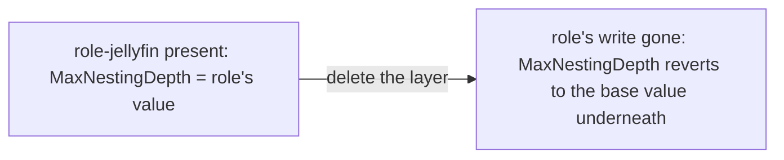

[Layers](~peios/registry/layers) explained how the registry resolves competing writes. This page is the reason it bothers. The layered model buys one thing above all: **configuration you can add and remove as a unit, with revert that is automatic and leaves nothing behind.**

## The payoff, in one sentence

**Because every write is tagged with a layer and nothing is overwritten in place, deleting a layer makes its writes disappear and the next-best write for each value resurface on its own — so installing a bundle of configuration and removing it again are just creating and deleting a layer.**

Everything below is a consequence of that.

## The base layer

Most of the time you are not thinking about layers at all, and the **base layer** is why. It is the default layer — precedence 0 — and it is where writes go when you do not ask for anything else. Manual administrative edits land here; so do the system's own defaults. It always exists, and it cannot be deleted or disabled; it is the floor the rest of the model stands on.

When this topic earlier showed you "write a value, read it back", that was the base layer doing its job. You can work with the registry for a long time and only ever touch base.

## Saying "no value", not just "another value"

A plain write competes to *be* the value. But configuration sometimes needs to say something a plain write cannot: *this value must not be set at all.* Overriding `MaxEventSize` with a different number is easy; asserting that `MaxEventSize` should be absent is a different statement.

A layer makes it with a **tombstone** — a write whose meaning is "no value here". It enters the same per-value contest as any other write ([Layers](~peios/registry/layers)); if it wins, a read of that value returns "not found" rather than falling through to some other layer's write. Like any write, it belongs to a layer — so when that layer is removed, the tombstone goes with it and whatever it was suppressing comes back.

A **blanket tombstone** is the same idea applied to a whole key at once: a marker that enters the contest as a "no value" candidate for *every* value name on the key. A layer can set a blanket tombstone and then write the specific values it does want — the effect is "clear everything here, then set these". It is how a layer declares the complete contents of a key instead of merging into whatever was already there.

The key-level equivalent is **hiding**: a layer can claim that no key exists at a path, masking one that an older or lower-precedence write provides. Remove the layer and the key reappears.

In every case the marker is just another write — owned by a layer, removed with the layer.

## Automatic revert

This is the property the whole design exists to deliver. Because layers are removable and nothing is ever destroyed in place, **deleting a layer cleanly undoes everything it did** — with no undo script, no bookkeeping, no leftover state:

- Its writes vanish from every contest they were in.
- Its tombstones and hidden-key markers lift.
- For each affected value or key, the registry simply re-runs the contest without the deleted layer's writes, and the next-best survivor becomes effective.

There is no separate "revert" operation. Revert is what *naturally happens* when a layer's writes stop existing, because the effective value was always just the winner of a live contest.

There is, in particular, no **tattooing** — the failure mode where removing configuration leaves its changes burned in. In a system that overwrites in place, uninstalling something means trusting that its installer recorded the previous values and restores them correctly. Here there is nothing to restore: the previous value never left.

## Roles

A **role** is a bundle of configuration deployed as a layer. Installing a role creates a layer and writes the role's keys and values into it (atomically, as one transaction, so the role never appears half-installed). Uninstalling a role deletes the layer — and by automatic revert, every value it set and every key it added simply falls away, and whatever the system looked like before resurfaces on its own. Clean uninstall is not something a role's authors have to implement carefully; it is a property of the layer.

## Group Policy

Domain **Group Policy** is configuration delivered from outside the machine, and it rides on layers too — but at a *higher precedence* than local layers. That choice is deliberate, and [Layers](~peios/registry/layers) explained why: a higher-precedence write wins regardless of recency, so a domain setting beats local configuration even if a local administrator writes the value again afterwards. Applying a policy adds the layer; lifting it deletes the layer, and the local configuration it had been overriding resurfaces automatically — the same revert, one tier up. (High-precedence layers are privileged to create, so policy cannot be forged by an unprivileged process; see [Access control](~peios/registry/access-control).)

## What layers are *not*

- **Not a transaction.** Layers decide *which* write wins and let you remove a group of writes together; atomicity — making several writes commit all-or-nothing — is a separate mechanism. A role install uses both: a transaction to apply the writes atomically, a layer to make them removable.
- **Not access control.** A layer does not decide who may read or change a value; the [security descriptor](~peios/registry/access-control) on each key does. And the two do not mix: a security change made while a layer existed is **not** reverted when the layer is deleted. Security is operational state, not configuration overlay — the next page is where that distinction lives.
- **Not a browsable history.** Layers are not a version-control timeline you can scroll through. You see the effective view — the current winners — not a log of every write that ever competed.

## Where to start

If you want what "deleting a key" really does once names are layered — and why there is no recursive delete — read [Deleting keys and values](~peios/registry/deleting-keys-and-values).

If you want the security model and its sharp interaction with layers — why deleting a layer reverts its values but *not* a security change made under it — read [Access control on keys](~peios/registry/access-control).

If you want to see how a watcher experiences a layer being added or removed — it sees the effective values change, with the layer machinery invisible — read [Watching for changes](~peios/registry/watches).

For the sandboxing case — per-thread *private* layers that only one caller sees — read [Advanced: private hives and layers](~peios/registry/private-hives-and-layers).
