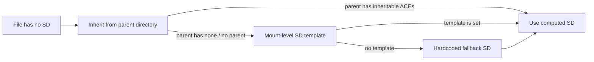

The four policy classes are the answer to one question: when FACS needs an SD for a file and the filesystem doesn't have one, what should happen?

The three managed classes — `facs_deny_missing`, `facs_synthesize_ephemeral`, `facs_synthesize_persistent` — answer the question in three different ways. The fourth, `unmanaged`, answers it by stepping out of the question entirely: FACS doesn't apply, so the question doesn't arise.

This page covers each class in detail, the synthesis chain that produces an SD when one is needed, and the universal corrupt-SD rule.

## facs_deny_missing

A FACS-managed mount where missing SDs are treated as an error. Every file on a `facs_deny_missing` mount **must** have a valid SD; one that does not is unreachable.

The runtime behaviour:

1. The kernel reads the file's SD from the filesystem (typically an xattr).
2. If no SD is present, the access fails. The kernel returns `-EACCES` for any operation that would require an SD-based access check.
3. The file is effectively unreadable, unwritable, undeletable, unmodifiable. Every access fails because there is no policy to evaluate against.

This is the strict mode. It is appropriate for filesystems where every file should have been provisioned with an SD — system mounts, application storage, anywhere the operator has set up the filesystem deliberately.

The defaults for Peios system mounts (the root filesystem, `/home`, `/var`) are `facs_deny_missing`. The image-build process ensures every file in the base image has an SD; subsequent file creation always inherits an SD from the parent. There is no path by which a file without an SD legitimately ends up on these filesystems.

If somehow a file does end up without an SD — a backup-restore tool that skipped xattrs, a misbehaving filesystem driver — that file is unreachable. The fix is to give it an SD (`kacs_set_sd`, requires WRITE_DAC, which the caller may not have if they cannot read the file).

Practical upshot: a `facs_deny_missing` mount is strict. Files without SDs are dead. This is the right setting for filesystems where you trust the provisioning.

## facs_synthesize_ephemeral

A FACS-managed mount where missing SDs are synthesised in memory, but **not written back** to the filesystem. The synthesised SD is used for the access check; it does not become part of the file's persistent state.

The runtime behaviour:

1. The kernel reads the file's SD from the filesystem.
2. If no SD is present, the kernel **synthesises** one using the synthesis chain (covered below).
3. The synthesised SD is used for the access check.
4. The synthesised SD is **not** written back to the filesystem. It exists only in the kernel's cache for the duration this inode is in memory.
5. On a subsequent open of the same file (after the inode has been evicted from cache, say), the SD is synthesised again. The same inputs produce the same output, so the same SD comes out — but the synthesis is repeated.

This class is appropriate for filesystems where you can't or don't want to write SDs:

- **Removable media** (USB drives, optical media). You don't want to modify the media just because you read a file on it.
- **FAT and exFAT.** These filesystems have no xattr support; the SD has nowhere to go even if you wanted to write it.
- **NFS client mounts.** The actual file lives on a remote server; modifying its SD via xattr would have unpredictable effects.
- **tmpfs and devtmpfs.** Per-instance pseudo-filesystems with no real persistence.

The synthesis-only-in-memory pattern lets FACS apply access control to these filesystems without changing their on-disk content. The trade-off is that the cost of synthesising is paid every time the inode is cold.

## facs_synthesize_persistent

A FACS-managed mount where missing SDs are synthesised **and** written back. The synthesis happens once; from then on the file has a real SD.

The runtime behaviour:

1. The kernel reads the file's SD from the filesystem.
2. If no SD is present, the kernel synthesises one using the synthesis chain.
3. The synthesised SD is used for the access check.
4. The synthesised SD is **also** written back to the filesystem (typically as the SD xattr). The file now has a persistent SD.
5. On a subsequent open, the SD is read from storage — no re-synthesis needed.

This class is for filesystems being adopted into Peios. A previously-unmanaged filesystem (say, an ext4 volume from a Linux system without KACS) can be mounted with `facs_synthesize_persistent`; every file accessed gets an SD on first access; over time, every file ends up with an SD.

The use case: migrating an existing filesystem to KACS-managed without a single-pass conversion tool. The synthesis-on-access pattern lets the conversion happen incrementally as files are touched. After enough time, every regularly-accessed file has been adopted; rarely-touched files get adopted the next time they are read.

After all files have SDs, the mount can be switched to `facs_deny_missing` for strict mode. The transition is a single `kacs_set_mount_policy` call; existing SDs are unaffected, and any straggler files without SDs become unreachable (which is the desired effect of switching to strict).

## unmanaged

The unmanaged class is the special case for filesystems FACS shouldn't apply to. The kernel uses its own per-operation access rules for files under this mount; no SD-based access check runs at FACS's level.

Specifically:

- `/proc` is `unmanaged`. Access to `/proc/<pid>/*` files is governed by the process-level checks (process SD + PIP, per the two-check rule), not by FACS.
- `/sys` is `unmanaged`. Writes are restricted to `BUILTIN\Administrators` and `SYSTEM` by hardcoded rule.
- `/sys/kernel/security/kacs/*` has explicit SDs set by the kernel; reading these uses the kernel's own logic.

The `unmanaged` class cannot be set via the public ABI. The `kacs_set_mount_policy` syscall rejects attempts to set this class with `-EINVAL`. Only the kernel itself sets this class — at boot, for the pseudo-filesystems it manages.

The reason for restricting this: making a regular filesystem `unmanaged` would mean FACS has no say over it at all, which would be a meaningful operational decision but also a security-relevant one. The kernel reserves the class for its own use.

If you mount a regular filesystem and don't want FACS to apply, the closest you can get is `facs_synthesize_ephemeral` with a permissive mount template — files get a permissive synthesised SD that effectively grants access. This is not the same as no FACS, but it is the closest path available through the public ABI.

## The synthesis chain

For the two synthesising classes, when the kernel needs to produce an SD for a file with none, it uses a chain of sources. The first source that yields a usable SD wins.

In order:

1. **Parent directory inheritance.** The kernel reads the parent directory's SD and computes what a newly-created child would inherit (per the [Inheritance](~peios/security-descriptors/inheritance) rules). If this produces a usable SD (with inheritable ACEs from the parent), that SD is used.
2. **Mount-level SD template.** Each FACS-managed mount can carry a default SD template — set via `kacs_set_mount_policy` along with the policy class. The template is a complete self-relative SD (max 64 KB). If the parent did not yield an SD, the template is used.
3. **Hardcoded fallback.** If neither the parent nor the template produces an SD, the kernel uses a hardcoded fallback: `GENERIC_ALL` to SYSTEM and `BUILTIN\Administrators`; `GENERIC_READ | GENERIC_EXECUTE` to Everyone. The owner is set to SYSTEM, group to SYSTEM.

The fallback is conservative: administrators get full control, others get read-and-execute. It is what every filesystem mounted with `facs_synthesize_*` and no specific configuration falls back to, and what every root-of-mount file ends up with on a freshly-installed Peios system.

For most mounts, the fallback is the safety net — typical files have parents with inheritable ACEs, and synthesis lands on step 1. The template is used for files at the root of the mount (where there's no parent on this filesystem) or in unusual cases where parent-inheritance doesn't apply.

## Corrupt SD handling

A universal rule across all FACS-managed classes: **a corrupt SD is treated as a denial**. If the SD on a file exists but fails structural validation — bad header, malformed ACL, invalid SID, exceeds the size limit, anything that prevents the parser from making sense of it — the access check fails with `-EACCES`.

The kernel does not fall back to synthesis when an existing SD is corrupt. The synthesis path is for files with no SD; a file with a *broken* SD is different. The kernel:

1. Detects the corruption when reading the SD.
2. Returns `-EACCES` for the access.
3. Emits an audit event (one per inode per cache population — the same corrupt SD encountered repeatedly during one mount's lifetime produces one audit event for that inode, not one per access).

The corruption audit event is part of the audit stream and useful for diagnostics. A misbehaving backup-restore tool that produced corrupt SDs on a restored set of files generates a flurry of these events when the files are first accessed.

The corrupt-SD rule is the same across all three FACS-managed classes. `facs_deny_missing` denies missing; `facs_synthesize_*` synthesises missing; all three deny corrupt. The "missing" and "corrupt" cases are different — missing is "no SD was attached" and is recoverable through synthesis or operator intervention; corrupt is "the SD that was attached is broken" and requires either fixing the SD or accepting denial.

## Class transitions

Changing a mount's policy class is allowed (subject to access rules covered in [Managing mounts](~peios/mount-policies/managing-mounts)). The interesting transitions:

- **`facs_synthesize_persistent` → `facs_deny_missing`.** Common during migration. As files are adopted by `synthesize_persistent`, they accumulate SDs. Once enough have been adopted, switch to `deny_missing` to enforce strictness. Any file still missing an SD becomes unreachable; an administrator can either accept that or set SDs on the holdouts.
- **`facs_synthesize_ephemeral` → `facs_synthesize_persistent`.** Less common. Would convert an ephemeral mount to a persistent one — the next access of any file without a stored SD would write the synthesised SD back. This effectively "snapshots" the synthesis on first access.
- **`facs_deny_missing` → `facs_synthesize_*`.** Unusual; would relax strictness. The kernel allows it but the operational reasoning is rarely good — synthesis is a recovery mechanism, not an everyday setting.

A class transition is just a policy update; no files are touched at the transition. The new policy applies to future accesses. Existing cached state (synthesised SDs in memory) may need to be re-evaluated — see the generation counter in [Managing mounts](~peios/mount-policies/managing-mounts).
