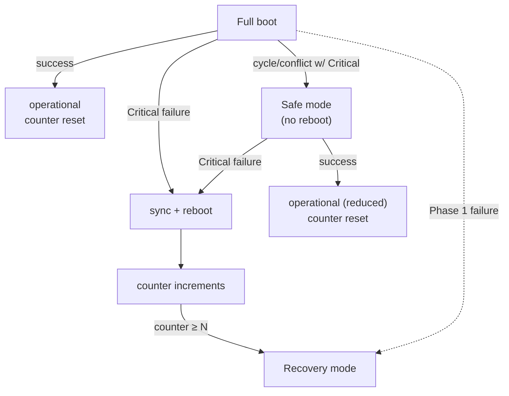

peinit's boot has two phases and a chicken-and-egg problem to solve. The problem: peinit reads everything it does from the [registry](~peios/the-registry/overview), but the registry is served by a daemon that something has to start first — and the identity authority that would mint that daemon's token does not exist yet either. The solution is to split boot into a **hardcoded** bootstrap that needs no registry, and a **registry-driven** phase that starts once the registry is up. The boundary between them is `registryd`.

## Where peinit takes over

peinit is PID 1, but it is not the *first* thing that runs. The [initramfs](~peios/boot-and-trust-establishment/initramfs-stage) assembles and mounts the real root — decryption, RAID/LVM, the root filesystem itself — and then hands control to peinit. The contract peinit relies on is narrow:

- The real root is already mounted **read-write**, and `/proc`, `/sys`, `/dev` are mounted and moved into it.
- peinit is exec'd as PID 1 from a fixed path on the real root.

peinit **does not** assemble, decrypt, repair, or even re-mount the root — those need tools and configuration that belong to the initramfs. It also does not `fsck` the root or mount non-root storage (a data partition is mounted by an ordinary Oneshot service, not by peinit). For the trust and identity side of this handoff — signatures, the SYSTEM token peinit inherits — see [peinit at PID 1](~peios/boot-and-trust-establishment/peinit-pid-1).

## Phase 1: the hardcoded bootstrap

Phase 1 is compiled into peinit. It cannot change at runtime and touches no registry. It does the minimum to make Phase 2 possible:

1. **Confirm the root is writable** with a single probe write. registryd's storage needs a writable root even for reads, so a read-only root cannot support Phase 2 → Recovery.
2. **Mount the remaining virtual filesystems** — `/dev/pts`, `/dev/shm`, `/run`, `/sys/fs/cgroup` — mounting each only if absent. A failure here → Recovery.
3. **Restore the persisted random seed** from `/var/lib/peinit/random-seed`, mixing it into the kernel's entropy pool early so anything that needs randomness during boot gets it. A missing seed is normal — first boots and stateless live boots have none — so peinit just carries on; a seed problem is never fatal and never sends boot to Recovery.
4. **Establish the machine-id** from `/etc/machine-id` — a stable, opaque identifier for this install (used for log correlation, instance identity, and software compatibility). It is *not* a security principal: it is not a SID, an account, or a credential, and no authorisation decision depends on it. If the file is missing, empty, or malformed, peinit generates a fresh 128-bit ID and writes it before continuing.
5. **Set the clock from the hardware RTC**, so early timestamps and the boot counter are meaningful. A failure here → Recovery.
6. **Start registryd** and wait for it to signal readiness, then **probe-read** the schema-version key to confirm it is actually serving reads. Any failure → Recovery — there is no Phase 2 without a registry.
7. **Provision boot-time paths.** With registryd up and before Phase 2 starts, peinit applies the entries under `Machine\System\Init\ProvisionedPaths\` — the registry-driven equivalent of tmpfiles.d, creating directories and files (with Peios security descriptors) that no single service owns. Best-effort entries that fail are logged and skipped, but an entry marked `Required=1` that cannot be provisioned sends boot → Recovery. The individual keys are catalogued in the [registry key reference](~peios/peinit/registry-key-reference).
8. **Infrastructure setup** — create the [control socket](~peios/peinit/controlling-services), open the JFS device for [ad-hoc jobs](~peios/peinit/jobs-and-operations), bring up the loopback interface. Control-socket failure → Recovery; the other two are logged as warnings and boot continues.

Most Phase 1 failures are fatal to a normal boot, because none of the later machinery can run without this foundation — the only outcome is [Recovery mode](#recovery-mode). The exceptions are the fail-soft steps called out above: a missing or unusable random seed, a regenerated machine-id, and best-effort provisioned paths all let boot continue.

> [!CAUTION]
> Packaged images, VM templates, and live ISOs must not ship a populated `/etc/machine-id` or a `/var/lib/peinit/random-seed` file. A shipped machine-id gives every clone the same identity, and a shipped seed is a public value that is not acceptable entropy. Clone and reset tooling should remove or truncate `/etc/machine-id` so peinit generates a fresh ID on the next boot, and should never bake a seed into the image — if you need strong first-boot randomness for a stateless image, provide a real kernel entropy source (hardware RNG or virtio-rng) instead.

### registryd and loregd

`registryd` is an **interface**, not a specific program. It is the path peinit execs to get a registry source daemon — the component that implements the registry's persistent storage and answers peinit's reads. The *implementation* behind that interface can vary; by default it is **loregd**.

This split matters in exactly one place: **Recovery mode**. In normal operation you only ever deal with the `registryd` abstraction — peinit starts it, treats it as opaque, and reads the registry through it. But when the registry *itself* is what broke, you need tools that work *without* a running registry, and those tools talk to the implementation directly. That is why the recovery tooling is named `loregd` (`loregd --inspector`, `--recover-from-backup`, …): in recovery you are working with the storage implementation, not the registry abstraction. It is the one context where the distinction is visible to an administrator.

## Phase 2: the registry-driven boot

With registryd serving reads, peinit boots the rest of the system from the registry:

1. **Read all definitions** under `Machine\System\Services\`. (A registry read timing out here → Recovery.)
2. **Build and validate the dependency graph** from the boot-triggered services and their transitive [dependency closure](~peios/peinit/dependencies). Validation runs *before* anything starts.
3. **Start services in dependency order**, in [parallel](~peios/peinit/dependencies) up to `MaxParallelStarts`, with [readiness gating](~peios/peinit/the-service-lifecycle) releasing each service's dependents as it becomes satisfied.

Only services with a `boot` trigger are start candidates; demand-only services are pulled in only if something boot-triggered depends on them, and [Disabled](~peios/peinit/triggers-and-timers) services are excluded from the graph (but kept in the model for on-demand start). The whole boot runs against one [snapshot](~peios/peinit/defining-a-service) — mid-boot registry edits do not perturb it.

The platform daemons come up first because everything rests on them. They are all SYSTEM, all minted by peinit (no authd yet), and all `ErrorControl=Critical`:

| Service | Phase | Identity source | Readiness | ErrorControl |
|---|---|---|---|---|
| registryd | 1 | minted by peinit | sd_notify | Critical |
| eudev | 2 | minted by peinit (privileges stripped) | process alive | Normal |
| lpsd | 2 | minted by peinit | sd_notify | Critical |
| authd | 2 | minted by peinit | sd_notify | Critical |
| eventd | 2 | minted by peinit | sd_notify | Critical |
| networking | 2 | authd | sd_notify | Normal |
| sshd | 2 | authd | process alive | Normal |
| application services | 2 | authd | per-service | Normal |

Once authd is up, every subsequent service gets its token through the [normal authd flow](~peios/peinit/identity-and-privileges). The order above is *emergent* from the standard role definitions' dependencies, not hardcoded — change the dependencies and the order changes. In practice login services such as `sshd` come up last, so the system is fully operational before it starts accepting user sessions.

## The three boot modes

The three modes form an escalation path from normal operation to last-resort maintenance.

### Full mode

The default. All boot-triggered services start in dependency order. A boot is **successful** — and the [boot-attempt counter](#the-boot-attempt-counter) resets to 0 — when every Critical service has reached and *held* a dependent-satisfying state (Active, Completed, or Skipped) for a grace period (`BootSuccessGrace`, default 30 s). The criterion is "satisfying," not "Active," so that a Critical Oneshot that reaches Completed can still mark the boot good.

### Safe mode

Safe mode starts a **reduced** set of boot-triggered services and rebuilds the graph from scratch using only those, dropping dependencies on excluded services. Two categories are eligible:

- **Critical services** (`ErrorControl=Critical`) — must start; a Critical failure here still follows the normal reboot path.
- **SafeMode services** (`SafeMode=1`) — best-effort; if they fail, Safe mode carries on without them.

Everything else is skipped. Safe mode is entered when:

- graph validation finds a **cycle involving a Critical service**, or
- an **unresolvable conflict involving a Critical service**, or
- the kernel command line says `peios.safemode=1`.

The first two are *configuration* errors — rebooting would just hit them again — so peinit downgrades **without** rebooting. Safe mode is **not** entered by a Critical service *crashing at runtime*; that follows the reboot path. And it is purely a boot-sequencing concern: once booted, you can start any service by hand exactly as in Full mode. It is the mode for "the configuration is broken but the TCB is healthy."

> [!NOTE]
> `SafeMode=1` and `ErrorControl=Critical` are *filters within the boot-triggered set*. They do not make a demand-only service auto-start in Safe mode — a service with no `boot` trigger stays demand-only regardless.

### Recovery mode

Recovery mode is the last resort, and it offers **no TCB guarantee** — the administrator gets an unrestricted SYSTEM shell on the console and must treat it with corresponding care. It is a maintenance *environment*, not a degraded boot.

In Recovery, peinit completes the Phase 1 basics, *tries* to start registryd (ignoring failure — the shell must appear regardless), skips all Phase 2 services, and execs a root shell on `/dev/console` (`/bin/recsh` if present, else `/bin/sh`), respawning it if it exits. It is entered when:

- the **boot-attempt counter reaches N** (default 3),
- the kernel command line says `peios.recovery=1`, or
- **registryd fails during Phase 1** — entered immediately, with no reboot and no counter increment, because there is no Phase 2 to attempt.

Because the registry itself may be what broke, recovery provides tools that work without it — talking to the [loregd implementation](#registryd-and-loregd) directly:

| Tool | Does |
|---|---|
| `loregd --inspector` | Read the storage database directly for diagnosis. |
| `loregd --recover-from-backup` | Restore from an automatic backup taken on every registryd startup. |
| `loregd --dangerously-clear-database` | Wipe the registry entirely. Recoverable, because role definitions are the source of truth for service config. |

> [!IMPORTANT]
> Recovery mode requires console access — physical, IPMI, or serial. There is no remote recovery in the current design (emergency SSH and registry historical reversion are noted as post-v1 work). Plan console access for any machine you need to be able to recover.

## The boot-attempt counter

The counter is what turns a crash-looping Critical service into an eventual Recovery shell instead of an infinite reboot loop. It is a plain integer in a file at `/.peinit/boot-attempts` — *not* in the registry, because the registry may be the very thing that is broken.

- peinit **reads** it at startup, before choosing a mode. The Recovery threshold (`counter ≥ N`) is checked against this pre-increment value, so the default N of 3 admits exactly three attempts before Recovery. A missing file counts as 0; a corrupt or unreadable one → Recovery.
- peinit **increments** it once per boot, right after confirming the root is writable and before Phase 2 — never before the root is known writable, or a read-only root would silently lose the increment and defeat escalation.
- The counter is **reset to 0** on a successful Full or Safe boot (after the grace period).
- If the counter file cannot be *written* (disk full), peinit treats it as 0 and continues — a write failure must not by itself trigger Recovery.

A [Critical service](~peios/peinit/supervision) exhausting its restart budget — at boot or at runtime — triggers a sync and reboot, which increments the counter on the next boot. Repeat that enough and the counter crosses N, and peinit stops trying and hands you a Recovery shell. The counter deliberately does *not* try to catch a peinit too broken to reach its own increment; that is a binary-integrity problem, not a boot-loop problem.

## Boot configuration

| Key | Default | Controls |
|---|---|---|
| `Machine\System\Boot\MaxParallelStarts` | 10 | Services starting concurrently (must be > 0; invalid → Recovery). |
| `Machine\System\Boot\BootSuccessGrace` | 30 | Seconds a Critical service must hold a satisfying state before boot counts as successful. |
| `Machine\System\Boot\ShutdownTimeout` | 90 | Maximum seconds for the whole [shutdown](~peios/peinit/shutdown) sequence. |

## Where to start

To understand the graph validation and parallel start that drive Phase 2, read [Dependencies and ordering](~peios/peinit/dependencies).

To understand the Critical-failure reboot path that feeds the boot counter, read [Keeping services running](~peios/peinit/supervision).

For the trust and token side of early boot, read [peinit at PID 1](~peios/boot-and-trust-establishment/peinit-pid-1).
