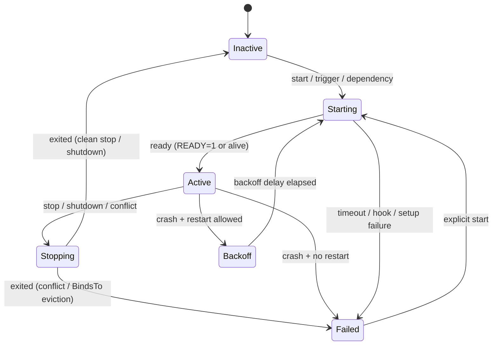

A service managed by peinit is, at every instant, in **exactly one state**. The state is what a `status` query reports, what gates dependents, and what decides which commands are valid. Alongside the state, peinit records the **cause** of the most recent transition — the *why* behind the *where*. Reading a status is reading these two things together: "Failed, because RestartBudgetExhausted" tells a very different story from "Failed, because ValidationError."

This page is the reference for both. It is worth internalising before [Controlling services](~peios/peinit/controlling-services) and [Troubleshooting](~peios/peinit/troubleshooting), because both lean on it.

## The states

| State | Process? | Satisfies dependents? | What it means when you see it |
|---|---|---|---|
| **Inactive** | No | No | Not started, or stopped cleanly and not set to restart. The neutral resting state. |
| **Starting** | Maybe | No | Activation in progress — conditions, hooks, fork, or readiness wait. Dependents are blocked. |
| **Active** | Yes | **Yes** | Running and ready. The normal state of a healthy Simple service. |
| **Reloading** | Yes | **Yes** | Re-reading configuration. Still counts as running. |
| **Stopping** | Yes (briefly) | No | SIGTERM sent; waiting for exit or SIGKILL escalation. |
| **Completed** | No | **Yes** | Oneshot finished successfully. Stays here only with `RemainAfterExit=1`. |
| **Backoff** | No | No | A restart is pending; the service is waiting out its backoff delay before the next attempt. |
| **Failed** | No | No | Exited abnormally and restart policy is exhausted or not configured. |
| **Abandoned** | Yes (unkillable) | No | SIGKILL was sent but the process survived in uninterruptible sleep (D-state). peinit has given up supervising it; its cgroup is leaked. |
| **Skipped** | No | **Yes** | A start-time [condition](~peios/peinit/execution-environment) was not met. The service does not apply here. |

Three of these — **Active**, **Completed**, **Skipped** — satisfy dependents. Everything else blocks them. That single column is the rule the whole [dependency](~peios/peinit/dependencies) system turns on: a service waiting on a `Requires` target does not move until that target reaches one of those three.

## The common path

Most of a service's life is a small loop. The diagram below shows the states a healthy Simple service moves through, plus the two ways it leaves Active.

A few things this picture makes concrete:

- An automatic restart always routes **through Backoff**, never through Failed. `Backoff → Starting` is the retry; `Failed` is reached only when restarts are exhausted or disabled. This is why [`OnFailure`](~peios/peinit/supervision) fires once at the end, not on every retry.
- `Starting` can fail *before any process exists* — a parent-side setup error, a failed pre-hook, a condition or assert. The cause records which.
- `Failed → Starting` is how a manual `start` (or a recovery path) revives a dead service; automatic restarts never originate from `Failed`.
- `Stopping` has **two** exits. A clean stop or a shutdown lands in `Inactive`. But a service stopped because it lost a [`Conflicts`](~peios/peinit/dependencies) race (`ConflictEviction`) or because its [`BindsTo`](~peios/peinit/dependencies) target went away (`BindsToPropagation`) comes to rest in `Failed`, carrying that cause — so an evicted or bound-out service shows as Failed in `status` and needs a `reset` (or, for a bound service, its target returning) before it starts again. It was not shut down on purpose, so peinit does not treat it as cleanly Inactive.

Oneshot services follow a parallel path through **Completed** instead of Active: `Starting → Completed`, and then either staying there (`RemainAfterExit=1`) or passing through to `Inactive`. See [Simple and Oneshot services](~peios/peinit/service-types).

> [!NOTE]
> **A crash while `Reloading` is still a crash.** If a service's main process *dies* while it is re-reading its configuration, peinit treats that as an ordinary `ProcessCrash` and routes it through the [restart policy](~peios/peinit/supervision) — `Reloading → Backoff` if a restart is warranted, or `Reloading → Failed` if it is not. This is why you can see a service jump straight from Reloading into Backoff or Failed. It is *distinct* from an `ExecReload` **command** failing: a failed reload command leaves the running process untouched and the service stays `Active`, reporting the failure without changing state.

## Transition causes

Every transition carries a cause. peinit keeps the cause of the *most recent* transition on the service, and emits all of them to [eventd](~peios/auditing/overview). The full taxonomy, grouped by what kind of thing happened:

**Why a service started**

| Cause | Meaning |
|---|---|
| `ExplicitStart` | An administrator or a trigger started it. |
| `DependencyStart` | Started to satisfy another service's dependency. |
| `RestartPolicy` | An automatic restart, after a backoff delay. |
| `BindsToRecovery` | A [bound](~peios/peinit/dependencies) target returned to Active; the dependent is auto-restarted. Does **not** consume the restart budget. |

**Why a service stopped**

| Cause | Meaning |
|---|---|
| `ExplicitStop` | An administrator requested stop. |
| `ConflictEviction` | A [conflicting](~peios/peinit/dependencies) service started and won. |
| `BindsToPropagation` | A bound target stopped, so this one stops too. |
| `ShutdownWave` | The system is shutting down. |

**Why a service failed or restarted** — the diagnostic causes

| Cause | Meaning |
|---|---|
| `ProcessCrash` | The main process exited non-zero or died on a signal. |
| `CleanExit` | A Simple process exited *successfully*, and policy is not Always — not a crash; goes straight to Inactive. |
| `CleanExitRestart` | A Simple process exited successfully but `RestartPolicy=Always`, so it is restarted. Logged clearly as *not* a crash. |
| `ReadinessTimeout` | `StartTimeout` expired before the service became ready. |
| `WatchdogTimeout` | A `WATCHDOG=1` keepalive did not arrive in time. |
| `HealthCheckFailure` | `HealthCheckRetries` consecutive health checks failed. |
| `PreHookFailure` | An `ExecStartPre` hook exited non-zero. |
| `ParentSetupFailure` | peinit could not even fork — resource exhaustion, cgroup error. No child was created. |
| `PreExecFailure` | Setup after fork but before exec failed (token install, rlimits, environment). |
| `RestartBudgetExhausted` | `RestartMaxRetries` reached within the window; no more retries. |

**Why a service was rejected** — definition and graph problems

| Cause | Meaning |
|---|---|
| `ValidationError` | The definition failed validation (bad field, unresolvable conflict, illegal health-check timing…). |
| `CycleDetected` | The service is part of a dependency cycle. |
| `DependencyFailure` | A `Requires` dependency entered Failed or does not exist. |
| `AssertionError` | A start-time `Assert` failed. |
| `ConditionSkipped` | A start-time `Condition` was not met → Skipped (this is *not* a failure). |
| `ProcessUnkillable` | The process survived SIGKILL (D-state) → Abandoned. |
| `ExplicitReset` | An administrator cleared Failed/Abandoned/Skipped without starting. |

The grouping matters for what peinit does next: the diagnostic causes are mostly **restart-eligible** (peinit consults [restart policy](~peios/peinit/supervision)), whereas the definition/graph causes are **never restarted** — retrying a broken definition cannot help. The distinction is spelled out in [Keeping services running](~peios/peinit/supervision).

> [!TIP]
> When a service is `Failed`, the cause is the first thing to read. A `ProcessCrash` or `WatchdogTimeout` points at the service's own code or health; a `DependencyFailure` points at something it needs; a `ValidationError` points at its definition. [Troubleshooting peinit](~peios/peinit/troubleshooting) is organised around exactly this lookup.

## Readiness gating during boot

The dependent-satisfaction rule is what makes boot orderly. A service's dependents do not start until it satisfies them:

- A **Simple** service satisfies dependents when it signals `READY=1` (Notify) or when its process exists (Alive).
- A **Oneshot** service satisfies dependents when it exits successfully and reaches Completed.
- A **Skipped** service satisfies dependents immediately — it succeeded by not needing to run.

If a service does not reach readiness within its `StartTimeout`, its dependents diverge by relationship: `Requires` dependents transition to Failed (`DependencyFailure`); `Wants` dependents start anyway. That difference is the whole point of the two relationship types — see [Dependencies and ordering](~peios/peinit/dependencies).

## The Abandoned state

`Abandoned` is the one state that reflects a kernel-level problem rather than a service-level one. peinit reaches it when it has sent SIGKILL to a service's process group but the processes are still there after a grace period — the post-kill timeout, **5 seconds** by default. If the service's cgroup has not emptied within it, the processes are wedged in **uninterruptible kernel sleep** (D-state), typically behind a hung mount or a broken storage controller, and the service is marked Abandoned (its cgroup leaked).

peinit cannot kill a D-state process; nothing in userspace can. So it stops trying: it marks the service Abandoned, leaks the cgroup (it cannot be removed while populated), and moves on rather than hanging. The leak is never silent — it shows up in the service's `warnings` and, on a later start, peinit creates a fresh "generational" cgroup so the new instance is unaffected by the stuck old one.

An Abandoned service is cleared with `reset`, which re-checks the cgroup: if it finally emptied, peinit cleans up; if it is still populated, peinit leaves it leaked and warns you. An Abandoned service is a sign of an underlying I/O fault that needs investigating, not something to paper over with a restart.

## Invariants

A handful of rules hold without exception:

1. A service is in **exactly one** state at any moment.
2. Only the transitions peinit defines are valid — there are no others.
3. **Only peinit** changes a service's runtime state. No external process can reach in and set it.
4. A service's *securable identity* (its [ServiceSecurity](~peios/peinit/who-can-manage-a-service) descriptor — who can manage it) is independent of its *process identity* (its [token](~peios/peinit/identity-and-privileges) — what it can access).
5. Readiness is **per start generation** — a `READY=1` from a previous incarnation is never honoured for the current start.

## Where to start

To understand what happens *after* a service crashes — restart policy, backoff, health checks, watchdogs — read [Keeping services running](~peios/peinit/supervision).

To understand how dependents block on and are released by these states, read [Dependencies and ordering](~peios/peinit/dependencies).

To see which commands are valid in which state, read the command × state matrix in [Controlling services](~peios/peinit/controlling-services).
