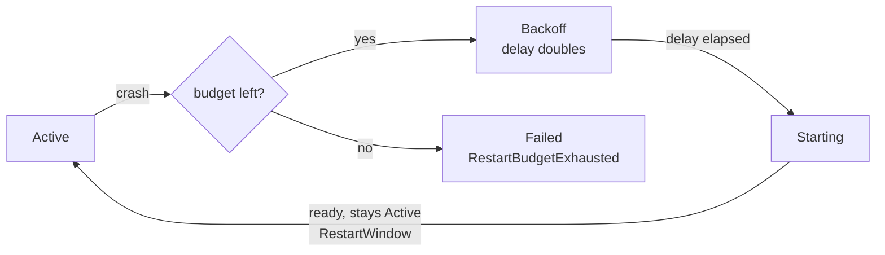

Once a service is [Active](~peios/peinit/the-service-lifecycle), peinit's job becomes *keeping it that way* — or deciding, deliberately, when to stop trying. That decision is governed by a small set of policies: a restart policy with a throttling budget, optional active health checks, an optional watchdog, and an error-control level that decides how serious a final failure is. This page covers all of them.

## Restart policy

When a service fails in a way that *might* be transient, peinit consults `RestartPolicy`:

| Policy | Value | Behaviour |
|---|---|---|
| **Never** | 0 | Never restart. The service goes straight to Failed. |
| **OnFailure** *(default)* | 1 | Restart on a crash or runtime failure. An exit code in `SuccessExitCodes` is *not* a failure and is not restarted. |
| **Always** | 2 | Restart on any failure, *and* — for a Simple service — restart even a successful clean exit (see [clean exits](#clean-exits)). |

Not every failure is restart-eligible. peinit splits causes into three groups:

- **Restart-eligible** — peinit consults the policy and budget: `ProcessCrash`, `WatchdogTimeout`, `HealthCheckFailure`, `ReadinessTimeout`, `PreHookFailure`, `PreExecFailure`, `ParentSetupFailure`. (The startup failures are eligible on purpose — a pre-hook that failed on a momentarily-missing mount deserves another try.)
- **Never restarted** — retrying cannot help: an explicit stop or reset, shutdown, conflict eviction, a broken definition (`ValidationError`, `CycleDetected`, `DependencyFailure`, `AssertionError`), an already-exhausted budget, or an unkillable process.
- **Budget-exempt** — `BindsToRecovery`, where a [bound](~peios/peinit/dependencies) service came back and its dependents are revived. The dependent did not fail on its own, so this restart does not count against its budget.

## The budget and backoff

Restarting an instantly-crashing service in a tight loop is worse than useless, so every restart is throttled by two mechanisms working together.

**Exponential backoff.** Before each restart the service sits in the [Backoff](~peios/peinit/the-service-lifecycle) state for a delay that *doubles* on each consecutive failure, starting from `RestartDelay` (default 1 s) and capped at 60 s. So a crash-looping service backs off 1 s, 2 s, 4 s, 8 s, … up to a minute between attempts.

**The budget.** A consecutive-failure counter tracks how many times the service has failed in a row. Once it reaches `RestartMaxRetries` (default 5), the *next* failure is not restarted: the service transitions to Failed with cause `RestartBudgetExhausted`.

**The reset.** The counter resets to zero once the service stays Active for `RestartWindow` seconds (default 120) without failing. This is the crucial detail: the budget is **not** "N restarts ever" — it is "N restarts faster than the service can sustain `RestartWindow` of health." A service that crashes once a day and recovers cleanly each time never exhausts its budget, because every crash starts from a counter of zero. Only failures recurring faster than the service can stay healthy accumulate.



> [!TIP]
> If a service flaps — restarting endlessly without ever sticking — and never hits its budget, the usual cause is that it briefly reaches Active each time and resets the counter. Either it is recovering long enough to reset (raise `RestartWindow`) or you are looking at a [health-check flap](#health-checks), which has its own guardrail below.

### Clean exits

For a **Simple** service, exiting with code 0 (or a `SuccessExitCodes` match) is *success*, not a crash — a daemon chose to quit. What peinit does next depends on the policy:

- Under `Never` or `OnFailure`, the cause is `CleanExit` and the service goes straight to **Inactive**, with no restart-policy consultation at all.
- Under `Always`, the cause is `CleanExitRestart` and the service is restarted — but through the *same* backoff and budget as a failure, so a daemon that exits cleanly in a tight loop cannot bypass throttling. Logs and status make clear it exited successfully and was restarted only because the policy is Always.

(A **Oneshot** clean exit is never restart-eligible regardless of policy — see [service types](~peios/peinit/service-types).)

## Health checks

A live process is not always a working one — it can lose its database connection, wedge in a bad state, or return errors while still "up." An active **health check** closes that gap by running a command periodically and treating its exit code as a verdict: 0 is healthy, non-zero is a failure.

Health checks apply to **Simple** services only. peinit starts a service's health-check timer once the service becomes Active; a [Oneshot](~peios/peinit/service-types) has no long-running process to probe, so it never has one. `HealthCheck` and its companion fields are inert on a Oneshot — no timer is started — so don't set them there expecting supervision.

| Field | Default | Controls |
|---|---|---|
| `HealthCheck` | — | The command to run (runs under the service's own [token](~peios/peinit/identity-and-privileges)). |
| `HealthCheckInterval` | 30 | Seconds between runs. |
| `HealthCheckTimeout` | 5 | Seconds before a check is killed and counted as failed. |
| `HealthCheckRetries` | 3 | Consecutive failures before the service is declared unhealthy. |

`HealthCheckRetries` consecutive failures mark the service unhealthy and restart it through the normal restart policy — backoff and budget included. A single success resets the failure count. If a check is still running when the next interval fires, the new one is skipped rather than stacked.

The `health` field in a `status` response reflects this: `healthy`, `unhealthy` (failing but not yet failed out), `unknown` (configured, no result yet), or `null` (no health check).

**The flap guardrail.** Health-check throttling only works if a failure cycle is shorter than the restart window — otherwise the counter resets between failures and the service restarts forever. peinit enforces this at validation time as a hard rule:

```
HealthCheckRetries × HealthCheckInterval < RestartWindow
```

A definition that violates it is a **validation error**, not a warning — the service is marked Failed with `ValidationError` rather than allowed to restart indefinitely.

> [!CAUTION]
> Be extremely cautious with health checks on `ErrorControl=Critical` services. A false-positive health-check failure on a Critical service will, after exhausting the restart budget, **reboot the machine** — and a flaky check can do this repeatedly. Critical platform services are better served by a passive [watchdog](#the-watchdog) with a generous timeout: the service itself knows whether it is healthy and simply stops sending keepalives if not. peinit applies the same health-check semantics to Critical services as to any other — there is no special-casing to save you.

A health check stuck in D-state is handled like any other stuck helper: its sub-cgroup is leaked and surfaced as a warning, but — unlike a stuck *main* process — it does **not** push the service to Abandoned. A health check holds no service resources; it is only a probe.

## The watchdog

The watchdog inverts the health check: instead of peinit asking the service if it is alive, the service must periodically tell peinit. Set `WatchdogTimeout` (seconds; 0 disables) and the service must send `WATCHDOG=1` via [sd_notify](~peios/peinit/output-and-logging) at least that often. Miss the deadline and peinit treats it as a failure (cause `WatchdogTimeout`) and applies the restart policy.

Like health checks, the watchdog is a **Simple**-only supervision mechanism. peinit arms the watchdog timer only once a Simple service becomes Active; on a [Oneshot](~peios/peinit/service-types) `WatchdogTimeout` is inert — no timer is started, and setting it changes nothing.

A service can adjust its own watchdog at runtime by sending `WATCHDOG_USEC=<microseconds>`: a positive value re-arms the timer with the new interval immediately; `0` disables the watchdog. This is for services whose phases have different latencies — a database might run a tight 5 s watchdog normally but widen it to 60 s during a compaction pass, because it knows its own phases better than the schema author did. The runtime value does **not** persist: a restart reverts to the schema's `WatchdogTimeout`.

## Timeout extension

A service that does genuinely slow work during a transition can ask for more time by sending `EXTEND_TIMEOUT_USEC=<microseconds>` while it is Starting, Stopping, or Reloading. Each message *replaces* the current phase deadline (it is not additive); a service that keeps sending them keeps proving it is making progress, and if it stops, the last deadline fires and peinit escalates normally.

The extension is capped to prevent a buggy service from extending forever:

| Phase | Base timeout | Maximum deadline |
|---|---|---|
| Starting | `StartTimeout` | `StartTimeout` × 4 |
| Stopping | `StopTimeout` | `StopTimeout` × 4 |
| Reloading | `StartTimeout` | `StartTimeout` × 4 |

During [shutdown](~peios/peinit/shutdown) a second, global cap also applies — the deadline can never exceed the remaining time in the global shutdown timeout, and the stricter of the two caps wins. A message received outside a transition (the service is Active, Failed, …) is ignored — there is no timeout to extend.

## OnFailure

When a service enters **Failed**, an `OnFailure` field names another service to start in response — a fallback for *graceful degradation* (the main web UI failed; bring up a minimal emergency endpoint). It is not a monitoring or alerting hook; that is [eventd](~peios/auditing/overview)'s job.

`OnFailure` fires for runtime failures — `ProcessCrash`, `WatchdogTimeout`, `HealthCheckFailure`, the startup-failure causes, and non-Critical budget exhaustion. It deliberately does **not** fire for:

- **`ShutdownWave`** — nothing new starts during shutdown.
- **`ValidationError`, `CycleDetected`, `DependencyFailure`, `AssertionError`** — these are definition or graph breakage, not a running service degrading. The fallback would likely sit in the same broken graph anyway.

Because a fallback can itself fail and carry its own `OnFailure`, peinit bounds the chain: it tracks which services it has already started for one originating failure, refuses to start one twice, and never follows the chain beyond a depth of 16. When the guard trips, it logs the loop and stops.

## ErrorControl: when failure is not an option

`ErrorControl` decides how serious an *irrecoverable* failure is:

| Level | Value | On irrecoverable failure |
|---|---|---|
| **Normal** *(default)* | 0 | The service stays in Failed. The rest of the system carries on. |
| **Critical** | 1 | peinit **syncs filesystems and reboots immediately.** |

A Critical service is one the system genuinely cannot run without — the platform daemons `registryd`, `authd`, `lpsd`, `eventd` are all Critical. "Irrecoverable" means the restart budget was exhausted: peinit tried, backed off, retried up to `RestartMaxRetries`, and the service still would not stay healthy. At that point the fastest path to a known-good system is a reboot.

A few consequences worth holding onto:

- **Critical failure outranks `OnFailure`.** When a Critical service exhausts its budget, peinit reboots; it does *not* start the `OnFailure` handler.
- **`ErrorControl=Critical` implies `SafeMode`.** A Critical service is always eligible to start in [Safe mode](~peios/peinit/boot-and-boot-modes).
- **Critical services are OOM-protected.** peinit sets their `oom_score_adj` to `-1000`, so the kernel will not pick them as out-of-memory victims.
- **A runtime Critical crash does not enter Safe mode** — it follows the reboot path. Safe mode is only for boot-time *configuration* errors (a cycle or conflict involving a Critical service). The escalation between reboots, the boot-attempt counter, and Recovery mode are covered in [Boot and boot modes](~peios/peinit/boot-and-boot-modes).

> [!WARNING]
> A Critical service that fails the same way on every boot becomes a **reboot loop**, which the boot-attempt counter is designed to break by escalating to Recovery mode after a few attempts. If you see a machine rebooting repeatedly, a crashing Critical service is the first suspect. See [Troubleshooting peinit](~peios/peinit/troubleshooting).

## Where to start

To see exactly which states these policies move a service through, read [The service lifecycle](~peios/peinit/the-service-lifecycle).

To understand how a failed service propagates to the ones that depend on it, read [Dependencies and ordering](~peios/peinit/dependencies).

When a service will not stay up, work backward from the symptom in [Troubleshooting peinit](~peios/peinit/troubleshooting).
