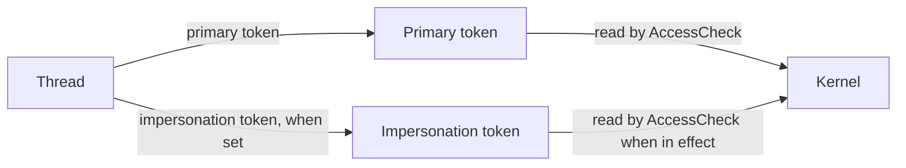

A **token** is the runtime carrier of identity in Peios. It is a reference-counted kernel object that holds a user SID, group SIDs, privileges, confinement capabilities, and a handful of other policy fields. Every thread on the system has exactly one effective token at any moment, and every access decision starts by reading that token.

If [Identity](~peios/identity/overview) describes who a principal is, the token is the concrete thing that says "this thread is acting as that principal, right now". You will see tokens come up constantly in these docs because they are the input to AccessCheck for files, registry keys, processes, sockets, and the tokens themselves.

## What a token contains

A token is a structured object with around twenty fields. The full field list is covered in [Token fields and types](~peios/tokens/token-types); this section sketches the shape so you have a mental model going into the rest of the topic.

| Group | Fields | What they do |
|---|---|---|
| **Identity** | `user_sid`, `groups`, `logon_sid`, `restricted_sids` | Who the token represents. |
| **Type and level** | `token_type`, `impersonation_level`, `integrity_level`, `mandatory_policy` | What kind of token this is and how it may be used. |
| **Defaults** | `owner_sid_index`, `primary_group_index`, `default_dacl` | What the token contributes when new objects are created without an explicit security descriptor. |
| **Session and provenance** | `auth_id`, `source`, `token_id`, `created_at`, `expiration`, `origin` | Where the token came from and which authentication event it belongs to. |
| **Privileges** | privilege bitmask (present / enabled / used / removed states) | System-wide rights the token holds. |
| **Confinement** | `confinement_sid`, `confinement_capabilities`, `confinement_exempt` | Sandboxing constraints, when the token is for a confined application. |
| **Claims** | `user_claims`, `device_claims`, `device_groups` | Typed attributes for conditional ACE evaluation. |
| **Projection** | `projected_uid`, `projected_gid`, `projected_supplementary_gids` | Linux-compatibility identity numbers, derived from the rest of the token. |
| **Audit policy** | `audit_policy` bitmask | Per-token forced auditing flags. |
| **Self SD** | `security_descriptor` | The token is itself an object — this is its own SD, governing who can read or adjust it. |

Most fields are set once when the token is minted and never change. A few — the enabled state of privileges, the enabled state of groups, the default DACL — are adjustable at runtime within strict rules. None of the identity fields (the SIDs themselves) ever change. See [Field mutability](~peios/tokens/token-types) for the exact rules.

## Tokens and threads

Every thread has a **primary token** — its baseline identity, inherited at fork and shared with every other thread in the process. While the thread is running normally, the primary token is what AccessCheck reads.

A thread may also temporarily install an **impersonation token** — a second token that overrides the primary for that one thread until it is reverted. Services use impersonation to act on behalf of a client they are handling: accept the connection, impersonate the client, do the work as them, revert. The primary token survives unchanged; only the one thread sees the impersonated identity, and only until it reverts.

Impersonation has its own topic: [Impersonation](~peios/impersonation/overview). For this page it is enough to know that a thread can have two tokens at once, and the kernel reads whichever is "in effect" right now.

## Where a token comes from

A token is always minted by code holding `SeCreateTokenPrivilege`. In a running system that effectively means **authd** — the authentication daemon — which creates tokens after verifying credentials, and **peinit**, which mints service tokens during boot before authd is up.

The minting flow is straightforward:

1. Authentication succeeds, or a service is being launched.
2. The minting component resolves the principal's group memberships, privileges, claims, and other policy from the directory.
3. It calls `kacs_create_token` with the resolved values.
4. The kernel returns a token file descriptor with `TOKEN_ALL_ACCESS`.
5. The minting component installs the token on the target process (the new login session's first process, or the service binary) and closes the fd.

From that point on the token lives in the kernel, referenced by every thread of every process that inherits it. The original fd is gone; the only handle into the token is through the threads carrying it (and any other process that opens it via `/proc/<pid>/token` or `kacs_open_process_token`).

No other component creates tokens. There is no API for an ordinary process to fabricate an identity for itself. A process can ask the kernel to **duplicate** a token it already has, or **filter** one to a more restricted version, but the original always comes from authd or peinit. This is deliberate: it is what makes the kernel's "where did this identity come from?" question always answerable.

## Tokens are objects too

A token is itself one of the objects KACS protects. It has a security descriptor of its own, and operations on it (querying, adjusting, impersonating, duplicating, installing) all go through AccessCheck against that SD.

| Right | Action it gates |
|---|---|
| `TOKEN_QUERY` | Read token information — fields, groups, privileges, etc. |
| `TOKEN_DUPLICATE` | Create an independent copy via DuplicateToken or FilterToken. |
| `TOKEN_IMPERSONATE` | Install as a thread's impersonation token. |
| `TOKEN_ASSIGN_PRIMARY` | Install as a process's primary token. |
| `TOKEN_ADJUST_PRIVILEGES` | Enable, disable, or permanently remove privileges. |
| `TOKEN_ADJUST_GROUPS` | Enable or disable groups. |
| `TOKEN_ADJUST_DEFAULT` | Change the default DACL, owner index, or primary group index. |
| `TOKEN_ADJUST_SESSIONID` | Change `interactive_session_id` (additionally requires `SeTcbPrivilege`). |

By default, a freshly minted token grants the SYSTEM identity and the creating principal full access, and grants the token's own user identity `TOKEN_QUERY` and the adjustment rights. The exact default SD is in [Token lifecycle](~peios/tokens/lifecycle).

This self-protection is what stops one thread from "stealing" another's identity. Even reading the fields of another process's token requires the `PROCESS_QUERY_INFORMATION` right on the target process *and* the relevant token rights on the token itself.

## The two token rules to remember

Almost every confusion about tokens reduces to one of two rules.

**Rule 1: A thread always has a token.** There is no "no identity" state. A thread that has not been given a more specific token is running on whichever token its process inherited — at the very least, the SYSTEM token from boot. Code that runs before authd is up runs as SYSTEM, which has every privilege. Code that runs after authd is up runs as whichever identity authd assigned. There is no third option.

**Rule 2: Identity is the token, not the process.** A process does not "have an identity" except through the tokens of its threads. Two threads in the same process can be running as different principals at the same instant, because one is impersonating and the other is not. When you debug an "access denied" question, the answer is in the *thread*'s token, not the process's notional identity.

## Where to start

If you want to understand the token field-by-field — what each value means, when it can change, how it is encoded — read [Token fields and types](~peios/tokens/token-types).

If you want to know how a token moves through fork, exec, adjustment, and destruction, read [Token lifecycle](~peios/tokens/lifecycle).

If you are interested in the restricted-token model — the sandbox primitive where a token is intersected with a secondary identity list — read [Restricted and write-restricted tokens](~peios/tokens/restricted-tokens).

If you need to understand UAC-style elevation — the linked Full/Limited token pair that lets one principal have two tokens for the same session — read [Elevation and linked tokens](~peios/tokens/elevation).
