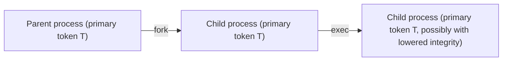

A token is reference-counted. It comes into existence when a privileged component mints it, is reference-counted up and down as it gets attached to processes and threads, and is destroyed when the last reference drops. Between mint and destruction it moves through a handful of well-defined transitions. None of them change a token's identity — but each affects how the token is reached, how many references it has, or how its mutable fields are set.

## Three ways to mint a token

A token is always created by code holding the right privilege:

| Operation | Effect | Privilege required |
|---|---|---|
| **`kacs_create_token`** | Mint a token from scratch using a wire-format specification. | `SeCreateTokenPrivilege` |
| **DuplicateToken** | Make an independent copy of an existing token. The copy is a new object; modifying it does not affect the source. | `TOKEN_DUPLICATE` on the source |
| **FilterToken** | Make a copy of an existing token with privileges removed, groups marked deny-only, or restricted SIDs added. | `TOKEN_DUPLICATE` on the source |

`kacs_create_token` is what authd and peinit use to mint genuinely new identities. The other two — DuplicateToken and FilterToken — produce copies derived from a token a process already has. A process can FilterToken its own primary token down to a more restricted version and install the result as the primary token of a child it is about to launch.

In all three cases the kernel:

1. Validates the inputs (well-formed SIDs, no duplicate luids, all index references in range, etc.).
2. Allocates a new token object with `refcount = 1`.
3. Assigns a fresh `token_id` LUID and `modified_id = 0`.
4. Stamps the `created_at` timestamp.
5. Injects the appropriate logon SID into the groups list (callers MUST NOT supply it).
6. Returns a token file descriptor with `TOKEN_ALL_ACCESS` (for create) or the access mask the caller asked for (for duplicate).

Any validation failure results in no token being created — the operation is all-or-nothing.

## Attaching to a process

A token by itself is just an object the kernel holds. It does not yet identify anyone. To take effect, it has to be **attached** to a process or thread.

There are three attachment paths:

- **Inheritance at fork** — the child's primary token is the parent's primary token. The token's reference count goes up by one.
- **Installation by a privileged caller** — `KACS_IOC_INSTALL` on a token fd makes the token the calling process's primary. Requires `TOKEN_ASSIGN_PRIMARY` on the token and `SeAssignPrimaryTokenPrivilege` on the caller. Used by peinit when launching a service: fork, install the service token on the child, exec the binary.
- **Impersonation on a thread** — `KACS_IOC_IMPERSONATE` on a token fd makes the token the calling thread's impersonation token. Requires `TOKEN_IMPERSONATE`. Process-wide primary token is unchanged.

A given token can be attached in all three ways at once: shared as the primary of N processes, also held as the impersonation token of M threads. Each attachment is a reference.

## Fork, exec, and the primary token

**Fork** copies the parent's primary token pointer into the child. Both processes now share the same token object. Adjustments made by the parent are visible to the child instantly — they share the storage. Adjustments made by either process via `AdjustPrivileges` etc. affect the shared token.

What does *not* survive fork is the parent's impersonation. A thread that forks while impersonating gets a child whose primary token is the parent's primary (not the impersonation). The child is not impersonating; its first thread is running on the inherited primary.

**Thread clone** (`CLONE_THREAD`) is different: the new thread is part of the same process, so it shares the same primary token. Privilege or group adjustments made by any thread are visible to all of them immediately.

**Exec** keeps the primary token. The new binary runs as the same identity. One subtle exception: if the token's `mandatory_policy` has `NEW_PROCESS_MIN` set and the executable carries a lower integrity label than the token, the kernel creates a copy of the token with integrity lowered to match, replaces the primary with that copy, and drops the original reference. This is the mechanism that prevents Medium-integrity code from running at Medium when its image is labelled Low.

Impersonation is **always reverted at exec**. A thread that execs while impersonating has its impersonation token released before the new program runs. This is enforced — the new binary cannot inherit an impersonation it did not establish.

## Impersonation install and revert

A thread becomes an impersonator by installing an impersonation token. The two ways to do it:

- **`kacs_impersonate_peer(fd)`** — extract the peer's identity from a connected Unix socket and install it at the appropriate level. The most common path for services accepting client connections.
- **`KACS_IOC_IMPERSONATE`** on a token fd — install a specific token (for transports that do not carry a peer token, or when the server has obtained a token by some other means).

Either operation has the same effect: the thread now has a primary token (unchanged) and an impersonation token (newly installed). AccessCheck reads the impersonation token from this point.

A thread reverts with **`kacs_revert`**. Always succeeds. Drops the impersonation reference and restores the original primary as the effective identity.

If a thread that is already impersonating installs a different impersonation token, the kernel silently reverts the old one first and then installs the new one. There is no nesting.

Impersonation tokens come from one of three sources during the install:

- A peer's identity captured at socket connect time.
- A duplicate of an existing token (DuplicateToken to a token type of Impersonation with the desired level).
- A new mint from authd (rare).

The level on an impersonation token is set by the **client** at connect time, never raised by the server. The full two-gate model — identity gate plus integrity ceiling — is in [Impersonation](~peios/impersonation/overview).

## Adjustment in place

Some fields can be changed at runtime. The operations are:

| Syscall / ioctl | What it changes |
|---|---|
| **AdjustPrivileges** | Enable, disable, or permanently remove privileges. Reset-all sentinel restores defaults. |
| **AdjustGroups** | Enable or disable group entries. Cannot target mandatory groups, deny-only groups, the logon SID, or the user SID. |
| **AdjustDefault** | Modify default DACL, owner index, primary group index. |
| **`kacs_set_sd`** on the token fd | Modify the token's own self-SD. Requires `WRITE_DAC` on the token. |

All adjustments are atomic — invalid input rolls the whole operation back, no partial change. Each successful adjustment bumps `modified_id` so caches keyed on token state can invalidate.

Because the token storage is shared across all threads of a process, an adjustment made by one thread is visible to all of them immediately. This includes adjustments to the primary token of a process that has just installed it but not yet had every thread converge — the kernel handles the convergence asynchronously, and during the brief window other threads may still see the old token. This window is small enough not to matter in practice but is worth knowing about if you are writing tests.

### Permanent privilege removal

When a privilege is **removed** rather than just disabled, it is gone from the token permanently. The token's privilege bitmask loses the present and enabled-by-default bits. The `used` bit stays — its purpose is auditing, and the fact that the privilege was *once* exercised is information that should not disappear.

Removal is irreversible by design. There is no API to re-add a removed privilege. The only way back is a different token (a fresh authentication, or a duplicate from a source that still has the privilege).

The same applies to `SE_GROUP_USE_FOR_DENY_ONLY` set on a group: it can be marked, but never cleared. Marking a group deny-only is a one-way trip down the access ladder.

## The default DACL

Every token carries a **default DACL**. It is the DACL that gets applied to a new object when:

- The creator (a `kacs_open` with `CREATE` disposition, say, or a registry-key create) does not supply an explicit SD.
- The object's parent has no inheritable ACEs that fully cover it.

In other words, the default DACL is the fallback. It guarantees that any object a token creates has at least *some* DACL, even when nothing else has spoken up.

The default DACL is adjustable via `AdjustDefault`. A typical default DACL grants the token's user identity and SYSTEM full access and excludes everyone else. Services that want a more permissive or more restrictive default can change it once at startup.

The default owner and primary group also live on the token, as indices into the `[user_sid, groups[0..N-1]]` array. They tell the kernel which SID to stamp as `owner` and which to stamp as `primary_group` when synthesising a new SD. Adjustable through the same call.

## Reference counts and destruction

Every attachment is a reference. A token is alive as long as any of these are true:

- Any process has it as a primary token.
- Any thread has it as an impersonation token.
- Any process has it open via a token fd.
- It is part of an established linked pair on a still-existing logon session.

When the last reference drops, the kernel destroys the token: frees the storage, releases the reference on the logon session. If the destroyed token's session loses its last token reference too, the session itself is destroyed and a `logon-session-destroyed` event is emitted via KMES. See [Logon sessions](~peios/logon-sessions/overview).

A token's `expiration` field has no effect on the lifecycle in v0.20 — it is stored for future use but not enforced. A token lives until its references drop, period. Session revocation, when needed, is implemented by userspace (authd) walking `/proc/*/token`, identifying tokens with the offending `auth_id`, and killing the holding processes. This is documented under [Inspecting tokens, sessions, and processes](~peios/inspecting/overview).

## Quick reference: which transitions change what

| Transition | Identity | Privileges | Groups | Integrity | Refcount |
|---|---|---|---|---|---|
| Fork | Same | Same | Same | Same | +1 (shared) |
| CLONE_THREAD | Same | Same | Same | Same | Same object |
| Exec (same integrity) | Same | Same | Same | Same | Same object |
| Exec (NEW_PROCESS_MIN downgrade) | Same | Same | Same | Lowered | New token |
| Impersonation install | Different (impersonation token) | Different | Different | Different | +1 on impersonation token |
| Impersonation revert | Back to primary | Back to primary | Back to primary | Back to primary | −1 on impersonation token |
| DuplicateToken | Same | Same | Same | Same | New token with its own count |
| FilterToken | Same | Subset | Subset (some deny-only, restricted_sids added) | Same | New token |
| AdjustPrivileges | Same | Changed (within rules) | Same | Same | Same object |
| AdjustGroups | Same | Same | Changed (within rules) | Same | Same object |
| KACS_IOC_INSTALL | Same token, different process | — | — | — | New attachment |
| Process exit | — | — | — | — | −1 |
