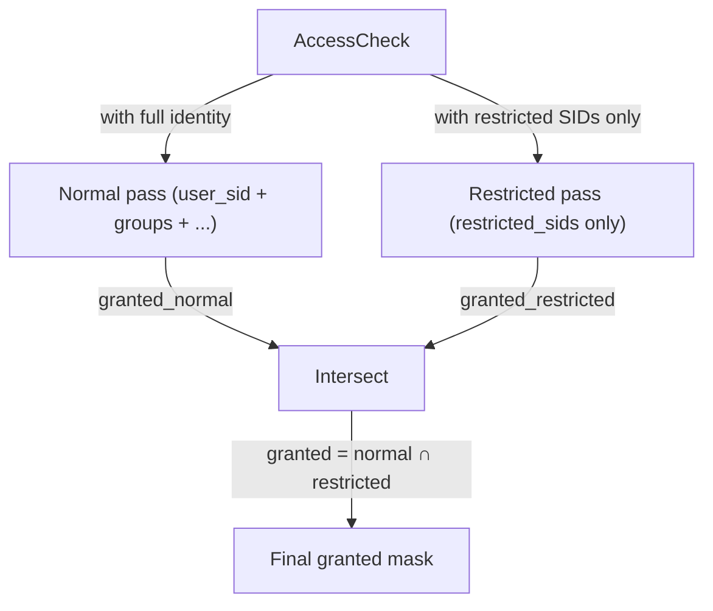

A **restricted token** is the kernel's narrow-the-identity primitive. It is a normal token with an extra list of SIDs attached — the `restricted_sids` list. During AccessCheck the kernel runs the DACL walk twice: once with the token's full identity, once with only the restricted SIDs. A bit is granted only if both passes grant it.

The effect is to put a ceiling on what the token can reach, expressed as "the rights this token would have if it were *just* those restricted SIDs". The identity (user, groups, privileges) is unchanged — but the kernel will only honour an ACE if the restricted-only view of the token would have honoured it independently.

Restricted tokens are the building block underneath several patterns: service hardening, sandbox processes, anti-malware quarantine, anything that says "this code should have less authority than the user it is running as".

## The two-pass model

When KACS evaluates AccessCheck for a restricted token, it runs through the same pipeline twice:

1. **Normal pass.** The DACL walk uses the token's `user_sid`, all enabled groups, and all the usual rules. Produces a `granted_normal` mask.
2. **Restricted pass.** The DACL walk runs again, but the only SIDs considered for matching are those in `restricted_sids`. The `user_sid` does not match. None of the regular `groups` match. Only the entries in `restricted_sids` count. Produces a `granted_restricted` mask.
3. **Intersection.** The final granted mask is `granted_normal & granted_restricted`.

Both passes must agree to grant a right. If the normal pass would grant `FILE_WRITE_DATA` but the restricted SIDs do not appear in any allow ACE for that right, the bit is dropped.

The restricted SIDs are usually narrow on purpose. A common pattern is to put a single capability SID (`internetClient`, say) in the restricted list — the token now has authority only on objects whose DACLs explicitly grant access to that capability.

## What is not affected

A few things are explicitly **not** narrowed by the restricted pass:

- **Privileges.** Privilege-granted access (SeBackup, SeRestore, SeTakeOwnership, SeSecurity) is restored after the intersection. A restricted token with SeBackup can still read any file the privilege would have granted.
- **The default DACL on new objects.** A restricted token still creates new objects with its default DACL, derived from its full identity.
- **Reading the token's own state.** Querying a restricted token does not require both passes; the token's self-SD governs that as normal.
- **MIC.** Mandatory integrity is evaluated before the DACL walks. A restricted token cannot use the restricted-SID trick to escape integrity rules.

Privileges being orthogonal to the restricted pass is the most important of these. The restricted-token model narrows identity-based access, not capability-based access. If you want to drop privileges too, that is a separate operation — see "Creation" below.

## Write-restricted: the common case

A **write-restricted** token narrows only the write-category rights. Reads and execute come from the normal pass alone; only write-mapped bits go through the intersection.

The motivation: it is rare to want a sandbox that cannot *read* anything in the normal world. Sandboxed code usually needs to load shared libraries, read configuration, perhaps look up its own metadata. What it must not do is *write* — into the user's home directory, into system paths, into any file outside the small set the sandbox explicitly allows.

In a write-restricted token:

| Right category | Where it comes from |
|---|---|
| Read (FILE_READ_DATA, FILE_LIST_DIRECTORY, etc.) | Normal pass only. |
| Execute (FILE_EXECUTE, FILE_TRAVERSE) | Normal pass only. |
| Write (FILE_WRITE_DATA, FILE_APPEND_DATA, WRITE_DAC, etc.) | Intersection of both passes. |

The "category" is determined by which generic right the bit maps to. `FILE_WRITE_EA` is in the write category; `FILE_READ_EA` is in the read category; and so on. The generic mapping for each object type defines the partition.

There is a quirk worth noting. When a token is write-restricted, the kernel also sets a `user_deny_only` flag on the token internally. This causes the token's own `user_sid` to match **only deny ACEs** in any pass, never allow ACEs. The motivation is to prevent a token from getting write access on an object simply because its user SID matches an allow ACE — the write-restricted intersection would otherwise be too easy to bypass by writing an ACE that names the user directly. With `user_deny_only` set, the user SID can still trigger denials but cannot grant.

This is a subtle interaction; most code that uses write-restricted tokens does not need to think about it, but if you are debugging an access denial on a write-restricted token and the user appears in the DACL with an allow ACE, the explanation is here.

## Creation

There is one path to creating a restricted token: **`KACS_IOC_RESTRICT`** on a token fd. The operation takes:

- A list of privilege LUIDs to remove from the new token.
- A list of group indices to mark `SE_GROUP_USE_FOR_DENY_ONLY` in the new token (set once, irreversible).
- A list of restricting SIDs to put in the new token's `restricted_sids`.
- An optional flag enabling write-restricted mode (which also sets `user_deny_only`).

The result is a new token fd. The source token is unchanged.

A typical sandbox launcher does something like this:

1. Open its own primary token.
2. Call `KACS_IOC_RESTRICT` to produce a restricted variant: remove every privilege except `SeChangeNotifyPrivilege`, mark unsafe groups deny-only, add the sandbox's allowed capability SIDs as the restricted SIDs, set the write-restricted flag.
3. Fork.
4. `KACS_IOC_INSTALL` the restricted token on the child.
5. Exec the sandboxed binary.

The child now runs as the same user, but the user's group memberships are mostly invisible, the privileges are gone, and writes are confined to objects whose DACLs explicitly allow the sandbox's restricted SIDs.

## Restricted tokens vs confinement

Two things in Peios narrow what a token can reach: the restricted-token model on this page, and **confinement** (covered in [Confinement](~peios/confinement/overview)). They look similar at a glance, but they exist for different audiences.

**Restricted tokens are a tool for code.** A program — a service, a sandbox launcher, an anti-malware engine — uses FilterToken or `KACS_IOC_RESTRICT` to narrow a token it already has, then runs sensitive work on the result. The decision is made in code, by the program itself, before it hands the restricted token to the constrained operation. Nothing outside the program needs to know about it, and nothing outside the program enforces it — the program is choosing to give itself less authority.

**Confinement is a tool for policy.** A sysadmin — or a service definition the sysadmin has chosen to deploy — declares that some component runs as a confined application with a specific confinement SID and an enumerated set of capabilities. The kernel enforces that policy whether or not the confined code is aware of it. Confinement is an administrative decision applied from outside the program, and the program cannot opt out of it.

That difference in audience is the *why* behind the technical differences:

| | Restricted | Confinement |
|---|---|---|
| Who decides | The program itself, in code | Administrative policy, applied from outside |
| Typical caller | A sandbox launcher, a hardened service, an anti-malware engine | A service manager applying a service definition; a container runtime |
| Storage on the token | `restricted_sids` list | `confinement_sid` + `confinement_capabilities` |
| Where it fires in AccessCheck | Inside the DACL walk, identity-based intersection | After the DACL walk and privileges, absolute intersection |
| Bypassable with a privilege? | Yes — privilege-granted bits survive | **No** — confinement is absolute |
| Owner implicit rights still apply? | Yes | **No** |
| Write-only variant available? | Yes (write-restricted) | No |

The technical asymmetry follows from the audience. A program restricting *itself* is trusting itself to use the primitive correctly — it can drop privileges if it wants to, leave them in if it doesn't, choose what its restricted SID set should be. Confinement is enforced *against* the code, so it has to be a harder line: privilege exercise and owner implicit rights are exactly the kinds of escape routes a confined application would otherwise reach for.

The two can be combined. A service that runs under a confinement policy and additionally restricts its own internal worker threads sets both. The kernel applies each layer; the final granted mask is the intersection of all of them.

## Practical patterns

A few patterns worth recognising:

- **Drop privileges only.** Sometimes you want to remove dangerous privileges without restricting identity at all. `KACS_IOC_RESTRICT` with a privilege removal list, an empty deny-only list, and an empty restricted_sids list does this — the result is a token with reduced privileges and no restricted-SID intersection.
- **Write-restricted with the deny-only user trick.** Set the write-restricted flag, leave `restricted_sids` containing only what you want the sandbox to be able to write to. The token's user SID can still match deny ACEs (so user-targeted denials still work) but cannot match allow ACEs on writes.
- **Capability-style sandbox.** Put one or more capability SIDs (well-known or derived) in `restricted_sids`. The sandbox can then reach only objects whose DACLs explicitly grant access to those capabilities, plus whatever its user identity grants in the normal pass.
- **Anti-malware quarantine.** Restrict to a narrow set of well-known SIDs (Everyone, Authenticated Users) and remove all privileges. The result is a token that can reach widely-shared resources but cannot exercise any system-level rights.

All of these are FilterToken / KACS_IOC_RESTRICT applied to the appropriate source token, with different inputs. The kernel does not distinguish between them; they are just patterns of use.
