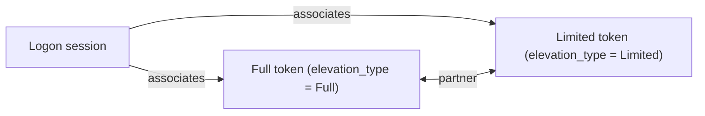

A **linked token pair** is two tokens for the same principal, one elevated (Full) and one not (Limited), associated with each other through their shared logon session. The point of the pair is to give a user a default identity that is *not* fully privileged, while keeping a second identity available for explicit elevation when the user actually wants to do administrative work.

If you have used UAC on a Windows desktop, this is the same model. The Limited token is what runs the user's shell and most of their software. The Full token is what runs the action they have just been prompted to authorise. The kernel does not decide when to switch — that is a user-space decision, prompted by some authority broker — but the kernel is responsible for keeping the pair linked, locating the partner on demand, and enforcing the rules around who is allowed to see what.

## The model



Both tokens share the same logon session (`auth_id`). They have the same user SID, the same logon SID, the same `created_at`. What differs:

- The Full token has whatever privileges and group memberships the principal is entitled to when running elevated — typically including BUILTIN\Administrators, SeBackup, SeRestore, etc.
- The Limited token is a filtered version — privileges removed, sensitive groups marked `USE_FOR_DENY_ONLY`. It is the version the user runs in by default.

Each carries an `elevation_type`:

| Value | Meaning |
|---|---|
| **Default** | Token is not part of a linked pair. The vast majority of tokens. |
| **Full** | The elevated half of a pair. |
| **Limited** | The non-elevated half of a pair. |

A token's elevation_type is set when it joins a pair, never cleared. If the session is destroyed, the pair linkage is removed but the individual elevation_type values stay until the token objects themselves are freed.

## Establishing a pair

A pair is created by an authority broker — almost always authd, occasionally peinit — using:

```
KACS_IOC_LINK_TOKENS(elevated_fd, filtered_fd, session_id)
```

The kernel requires:

- `SeTcbPrivilege` on the caller.
- `TOKEN_DUPLICATE` on both token fds.
- Neither token already linked.
- Both tokens part of the same session (`session_id`).
- The two tokens not the same token.

When the call succeeds, the kernel:

1. Records the pair on the session.
2. Sets the elevated token's `elevation_type = Full`.
3. Sets the filtered token's `elevation_type = Limited`.

Both tokens continue to be valid as independent tokens. The pair linkage is additional state on the session, not a property that bundles the two into one object.

A typical flow during user login:

1. authd authenticates the user.
2. authd creates the user's session.
3. authd mints the Full token with all the user's entitled privileges and groups.
4. authd FilterTokens the Full token down to the Limited version — privileges removed, admin groups deny-only.
5. authd calls `KACS_IOC_LINK_TOKENS` to link the two.
6. authd installs the Limited token as the primary of the user's first process.
7. The Full token is kept available (via session state or an authority broker process) for later elevation requests.

The user's shell, file manager, web browser, and most of their applications now run on the Limited token. Whenever the user does something administrative, the authority broker — after whatever consent step is appropriate — fetches the Full token via `KACS_IOC_GET_LINKED_TOKEN` and installs it on the new process.

## Looking up the partner

```
KACS_IOC_GET_LINKED_TOKEN(token_fd) -> partner_fd
```

Given a token that is part of a pair, this ioctl returns a handle to the partner. The semantics depend on who is asking:

- **With `SeTcbPrivilege`**, the caller gets a full handle on the partner token — `TOKEN_ALL_ACCESS`, the actual token object. This is what authority brokers use to perform an elevation: fetch the Full token's fd, install it on a child process.
- **Without `SeTcbPrivilege`**, the caller gets a *degraded* handle — a freshly duplicated Identification-level clone of the partner, opened only with `TOKEN_QUERY`. The clone is enough to inspect the partner's identity ("am I currently the Limited token? what would the Full version contain?") but cannot be used for any access check and cannot be installed.

The asymmetry is deliberate. Anyone who can prove they hold one half of a pair is allowed to learn something about the other half — that is useful for diagnostics and for user-facing tools that want to display "you are running as Limited; admin rights are available". But actually wielding the elevated identity requires `SeTcbPrivilege`, the privilege held only by the authority broker that is supposed to gate elevation.

`KACS_IOC_GET_LINKED_TOKEN` fails with `-ENOENT` on a token whose `elevation_type` is `Default`, or on a token whose pair was destroyed when its session was destroyed.

## What the link does *not* do

A few clarifications on what linkage does not change:

- **It does not unify the two tokens.** They remain independent objects. Adjustments to one have no effect on the other. Destroying one does not destroy the other.
- **It does not change access decisions.** AccessCheck reads whichever token is currently in effect on the thread. The fact that a token has a partner is invisible to the access check — only the broker that calls `KACS_IOC_GET_LINKED_TOKEN` sees the pair.
- **It does not require either token to be installed.** A pair can exist on a session that has not yet attached either of its tokens to any process. (Unusual but valid.)
- **It does not change `auth_id`.** Both tokens still report the same session ID. The session is the level at which they are paired.

## Teardown

A pair is dissolved when the underlying logon session is destroyed. At that point:

- The pair association is removed from the session.
- Subsequent calls to `KACS_IOC_GET_LINKED_TOKEN` on either token return `-ENOENT`.
- The individual tokens themselves continue to exist as long as their reference counts hold. Their `elevation_type` values are unchanged but no longer meaningful.

A session is destroyed when its last token reference drops (see [Logon sessions](~peios/logon-sessions/overview)). For a linked pair, that means: both tokens must lose all their attachments — every process running on them must exit, every fd open on them must be closed, every impersonation token derived from them must be reverted.

For the Limited token this happens naturally when the user logs out. For the Full token, the authority broker is responsible for releasing it when the session ends — typically by holding it in a process that exits when the user logs out.

## Common patterns

**Default-Limited login.** Every interactive login establishes a pair where the user's shell runs as Limited. The Full token is held by the authority broker.

**Elevation on demand.** When the user invokes an administrative action (a control panel, a `sudo`-equivalent), the broker prompts for consent, then uses `KACS_IOC_GET_LINKED_TOKEN` to fetch the Full token and `KACS_IOC_INSTALL` to install it on the privileged child process.

**Service accounts (no pair).** Services do not generally need elevation; their tokens are unpaired and `elevation_type = Default`. A service that needs occasional elevated work is a different pattern — usually IPC to an already-elevated service rather than a linked-pair within the same service.

**Diagnostics ("am I elevated?").** A process can call `KACS_IOC_GET_LINKED_TOKEN` on its own primary token (which it always has at least `TOKEN_QUERY` on). Without `SeTcb` it gets an Identification-level clone — enough to read `elevation_type` and `groups` on the partner and display "elevated rights available". The clone itself cannot be used for anything but inspection.
