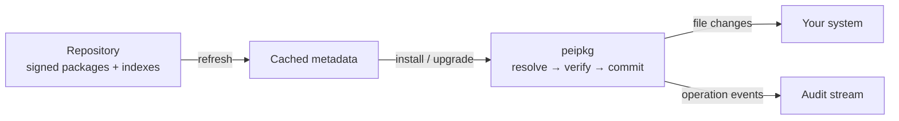

`peipkg` is the command that manages software on a running Peios system. It installs packages and the dependencies they need, upgrades them, removes them, and answers questions about what is installed and where it came from.

```
$ peipkg install nginx
$ peipkg upgrade
$ peipkg list
```

This page is the map. It explains what a package is, where packages come from, the one design choice that shapes everything else — that peipkg holds no authority of its own — and then names every command and points you at the rest of the topic.

## What a package is

Peios distributes software as **`.peipkg` files**: signed, self-contained archives. Each one carries a **manifest** — a name, a version, a target architecture, the other packages it depends on, the packages it conflicts with — and a **payload**, the files that land on disk when it is installed.

A package is a *low-level primitive*. It is the unit peipkg installs and tracks, and nothing more. The user-facing layers that most operators think in — roles, role features, applications — are built *above* packages and are managed separately. peipkg installs `nginx` the package; it does not know what a "web server role" is. This topic is about the primitive.

Every installed package is tracked in a private database. peipkg knows, for every package, exactly which files it owns — which is what makes a clean removal, an honest upgrade, and the [`verify`](~peios/package-management/inspecting-and-verifying) check possible.

## Where packages come from

Packages come from **repositories**: HTTP or HTTPS locations that serve a set of `.peipkg` files alongside signed indexes describing them. A Peios system is configured with one or more repositories, each one **anchored to a signing key the operator has chosen to trust**.

peipkg keeps a local, verified copy of each repository's metadata. `peipkg refresh` updates that copy; `peipkg install` and `peipkg upgrade` plan against it. The trust model — how a repository is anchored, how its signing keys rotate, what an *unsigned* repository costs you — is the subject of [Repositories and trust](~peios/package-management/repositories-and-trust).

A package can also be installed straight from a `.peipkg` file on disk, with no repository involved. That path trades the repository's trust guarantees for convenience; [Installing and removing packages](~peios/package-management/installing-and-removing) covers exactly what it keeps and what it gives up.



## peipkg has no authority of its own

This is the single most important thing to understand about peipkg, and it is different from how package managers work on most systems.

peipkg is **not a privileged daemon**. It is not setuid. It has no service account, no special identity, no broker it asks to do privileged work. It is an ordinary program, and it runs **as you** — under your token, with exactly your rights.

So the question "may I install this?" is not a question peipkg answers. It is the same question Peios asks of *any* attempt to write a file: it compares your token against the [security descriptor](~peios/security-descriptors/overview) on the directory being written. If the security descriptors on `/usr`, `/opt`, and the rest say your token may write there, the install succeeds. If they do not, it fails — at the file operation, the same way any unauthorised write fails.

"Who may install software" is therefore not a peipkg setting. It is just the access rules on the system directories — `Administrators`, by default. To grant someone install rights, you grant them write access to the directories packages land in; to scope what they may touch, you scope those security descriptors. This is the ordinary [access-decision](~peios/access-decisions/overview) machinery, with nothing package-specific layered on top.

One consequence is worth stating plainly: **a package cannot grant its installer rights the installer did not already have.** Any security descriptors a package asks to set on its own files can only be descriptors the caller already had the authority to set. There is no confused deputy here, because there is no deputy.

## Every change is a transaction

An install, an upgrade, a downgrade, a removal — each is a **transaction**, and each is atomic. There is a single instant, the *commit*, before which any failure, interruption, or power loss leaves the system exactly as it was, and after which the operation is complete. There is no partially-installed in-between state for a transaction to get stuck in.

Transactions are also reversible. peipkg keeps a history of them, retains the data needed to walk one back, and offers [`undo`](~peios/package-management/keeping-a-system-current) and [`recover`](~peios/package-management/transactions-and-recovery) to do it. [Transactions and recovery](~peios/package-management/transactions-and-recovery) covers the model in full.

## Every operation is audited

peipkg records each operation it performs — what was installed, upgraded, or removed, and the outcome — to the Peios [audit stream](~peios/auditing/overview). When a plan contains an action that needs deliberate authorisation, the authorising act itself is recorded too.

These events are a *semantic summary*: a readable account of what peipkg set out to do. They are not the security boundary. The authoritative record is the kernel's own audit of the actual file operations — and because peipkg runs with no special authority, it cannot suppress that record.

## The command surface

Every command is invoked as `peipkg <command> [arguments]`.

| Command | Does |
|---|---|
| `install` | Install packages, with dependencies, from a repository or a local `.peipkg` file. |
| `remove` (alias `uninstall`) | Remove installed packages. |
| `upgrade` | Move installed packages to their newest available version. |
| `downgrade` | Move one package to a specific older version. |
| `undo` | Reverse the most recent transaction. |
| `refresh` | Update the cached metadata of the configured repositories. |
| `repo` | Configure repositories — `add`, `list`, `remove`. |
| `list` | List the installed packages. |
| `info` | Show one installed package's details. |
| `files` | List the files a package owns. |
| `owns` | Report which package owns a given path. |
| `search` | Search the configured repositories for a package. |
| `verify` | Check installed files against what was recorded at install. |
| `history` | Show the transaction log. |
| `recover` | Roll back a transaction left pending by an interruption. |
| `clean` | Delete cached metadata for repositories no longer configured. |

One global option sits before the command: `--root DIR` makes peipkg operate on a Peios installation mounted at `DIR` rather than the running system at `/`. It is for image builders and offline maintenance; day to day you never need it.

## The producer side

peipkg is the **consumer** half of the Peios packaging story — the tool that runs on a deployed system and consumes packages. It has a counterpart it never shares a process with: the **producer** tools (`peipkg-build`, `peipkg-repo`, `peipkg-manager`) that turn source into signed `.peipkg` files and assemble the repositories peipkg fetches from. Building packages and running a repository are a separate job with their own documentation, the *Peios Packages* guide. This topic is for the operator of a Peios system, not the operator of a build farm.

## Where to start

For the everyday work — putting software on a system and taking it off — read [Installing and removing packages](~peios/package-management/installing-and-removing).

For keeping a system up to date, and for walking a change back, read [Keeping a system current](~peios/package-management/keeping-a-system-current).

To configure where packages come from and how their authenticity is established, read [Repositories and trust](~peios/package-management/repositories-and-trust).

To understand why an interrupted install is always safe, read [Transactions and recovery](~peios/package-management/transactions-and-recovery).

To understand how peipkg decides *which* versions of *which* packages a request implies — and why it sometimes asks for a second, more deliberate yes — read [Dependency resolution](~peios/package-management/dependency-resolution).

To inspect what is installed and check that it is intact, read [Inspecting and verifying](~peios/package-management/inspecting-and-verifying).
