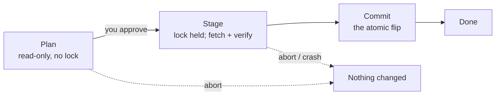

Every change peipkg makes — an install, an upgrade, a downgrade, a removal — is a **transaction**. A transaction is atomic: it either happens completely or not at all. There is no state in which a package is half-installed, and no failure, signal, or sudden power loss that can leave one there.

This page explains how that guarantee is built, what an interrupted run leaves on disk, and the two commands — `recover` and `history` — that exist because of it.

## The three phases

Every operation moves through the same three phases.



**Plan.** peipkg reads your request, reads the installed set, reads the cached repository metadata, and computes the ordered list of changes — or rejects the request. This phase is entirely read-only and takes no lock. It is why `--dry-run` and the query commands never block, even while another transaction is running, and why a plan can always be abandoned for free.

**Stage.** Once you approve the plan, peipkg takes a single-writer lock — only one transaction touches the system at a time — and prepares everything. It downloads every `.peipkg` in the plan and **verifies all of them before staging any one of them**, so no package's contents can influence another's verification. Verified payloads are written into a staging area, each file hash-checked as it lands. Nothing the system uses has changed yet.

**Commit.** peipkg moves the staged files into place and records the new package state. This is the phase that changes the system.

## The one instant that matters

Within the commit there is a **single instant** — the moment peipkg records the new state in its database — that divides the entire operation in two:

- **Before it:** any failure, any signal, any power loss rolls everything back. The staged files are discarded, any displaced files are put back, and the system is exactly as it was. *Nothing happened.*
- **After it:** the operation is complete and durable. *It is done.*

There is no third outcome. A transaction is never "partly applied". This is the whole guarantee, and everything below is the machinery that delivers it.

## Backups make rollback free

When peipkg replaces or removes a file, it does not overwrite or delete it. It **renames the old file aside** — to a sibling name in the same directory — and puts the new file in place. The old contents are untouched, just under a different name.

Rolling back is then simply renaming everything back. No data is copied, no contents are reconstructed; the rollback is the same cheap rename operation in reverse. This is why a failed transaction is not merely *recoverable* but recovers to a *byte-exact* prior state.

Those set-aside files also outlive a successful commit for a while — retained so that an [`undo`](~peios/package-management/keeping-a-system-current) of a recent transaction is fast and needs no network. They are cleaned up automatically as they age out.

## What an interruption leaves behind

If a transaction is interrupted mid-stage or mid-commit, you may find files with these names near where a package was being installed:

| Name | Is |
|---|---|
| `<name>.peipkg-staged-<id>` | An incoming file that had been staged but not yet moved into place. |
| `<name>.peipkg-backup-<id>` | A file that had been renamed aside to make room — the backup. |

These names are deliberate. They have no leading dot, so they are *visible* — meant to be tripped over and understood, not hidden. The `<id>` is the transaction number; look it up with `peipkg history` to see exactly which operation left it.

You do not clean these up by hand. peipkg knows about them and resolves them itself — see `recover`, next.

## Recovering an interrupted transaction

```
peipkg recover
```

When a transaction is interrupted before it commits, peipkg records it as **pending**. The next time peipkg starts any transaction it checks for a pending one first and rolls it back automatically before doing anything else — so in normal use recovery just happens, and you never see it.

`peipkg recover` runs that step on demand. Use it when a transaction was interrupted and you want the system put right immediately, without waiting for the next install or upgrade.

```
$ peipkg recover
recovered: the interrupted transaction was rolled back
```

Recovery only ever **rolls back**. A transaction that was interrupted *after* its commit instant is already complete — there is nothing pending and nothing to recover. Recovery deals exclusively with the "before the instant" case, and it always resolves it the same way: back to the prior state.

If there is no pending transaction, `recover` says so and exits cleanly.

## The transaction log

```
peipkg history
```

`history` prints the transactions peipkg has carried out, most recent first — each with an id, a timestamp, its state (`committed`, `rolled-back`, or `pending`), and a short summary.

```
$ peipkg history
49  2026-05-19T14:02:10Z  committed    upgrade nginx, zlib
48  2026-05-19T09:31:55Z  committed    install nginx
47  2026-05-18T22:14:03Z  rolled-back  install brokenpkg
```

| Option | Effect |
|---|---|
| `-n N` | Show at most `N` transactions. `-n 0` shows all of them. The default is `20`. |
| `--json` | Emit JSON. |

The history is what [`undo`](~peios/package-management/keeping-a-system-current) reads to find the most recent transaction, and what ties a stray `*.peipkg-backup-<id>` file back to the operation that created it.

## Configuration files on upgrade

Upgrading a package raises a question for any configuration file under `/etc/` that the package owns: the new version ships a new default, but you may have edited the old one. peipkg decides per file, by comparing the file on disk against the hash it recorded at install:

- **Unchanged since install** — peipkg replaces it with the new default. You wanted the package's settings, and you get the current ones.
- **Edited since install** — peipkg keeps *your* file untouched and writes the new default beside it as `<name>.peipkg-new`. The upgrade report notes it:

  ```
  peipkg: warning: /etc/nginx/nginx.conf has been modified since install —
    keeping it; the new default was written to /etc/nginx/nginx.conf.peipkg-new
  ```

Your edits are never silently discarded, and the new defaults are never silently lost — you are simply told the two diverged and left to merge them when you choose.

## Side effects run after commit

A few packages need a system-wide step after their files are in place — refreshing the shared-library cache, the kernel-module map, or the manual-page index. peipkg runs those steps **after** the commit instant, once per transaction.

Because they run after the operation is already complete and durable, a side-effect step that fails is reported as a **warning, not a failure**. The transaction stands; the step is one that corrects itself the next time it runs. An install is never rolled back over a stale cache.

## Why this shape

The pay-off of the three-phase model is concrete:

- An install interrupted by a crash or a power cut never leaves a broken package — it leaves either the old state or the new one.
- The plan you approve under `--dry-run` is the plan that executes — resolution is read-only and deterministic.
- Queries and dry-runs never wait on an in-flight transaction, because only staging and commit take the lock.
- Every transaction is reversible, by `undo` for a recent one or `downgrade` for a specific package.

And it all rests on one idea: do all the fallible work — downloading, verifying, staging — *before* the single instant that commits, so that the commit itself is the only thing that can be said to have "happened".
