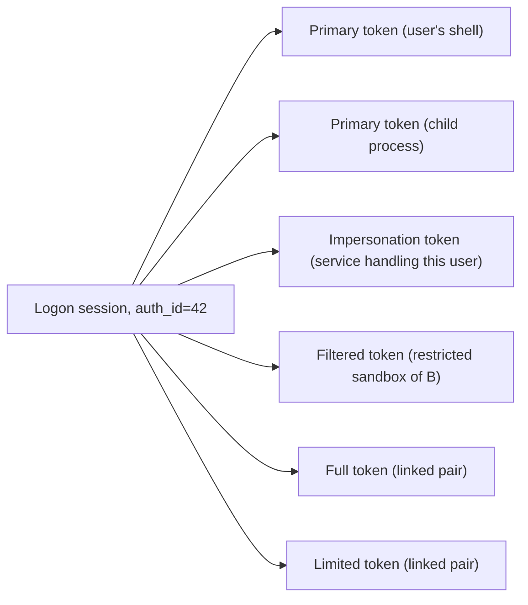

A **logon session** is the kernel object that records one authentication event. It exists from the moment a principal successfully signs in to the moment every token derived from that sign-in is released. Every token references exactly one session through its `auth_id` field, and the session ties together everything that came out of that sign-in: the primary tokens, the impersonation tokens derived from them, the linked Full/Limited pair when one is established.

Sessions exist to answer two questions cleanly:

- "Did all of these tokens come from the same sign-in?"
- "When this principal logs out, what should we tear down?"

The first matters for audit and for revocation. The second matters because logging out has to do more than just close a shell — it has to release Kerberos tickets, drop linked-pair associations, fire the right events. Sessions are the unit at which those teardowns happen.

## What a session contains

A logon session is a small kernel object — fewer fields than a token, no privileges or groups of its own. Its job is to identify the event, not the principal.

| Field | What it is |
|---|---|
| `session_id` | A unique LUID identifying the session. Same as the `auth_id` on every token belonging to the session. |
| `logon_type` | What kind of sign-in produced this session — Interactive, Network, Service, Batch, etc. See [Logon types](~peios/logon-sessions/logon-types). |
| `user_sid` | The principal who signed in. The same SID appears in `user_sid` on every token of the session. |
| `auth_package` | A string identifying the authentication mechanism (e.g. "Kerberos", "NTLM", "local"). Informational; not used by AccessCheck. |
| `created_at` | Timestamp of the sign-in. |
| `logon_sid` | A per-session SID derived from the session_id. See below. |

The session is the unit of identity provenance. If you want to answer "where did this token come from?", the path is: token → `auth_id` → session → `logon_type`, `auth_package`, `created_at`, `user_sid`. Everything an audit log needs to reconstruct a sign-in is reachable from the session.

## The logon SID

Every session has its own SID, called the **logon SID**:

```
S-1-5-5-X-Y
```

Where `X` and `Y` are the high and low 32 bits of the session's LUID. The logon SID is unique to the session — two different logins by the same user produce two different logon SIDs, because they have different session IDs.

Every token of the session carries its logon SID in two places: the dedicated `logon_sid` field, and as an entry in the `groups` list with the `SE_GROUP_LOGON_ID` flag set. Both views point at the same value. The flag exists so the access check can identify the logon SID without needing to know its specific value.

The logon SID is what lets you write an ACE that targets "the specific sign-in that did this" rather than "this user". Common uses:

- **Per-session temporary objects.** Grant access to the logon SID only. When the session ends, the SID becomes unreachable (no future token will ever carry it), so the object is effectively cleaned up at logout from an access-control perspective.
- **Service-to-user isolation in shared sessions.** Two services running for the same user but in different sessions can use the logon SID to keep their per-session state apart even though the user SIDs are identical.
- **Audit anchoring.** An audit event records the logon SID alongside the user SID. The two together let an investigator distinguish "this user did this" from "this specific sign-in did this".

The logon SID cannot be disabled (`SE_GROUP_LOGON_ID` is a mandatory-equivalent flag), and it cannot be removed from the token. It is intrinsic to the token.

## Sessions and tokens

A session can have many tokens. Every primary token of a process belonging to the session, every impersonation token derived from one of those primaries, every duplicated or filtered copy that shares the same `auth_id` — all of them are tokens of that session.



The kernel keeps a reference count of how many tokens belong to a session. When the count drops to zero — every token of the session has been released — the session itself is destroyed and a `logon-session-destroyed` event is emitted.

The implication is that destroying a session is not a primitive operation. There is no `kacs_destroy_session` syscall. You destroy a session by ensuring every token belonging to it is released, which usually means killing every process running on those tokens. Session **revocation** — what authd does when an administrator forces a logout — is implemented this way in user space.

## Bootstrap sessions

Two sessions exist before authd is up, created by the kernel during boot:

| Session | ID | Purpose |
|---|---|---|
| **SYSTEM session** | 0 | The session of the SYSTEM token, attached to init and inherited by every process until authd assigns real tokens. |
| **Anonymous session** | 998 | The session of the Anonymous token, used as the user SID for Anonymous-level impersonation. |

Both are created by direct kernel initialization — they do not go through `kacs_create_session`. They are also never destroyed during a running system's lifetime: the SYSTEM token always exists somewhere, and the Anonymous token is a singleton.

You will see these IDs in audit logs and `/sys/kernel/security/kacs/sessions` listings. They are not bugs.

## Sessions are not durable

A session exists in the kernel only while it has active tokens. There is no on-disk session table. The session ID space is not stable across boots — after a reboot, the same user signing in again gets a different session ID, and a new logon SID.

This matters in two practical ways:

- **You cannot reference a session across a reboot.** An ACL entry that targets the logon SID of "the previous boot's session 5" is meaningless after the next boot. The SID format will look syntactically valid, but no token will ever match it.
- **Per-session state should be in memory, not on disk.** Anything intended to survive a single sign-in should be keyed on the user SID, not the logon SID.

## Where to start

If you want the catalog of logon types — what Interactive, Network, Service, Batch, NewCredentials, and the rest each mean — read [Logon types](~peios/logon-sessions/logon-types).

If you want the creation, destruction, and revocation mechanics — including the `logon-session-destroyed` event and what authd does for forced logout — read [Session lifecycle](~peios/logon-sessions/lifecycle).

If you want to see which sessions are currently active on a running system, read [Inspecting tokens, sessions, and processes](~peios/inspecting/overview).
