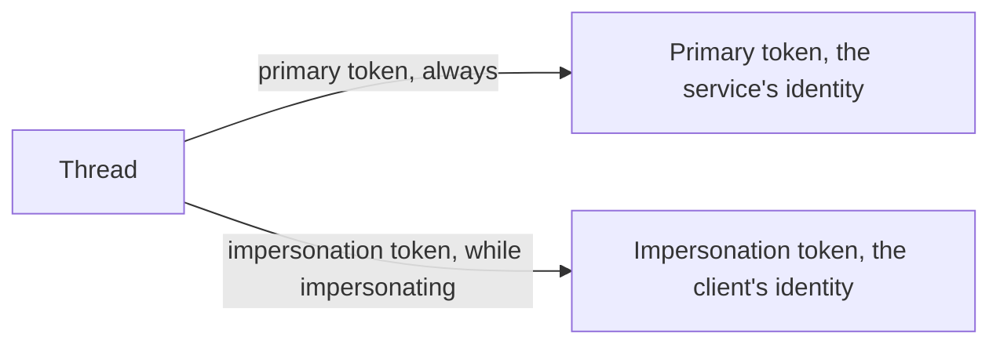
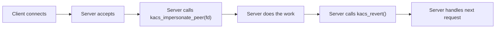
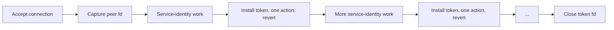

**Impersonation** is the mechanism that lets one thread temporarily act as another principal. The thread installs a second token — an **impersonation token** — and from that moment until it reverts, every access decision on that thread reads the impersonation token instead of the thread's primary. Other threads in the same process are unaffected. The primary token is preserved untouched and resumes its role the instant the thread reverts.

Impersonation exists because of one stubborn fact: most code that handles user requests does not run as the user. A storage service runs as a service account, a database runs as `postgres`, the registry daemon runs as `loregd`. When a real user asks one of these services to do something, the work has to be evaluated against the *user's* rights, not the service's. Impersonation is how that swap happens cleanly.

## The two-token model

A thread can have two tokens at once:

While the impersonation token is installed, every AccessCheck on that thread reads it. The primary is invisible until revert. Other threads in the same process still read their own primary tokens — impersonation is strictly per-thread.

Two consequences worth knowing up front:

- **The process's identity does not change.** Other processes inspecting this one still see the primary token as the process's identity. Tools like `ps`, `/proc/<pid>/token`, and audit events that record the process identity all report the primary. Only the thread's own view is overridden.
- **The PSB does not change.** A thread impersonating a higher-trust token does **not** get higher process integrity protection. PIP is a property of the binary running, not of the impersonation token. See [Process integrity protection](~peios/process-integrity-protection/overview) for the why.

## A canonical server flow

The simplest case — one OS thread, one request, start to finish — follows a flow like this:

1. **Client connects.** Before connect, the client may have called `kacs_set_impersonation_level` on the socket to bound how far its identity may travel (see [Impersonation levels](~peios/impersonation/impersonation-levels)).
2. **Server accepts.** The kernel captures the client's identity onto the socket at connect time.
3. **Server impersonates.** A call to `kacs_impersonate_peer(fd)` installs the captured identity onto the calling thread, at the effective level determined by the two-gate model.
4. **Server does the work.** Every access check on this thread now runs against the client's identity. File opens succeed if the client could open the file; registry reads succeed if the client could read; and so on.
5. **Server reverts.** `kacs_revert()` drops the impersonation token. The thread is back to its primary identity for the next request.

A server that handles many concurrent clients impersonates separately per thread. A server that handles requests serially impersonates and reverts in a loop. Either way, the impersonation is always a *bracketed* operation — install, do work, revert.

## Just-in-time impersonation

The canonical flow above assumes one OS thread is dedicated to one request from start to finish. That model fits a thread-per-connection server, but it does not fit most modern application runtimes. In Go, a goroutine can be scheduled onto any of the runtime's worker threads, and may move between them at any await point. In Rust's async runtimes, in Java's virtual threads, in Node's event loop — wherever you have M:N scheduling, the "impersonate at the top of the request, revert at the bottom" pattern is unsafe. The impersonation is installed on whichever OS thread happened to be running when the call was made; the request may continue on a different OS thread an instant later.

Most real Peios applications use **just-in-time impersonation** instead: capture the client's identity as a token fd at request start, hold the fd in the request context, and install it on the current OS thread only for the brief moment of the access-requiring action, reverting immediately after.

The sequence:

1. At accept, the server calls `kacs_open_peer_token(fd)` to capture the client's identity as a token fd. The fd is stored in the request context — request struct, goroutine-local, whatever the runtime provides.
2. Most of the request is processed as the service's own identity. Decoding, dispatching, internal bookkeeping, response framing — none of these need the client.
3. When the code reaches the one operation that requires the client — opening a user-controlled file, reading the user's home directory, anything where the access decision must be the client's, not the server's — it installs the impersonation token on the current OS thread (`KACS_IOC_IMPERSONATE`), does the single operation, and calls `kacs_revert` immediately.
4. The request continues at service identity. Further per-request impersonations follow the same install-do-revert pattern.
5. At end of request, the captured token fd is closed.

This pattern has two real advantages over the canonical flow:

- **It is safe under multiplexed threading.** The impersonation is installed and reverted within a tight, synchronous block of code that does not yield to the runtime, so the runtime cannot move the work to another OS thread mid-impersonation. The token fd in the request context travels with the request regardless of which thread is currently executing it; only the install-do-revert window actually pins a thread.
- **It minimises the time spent impersonated.** Bugs where the wrong code runs as the wrong identity — a logging call between impersonate and the real work, an error path that forgets to revert, an unrelated background task pre-empting on the same thread — are bounded by the same tight block. Most of the request is unambiguously the service's identity; only the access-requiring call is the client's.

The cost is a small amount of boilerplate at every impersonation point. The performance cost is negligible: install and revert are pure in-kernel operations with no allocation and no IPC.

If you are writing a new service for Peios in a modern runtime, this is the pattern to start from. The canonical flow above is the simple-case reference; just-in-time is the realistic default.

## Why not just run the server as the user?

The reason impersonation exists rather than "spawn one server process per user" is the cost. Long-lived services that handle many users — a file server, a database, the registry daemon — would otherwise need one process per concurrent session. Impersonation lets a single long-lived service process handle requests for arbitrary users by swapping identities per thread, paying only the cost of an in-kernel token install per request.

The trade-off is that the server has to be careful. Code paths that touch user-controlled state are expected to be running impersonated; code paths that touch service-internal state (its own configuration, its own logs) are not. Mixing these up is the most common bug category in services written for this model: a request handler that opens a user-controlled path while still running as the service account, or a maintenance routine that touches the service's own state while still impersonating the last client.

The pattern that minimises this is to make impersonation the default state of a request thread and revert only at well-defined boundaries (logging, internal bookkeeping, between requests).

## What impersonation does *not* do

A few things impersonation looks like at a glance but is not:

- **It does not invent new authority.** The impersonation token carries the client's privileges, integrity (capped at the server's own — see [The two-gate model](~peios/impersonation/the-two-gates)), groups, and SIDs intact, and the impersonating thread can exercise any of them on the client's behalf. What impersonation does *not* do is grant more than the client had, raise integrity above the server's ceiling, or change the binary's PIP.
- **It does not give the server arbitrary identity.** The server can only assume identities the kernel has handed it — through a captured peer token, or through a token fd the server already possessed by some other path. There is no API to fabricate an impersonation token from a SID string.
- **It does not grant inherent access.** Impersonating a user is not a master key to the user's data. The user's home directory, registry keys, and in-flight tokens are reachable if and only if the user themselves has access — the access check still runs to decide. Impersonation is the mechanism for evaluating that check as the user; it is not the access itself.
- **It does not survive exec.** A thread that execs while impersonating has its impersonation token released before the new program runs. Impersonation is intra-program state; the new binary cannot inherit it.

## Where to start

If you want to understand the four impersonation levels — Anonymous, Identification, Impersonation, Delegation — and what each one permits, read [Impersonation levels](~peios/impersonation/impersonation-levels).

If you want the rules that decide what level a server actually ends up with — the identity gate, the integrity ceiling, and the silent downgrade behaviour — read [The two-gate model](~peios/impersonation/the-two-gates).

If you want the concrete mechanics — peer token capture from sockets, the difference between `kacs_impersonate_peer` and `kacs_open_peer_token`, and the explicit-fd variant — read [Peer tokens and capture](~peios/impersonation/peer-tokens).
