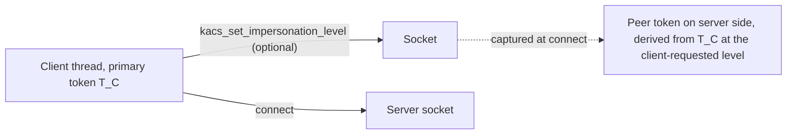
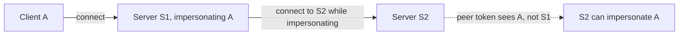

When a client connects to a server over a connected Unix socket, the kernel captures the client's identity onto the socket at connect time. The server can later impersonate that identity by calling `kacs_impersonate_peer(fd)` on the connection — no further negotiation, no credential exchange, no token transfer in the message stream. The token is held by the kernel and tagged to the socket from the moment of connect.

This is the primary way servers acquire impersonation tokens. Almost every local IPC in Peios — registry access, service-to-service calls, user-to-daemon requests — goes through it. The model is simple enough that most services need to know only one syscall (`kacs_impersonate_peer`) and one cleanup call (`kacs_revert`).

This page covers the capture mechanism, the two different syscalls for using a captured peer token, the transports that do and do not carry peer tokens, and how identity cascades when a service that is itself impersonating connects to a third service.

## Capture at connect time

When the client calls `connect()` on a Unix stream or seqpacket socket, the kernel:

1. Reads the client's effective token (impersonation if set, primary otherwise).
2. Reads the impersonation level the client requested on the socket (default Impersonation).
3. Constructs a peer token derived from the client's token, at the requested level.
4. Attaches the peer token to the server-side socket.

The peer token is held by the kernel for the life of the socket. The client's identity travels into the kernel at connect, not at impersonate. By the time the server calls `kacs_impersonate_peer`, the work of capturing identity is already done.

This timing matters in one specific way: **the captured identity is the client's identity at the moment of connect**. If the client changes identity afterwards (impersonates a third party, drops privileges, anything), the change does not affect the peer token on the existing connection. The peer token is a snapshot. Servers that want to track changing client identity across a long-lived connection need to renegotiate (typically by having the client reconnect).

## Two ways to use a peer token

The kernel exposes two operations on a peer token:

- **`kacs_impersonate_peer(fd)`** — the combined operation. Captures the peer's identity from the socket and installs it on the calling thread, at the level the two-gate model permits. The most common path.
- **`kacs_open_peer_token(fd)`** — the inspect-and-store operation. Returns a token fd to the peer's identity without installing it. The fd carries `TOKEN_QUERY | TOKEN_IMPERSONATE` access — enough to read the token and to install it later via `KACS_IOC_IMPERSONATE`, but not enough to duplicate or adjust it.

The two operations exist because servers have different needs:

- **Direct request handling.** A request thread that wants to impersonate, do work, and revert all in one tight synchronous block calls `kacs_impersonate_peer` and then `kacs_revert`. There is no reason to hold the token fd around.
- **Just-in-time impersonation.** A server that wants to keep the client's identity available across a request but only install it at the moment of each access-requiring action — the [just-in-time pattern](~peios/impersonation/overview) covered on the overview page — calls `kacs_open_peer_token` to capture the token fd at request start, stores it in the request context, and installs it on the current OS thread (`KACS_IOC_IMPERSONATE`) just before each action that needs the client's identity, reverting immediately after. This is the right pattern for any server using a multiplexed runtime (Go, Rust async, Java virtual threads, Node), and is the recommended default for new services.
- **Deferred work across threads.** A request handler that hands off work to a thread pool cannot reasonably keep its own thread impersonating while another thread does the work — impersonation is per-thread. The same `kacs_open_peer_token` mechanism lets it capture the token fd, pass it to the worker, and have the worker install it before doing the access-requiring operation.
- **Inspection without action.** A logging or audit thread that wants to record the client's identity without doing any work as them calls `kacs_open_peer_token`, queries the token via `KACS_IOC_QUERY`, and closes the fd. No impersonation is ever installed.

The "capture once, install per action" pattern is the main reason for separating the two operations. It is what makes safe impersonation possible under M:N threading and what bounds the time a thread is actually impersonated to the smallest window that does the work.

## kacs_revert and the explicit-fd variant

A thread reverts impersonation with `kacs_revert()`. Always succeeds. Drops the impersonation token reference and restores the primary as the effective identity.

There is also `KACS_IOC_IMPERSONATE` — an ioctl on a token fd, not on a socket. This is the explicit-fd variant. The caller passes the fd of a token they have obtained by some other means (DuplicateToken, `kacs_open_peer_token`, etc.) and the kernel installs it on the calling thread, running the two-gate model as usual.

`kacs_impersonate_peer` is essentially `kacs_open_peer_token` followed by `KACS_IOC_IMPERSONATE`, fused for the common case where you do not need the token fd to outlive the impersonate-and-revert cycle.

## Transports that carry peer tokens

Peer token capture works on Unix sockets that have a real **connect** step. Specifically:

| Transport | Peer token? |
|---|---|
| `SOCK_STREAM` Unix socket | **Yes.** Captured at connect. |
| `SOCK_SEQPACKET` Unix socket | **Yes.** Captured at connect. |
| `SOCK_DGRAM` Unix socket | **No.** No connect step; no point at which to capture. |
| `socketpair(2)` | **No.** The two ends share an origin; there is no "client" and "server". |
| Pipes (`pipe(2)`, named FIFOs) | **No.** No socket framework. |
| TCP sockets | **No.** Peer is potentially remote; KACS does not capture network identities. |

Servers using a transport that does not carry a peer token cannot use `kacs_impersonate_peer`. They have to obtain a token fd by some other path and use `KACS_IOC_IMPERSONATE` to install it. Common patterns:

- **Token fd passed over the connection.** A datagram protocol can include a token fd in an `SCM_RIGHTS` message; the receiver gets the fd and impersonates from it. The token fd has whatever access the sender opened it with, bounded by what the sender held.
- **Out-of-band capture.** A service that knows the peer's PID can call `kacs_open_process_token(pidfd)` to get the peer's primary token (subject to the process SD and PIP dominance checks). Less common; usually only the loopback-like patterns inside the TCB work this way.

The lack of peer tokens on datagram and pipe transports is intentional, not an oversight. Those transports are fundamentally connection-less or pre-existing; capturing a "peer" identity that may not exist is ill-defined.

## Identity cascading

A service that is impersonating client A may itself need to call a third service. When it does, the connection it opens carries A's identity, not the service's own.

The mechanism: the impersonation token is the thread's effective token, and the effective token is what the kernel reads when capturing peer identity at connect. So when S1, while impersonating A, calls `connect()` on a socket to S2, the kernel captures A's identity onto S2's side of the socket. S2 can then `kacs_impersonate_peer` and get A.

This cascading is automatic and is what makes the local-IPC ecosystem work cleanly. A user makes one request to a service, and that service makes downstream requests to other services on the user's behalf — registry, file system, audit logging — and each of those downstream services sees the user as the peer. No explicit token forwarding is required.

The cascading is bounded by the impersonation level the original client granted. If A connected at Impersonation level, S1 captures A at Impersonation; when S1 connects to S2, the captured identity on S2's side is bounded by what S1's effective token currently is — which is A at Impersonation. The level does not get re-extended by cascading.

The same mechanism reaches the network boundary only at Delegation. If A connected at Delegation level, the captured identity on cascaded local connections is still A at Delegation, *and* outbound network calls from S1 carry A's Kerberos credentials (via authd; KACS only records the flag). Without Delegation, network calls from S1 go out as S1, not as A.

## What the server has to do

There are two server-side shapes, depending on which pattern (canonical synchronous or just-in-time) the server is using. Both start at the same point — the kernel has captured the client's peer token onto the socket at connect time — and diverge after accept.

**Canonical synchronous flow** (one OS thread, one request, start to finish):

1. **Accept the connection.** Standard `accept()` on the Unix socket. The kernel has already captured the client's peer token onto this socket.
2. **Impersonate the peer.** Call `kacs_impersonate_peer(fd)`. The kernel runs the two-gate model and installs the resulting token.
3. **(Optional) Inspect the granted level.** Read the thread's effective token's `impersonation_level`. If it is below what you expected, the client's request, the identity gate, or the integrity ceiling has lowered it.
4. **Do the work.** Every access check on this thread is now against the impersonation token.
5. **Revert.** Call `kacs_revert()`. The thread is back to its primary identity.
6. **Handle the next request.** Either on the same connection (loop back to step 2 if the client may re-impersonate per request) or on the next connection.

**Just-in-time flow** (the right shape for any modern runtime — Go, Rust async, etc. — and the recommended default):

1. **Accept the connection.** As above.
2. **Capture the peer token fd.** Call `kacs_open_peer_token(fd)` and store the returned token fd in the request context. The fd carries `TOKEN_QUERY | TOKEN_IMPERSONATE`.
3. **(Optional) Inspect the captured token.** Query the captured fd to verify the identity and level before doing any work.
4. **Do most of the request as the service.** Decoding, dispatch, internal bookkeeping, response framing — all run as the service's own identity.
5. **For each access-requiring action**, install the captured token on the current OS thread (`KACS_IOC_IMPERSONATE` on the stored fd), do the single action, call `kacs_revert()` immediately. Keep the impersonation window as tight as possible.
6. **Close the captured fd** at end of request.

A server that handles concurrent connections per thread runs whichever flow it uses in each thread, in parallel. The impersonation state is strictly per-thread; nothing shared.

## Common mistakes

A few patterns that bite first-time service authors:

- **Forgetting to revert.** A thread that finishes a request without calling `kacs_revert` continues to impersonate the previous client. The next request handled on that thread uses the wrong identity. Make `kacs_revert` part of your between-requests cleanup, unconditionally.
- **Reverting too early.** A thread that reverts before all of the work is done — perhaps because an inner function is doing cleanup that runs as the service identity — will fail access checks on the parts that needed to remain impersonated. Keep the impersonation scope wide enough to cover the whole user-facing operation.
- **Holding a peer token fd across exec.** Token fds are file descriptors and survive exec by default (unless O_CLOEXEC was set). But the impersonation state of the *thread* does not survive exec — it is reverted automatically. If your service execs another binary, the new binary starts with no impersonation, even if the old code was impersonating.
- **Assuming the level you asked for is the level you got.** The two-gate model can silently downgrade. Code that branches on level should query, not assume.
