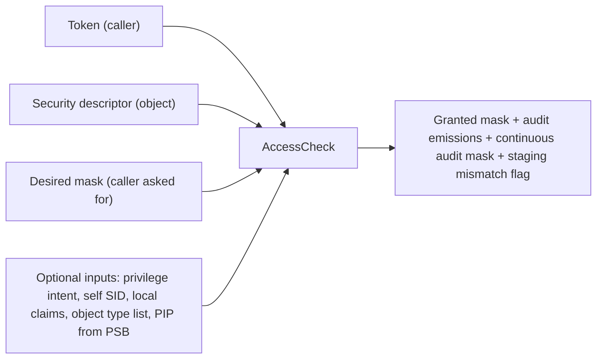

**AccessCheck** is the function the kernel calls every time something is about to happen to a protected object. The caller has a token; the object has a security descriptor; the caller wants some set of rights. AccessCheck takes all three and produces an answer: which of those rights are granted, which are not, and whether to fire any audit events as a result.

The function is not a single comparison. It is a pipeline of layers, each of which can constrain the result. A right that the DACL would have granted can be removed by a later layer (restricted-token intersection, confinement, central access policy). A right that the DACL would not have granted can be added by an earlier layer (privilege grants). Following an access decision through is following each layer in order.

This page is the map. It walks through the pipeline from start to finish, names every stage, and points each one at the topic that covers it in depth.

## The shape of an access check

Inputs:

| Input | Source | What it contributes |
|---|---|---|
| Token | The calling thread's effective token. | Identity (user SID, groups, restricted SIDs), token-level state (integrity level, mandatory policy, privileges, confinement). |
| Security descriptor | The object being accessed. | Owner, primary group, DACL, SACL — everything the policy on the object says. |
| Desired mask | The caller. | The 32-bit access mask of rights the caller wants. May include `MAXIMUM_ALLOWED` to ask "what could I have?". |
| `privilege_intent` | The caller. | Flags for backup and restore intent — see [Intent-gated privileges](~peios/privileges/intent-gated). |
| `self_sid` | The caller. | The SID that `PRINCIPAL_SELF` (`S-1-5-10`) should resolve to during the DACL walk. Used by directory-style objects. |
| `local_claims` | The caller. | Per-call attributes in the `@Local.*` namespace, available to conditional ACE expressions. |
| Object type list | The caller (optional). | A tree of property GUIDs for per-property evaluation. See "Object type list" below. |
| PIP type and trust | The PSB of the calling process. | Used by the PIP step to compare against any trust label on the object. |
| Object audit context | The caller. | An opaque blob included in any audit events emitted for this call, identifying the object to audit consumers. |

Outputs:

| Output | Meaning |
|---|---|
| Granted mask | The 32-bit access mask of rights the caller actually gets. |
| Audit emissions | Any audit events that fired (SACL audit ACEs, privilege-use, token-forced policy events). |
| Continuous audit mask | For file-like objects, the per-operation audit mask to cache on the open handle. See [The SACL](~peios/security-descriptors/the-sacl). |
| Staging mismatch flag | Set when a staged CAAP policy would have produced a different result. See [Central access policies](~peios/central-access-policies/overview). |

The function does not return a boolean. It returns a granted mask, and the caller is responsible for comparing that mask against what was requested. "Access denied" is what happens when the granted mask does not contain all the requested rights — but partial grants are visible to the caller, and `MAXIMUM_ALLOWED` callers specifically want to know everything they would have gotten.

## The pipeline, step by step

The pipeline runs in a defined order. Each step either pre-decides bits, modifies the running state, or both. The kernel implements it as a 15-step procedure; this section names each step, says what it does, and points to where it is covered in detail.

| Step | Name | What it does |
|---|---|---|
| 0 | **Impersonation level gate** | If the effective token is Impersonation-type at the Identification level, deny everything immediately. The token may be inspected but not used for access decisions. |
| 1 | **Input validation** | The SD must be present, must have an owner, must have a primary group. Object type list must be well-formed. Malformed inputs are rejected with appropriate errors. |
| 2 | **Generic mapping** | Generic rights in the desired mask (`GENERIC_READ`, `GENERIC_WRITE`, etc.) are expanded to object-specific bits using the object's GenericMapping table. `MAXIMUM_ALLOWED` is stripped and remembered as a mode. |
| 3 | **Effective privileges** | Backup and restore privileges are stripped from the privilege set unless the caller passed the corresponding intent flag. See [Intent-gated privileges](~peios/privileges/intent-gated). |
| 4 | **Privilege grants** | Pre-decide bits that are granted by privilege regardless of the DACL: `ACCESS_SYSTEM_SECURITY` via SeSecurity, backup-read bits via SeBackup, write/metadata bits via SeRestore. See [Privileges in the pipeline](~peios/access-decisions/privileges-in-the-pipeline). |
| 5 | **Pre-SACL walk** | Scan the SACL for the mandatory integrity label (MIC) and the PIP trust label. Pre-decide write/read/execute bits as denied for non-dominant callers. Resource attributes are extracted and indexed for conditional expressions. See [Mandatory integrity control](~peios/access-decisions/mandatory-integrity-control) and [Process integrity protection](~peios/process-integrity-protection/overview). |
| 6 | **Virtual group injection** | `OWNER RIGHTS` (`S-1-3-4`) and `PRINCIPAL_SELF` (`S-1-5-10`) are injected into the token's group view if the caller owns the object or matches `self_sid` respectively. See [Ownership](~peios/security-descriptors/ownership). |
| 7 | **Tree initialisation** | If the caller passed an object type list (per-property evaluation), the pipeline's `decided`/`granted` state is seeded per node. Skipped for ordinary calls. |
| 8 | **Normal DACL evaluation** | Grant owner implicit rights (READ_CONTROL, WRITE_DAC) unless suppressed by OWNER RIGHTS. Walk the DACL using first-writer-wins, applying ACE flags, propagating per-property results for object type lists. See [DACL evaluation](~peios/security-descriptors/dacl-evaluation). |
| 9 | **Post-DACL SeTakeOwnership** | If the walk did not grant `WRITE_OWNER` and the mandatory policy did not block it, `SeTakeOwnershipPrivilege` grants it now. See [Ownership](~peios/security-descriptors/ownership). |
| 10 | **Restricted token pass** | If the token is restricted, the DACL is re-evaluated using only the restricted SIDs, and the result is intersected with step 8's result. Privilege-granted bits from step 4 are restored after the intersection. See [Restricted and write-restricted tokens](~peios/tokens/restricted-tokens). |
| 11 | **Confinement pass** | If the token is confined, the DACL is re-evaluated against the confinement SID set and the result is absolutely intersected. Privileges do **not** bypass confinement. See [Confinement](~peios/confinement/overview). |
| 12 | **CAAP evaluation** | Each `SYSTEM_SCOPED_POLICY_ID` ACE in the object's SACL is resolved and evaluated. Each rule's DACL is intersected with the running grant. Staging mismatches are recorded. See [Central access policies](~peios/central-access-policies/overview). |
| 13 | **Privilege-use audit emission** | For each privilege that contributed bits, an audit event is emitted if the token's `audit_policy` requested it (success or failure variant depending on whether the bits survived). |
| 14 | **SACL audit walk** | Walk the object's SACL and all collected CAAP effective SACLs for `SYSTEM_AUDIT*` and `SYSTEM_ALARM*` ACEs. Emit audit events; compute continuous-audit mask. See [Auditing](~peios/auditing/overview). |
| 14b | **Token audit policy** | The token's `audit_policy` field can force audit events independently of any SACL ACE. Success and failure flags emit policy-forced events. |
| 15 | **Result computation** | The final granted mask is `granted & mapped_desired`. The function returns this mask, plus the audit emissions, the continuous-audit mask, and the staging mismatch flag. |

The numbering is the kernel's; you will see it in audit and error messages.

## Reading the pipeline

A few observations about the shape that are worth pinning before reading the deeper pages:

**Pre-DACL layers can pre-decide bits as denied.** MIC and PIP do this for non-dominant callers. A bit pre-decided as denied stays denied; no later step can grant it. The owner of an object that has a high mandatory label cannot read it from a lower-integrity session even though the DACL would grant the read.

**Pre-DACL layers can pre-decide bits as granted.** Step 4 (privilege grants) does this. Bits granted by privilege are decided before the DACL walk runs; the walk's first-writer-wins applies to undecided bits, so a privilege grant is effectively immune to a later DACL deny.

**The DACL walk is the central act.** Steps 0–7 set up state for it; steps 9–12 narrow what it produced. The walk itself, governed by [DACL evaluation](~peios/security-descriptors/dacl-evaluation), is where most of the visible policy lives.

**Narrowing layers (restricted, confinement, CAAP) only remove access, never add.** A right that the DACL plus privileges granted may be lost in steps 10–12. A right that those did not grant cannot be added by the narrowing layers.

**Audit fires last and observes everything.** By the time the audit walk runs (step 14), the granted mask is final. Audit ACEs can compare against the requested mask, the granted mask, and the difference, and decide whether to emit. Token-forced audit policy can emit even when no SACL ACE matched.

**A staging mismatch is informational, not corrective.** Step 12 evaluates both the effective CAAP rules (which affect the granted mask) and the staged CAAP rules (which do not). If they would have produced different results, the function reports it; it does not change the granted mask.

## Two AccessCheck variants

The kernel exposes two AccessCheck syscalls. They differ in what they return:

| Syscall | What it does |
|---|---|
| **`kacs_access_check`** | The common case. Returns a single granted mask for the whole object. |
| **`kacs_access_check_list`** | The per-property variant. Requires an object type list and returns a separate granted mask and status per node in the tree. Used by directory-style objects with property-level access control. |

The pipeline is the same for both. The list variant just tracks per-node state through every step, so an object type list with twelve nodes produces twelve granted masks at the end, one per node.

For most objects (files, registry keys, tokens), the regular variant is the right one. Per-property is meaningful only when the object has properties that can be granted independently — a directory object with named attributes, say.

## Object type list, briefly

Object ACEs in a DACL carry a property GUID. When the caller passes an object type list, AccessCheck evaluates each ACE against each node of the tree, propagating per-property grants and denials according to the tree structure (a grant on a parent set flows to its children; a denial flows up; sibling grants intersect).

The tree itself is provided by the caller as a preorder-flat array of `kacs_object_type_entry` records. The array must be well-formed: starts at level 0, no level gaps, no duplicate GUIDs, and so on. Malformed lists are rejected at step 1.

The full mechanics of object ACEs and the object type list are in [ACLs, ACEs, and access masks](~peios/security-descriptors/acls-and-aces). Most code never builds an object type list — they exist for the directory-object case specifically.

## Where to start

If you want MIC in depth — what an integrity level actually does to access, how the policy bits work, how the SD's mandatory label drives it — read [Mandatory integrity control](~peios/access-decisions/mandatory-integrity-control).

If you want to know exactly which bits each AccessCheck-influencing privilege grants and where in the pipeline that grant happens, read [Privileges in the pipeline](~peios/access-decisions/privileges-in-the-pipeline).

If you want the narrowing layers — restricted-token pass, confinement pass, CAAP — in detail, read [Narrowing layers](~peios/access-decisions/narrowing-layers).

If you are debugging an unexpected denial right now, read [Debugging a denial](~peios/access-decisions/debugging-a-denial).
