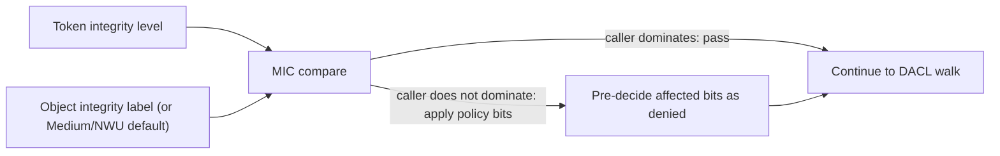

**Mandatory integrity control** is the layer of the access check that gates rights based on a numeric trust axis called the **integrity level**. Where the DACL asks "is this principal allowed?", MIC asks "is the caller trusted enough to do this regardless of the DACL?". A non-dominant caller — one whose integrity is lower than the object's — has certain rights pre-decided as denied, before the DACL is even looked at.

The integrity axis is independent of identity. Two threads, same user, can run at different integrity levels and see different effective access. An interactive shell at Medium and an elevated session at High are the same person, separated by integrity. MIC enforces that separation.

MIC fires in step 5 of the access check pipeline — pre-DACL. Its decisions are immutable from that point. The DACL walk, the restricted-token pass, none of them can undo a MIC denial.

## The integrity levels

There are five integrity levels in v0.20, with strictly ordered SIDs:

| Level | SID | RID | Typical use |
|---|---|---|---|
| **Untrusted** | `S-1-16-0` | 0 | Tokens for highly-sandboxed processes. The lowest level. |
| **Low** | `S-1-16-4096` | 4096 | Tokens for confined applications, anti-malware quarantines. |
| **Medium** | `S-1-16-8192` | 8192 | The default for interactive sessions and most services. |
| **High** | `S-1-16-12288` | 12288 | Elevated administrative sessions. The Full token in a UAC-style linked pair. |
| **System** | `S-1-16-16384` | 16384 | The kernel, peinit, authd, and the rest of the TCB. |

The numeric RIDs are spaced by 4096 to leave room for future levels without disturbing the existing ordering. A SID's level is determined by its RID; the kernel does not check the SID against a hardcoded list, so an integrity SID with an unusual RID would be interpreted by its position in the ordering.

The comparison is the obvious one: Untrusted < Low < Medium < High < System. A caller **dominates** an object if the caller's integrity level is at least the object's level. Otherwise the caller is non-dominant and MIC's policy bits decide what they cannot do.

## Where the object's label lives

An object's mandatory integrity label is in its SACL, as a `SYSTEM_MANDATORY_LABEL_ACE`. The ACE has:

- A **SID** from the integrity namespace (one of the five above).
- A **mask** containing the MIC policy bits.

When the access check looks at an SD, it scans the SACL for `SYSTEM_MANDATORY_LABEL_ACE` entries that are not inherit-only. The first such ACE is the object's effective label. If there is none, the object's effective label is **Medium with `NO_WRITE_UP`** — that is the default for an unlabelled object.

The Medium-with-NO_WRITE_UP default exists to protect default objects from lower-integrity callers without requiring every object to carry an explicit label. An unlabelled file on a standard filesystem is automatically protected against writes from a Low-integrity sandboxed process; the sandbox cannot scribble on system data even though no one explicitly marked the data with a label.

The SACL ACE also lives there for a reason: changing the integrity label is a privileged operation (gated by `SeRelabelPrivilege` for label-raising and by the standard SACL access rule for label-lowering). Stored as a SACL ACE, the label is automatically under SACL access control — the owner of an object cannot lower its integrity label without `SeSecurityPrivilege` or `SeRestorePrivilege`. This is exactly the right gate; a user should not be able to weaken the protections on their object just because they own it.

## The MIC policy bits

The mask of a `SYSTEM_MANDATORY_LABEL_ACE` contains MIC policy bits that say what non-dominant callers cannot do:

| Bit | Value | Effect on non-dominant callers |
|---|---|---|
| `SYSTEM_MANDATORY_LABEL_NO_READ_UP` | 0x01 | Read-category rights are denied. |
| `SYSTEM_MANDATORY_LABEL_NO_WRITE_UP` | 0x02 | Write-category rights are denied. |
| `SYSTEM_MANDATORY_LABEL_NO_EXECUTE_UP` | 0x04 | Execute-category rights are denied. |

The names use "up" because the non-dominant caller is *below* the object. A "no write up" rule denies a Medium caller from writing to a High object — the caller would be writing "up" to higher integrity.

The bits compose. A label with all three set blocks all access categories from non-dominant callers. A label with only `NO_WRITE_UP` allows non-dominant callers to read but not write. The most common combination by far is `NO_WRITE_UP` alone — it is the default, and it captures the most important integrity rule (lower-integrity code should not be able to modify higher-integrity data).

Read-up and execute-up restrictions are less common. They appear on objects whose existence or contents should be hidden from lower-integrity callers entirely.

## How MIC fires in the access check

At step 5 of the pipeline:

1. Extract the object's integrity label (or apply the Medium-with-NO_WRITE_UP default if there is no label ACE).
2. Compare the token's `integrity_level` against the object's label.
3. If the token's level is at least the object's level, MIC is satisfied. Nothing happens; the pipeline proceeds.
4. If the token's level is below the object's, look at the label's policy bits. For each bit set, take the corresponding category of rights from the desired mask and mark those bits as decided-and-denied. The bits enter the pipeline's `decided` set but not `granted`.

The categories — read, write, execute — are defined by the object's GenericMapping. For a file, the read category is the set of bits that map from `GENERIC_READ` (`FILE_READ_DATA`, `FILE_READ_ATTRIBUTES`, `FILE_READ_EA`, `READ_CONTROL`, `SYNCHRONIZE`). Same idea for the write and execute categories.

By the time the pipeline reaches the DACL walk in step 8, the bits MIC denied are already decided. The walk processes the remaining bits; the denied ones are skipped.

## The "token mandatory policy" field

A separate but related field: every token carries a `mandatory_policy` bitmask. It uses two flags:

| Flag | Value | Effect |
|---|---|---|
| `NO_WRITE_UP` | 0x01 | The MIC rule is active for this token's accesses. |
| `NEW_PROCESS_MIN` | 0x02 | At exec, if the executable's integrity label is lower than the token's, the token's integrity is lowered to match. |

Both flags are set at token creation and **cannot be changed at runtime**. A process cannot relax its own MIC policy — the kernel rejects any AdjustPrivileges-style call that would. The reasoning: a Medium-integrity process should not be able to silently turn off its own write-up restriction.

`NO_WRITE_UP` is set on essentially every token authd issues. It is the active state of MIC enforcement.

`NEW_PROCESS_MIN` is set on tokens that want exec to enforce integrity boundaries. When set, exec of a binary marked at a lower level produces a token whose integrity is lowered. This is what prevents a High-integrity shell from launching a Medium-labelled binary as High-integrity — the resulting process is Medium, regardless of who launched it.

## What MIC does *not* constrain

A surprisingly important set of things.

**MIC does not constrain privilege grants.** Step 4 of the pipeline (privilege grants) runs *before* MIC, and the bits it pre-decides as granted survive MIC. A caller holding `SeBackup` with `BACKUP_INTENT` set gets read-category rights via the privilege regardless of MIC. The reason: privileges are explicit, intentional, and audited — they are not subject to the same "block by default" treatment as the DACL.

The exception is **PIP**. Where MIC ignores privilege grants, PIP strips them. A non-dominant PIP caller loses privilege-granted rights, not just DACL-granted ones. PIP is the stricter integrity-style enforcement; MIC is the looser one. See [Process integrity protection](~peios/process-integrity-protection/overview).

**MIC does not deny WRITE_OWNER granted by SeTakeOwnership.** Same reasoning. A backup tool can take ownership of higher-integrity objects via SeTakeOwnership even though it could not write to them via the DACL.

**MIC does not lower integrity automatically on access denial.** A non-dominant caller blocked by MIC just gets the relevant bits denied. The token's integrity is not adjusted. The same token can succeed at accessing a lower-integrity object on the next call.

**MIC is asymmetric.** A non-dominant caller is constrained; a dominant caller is not. There is no "no write down" — a High-integrity process writing to a Medium object faces no MIC restriction. This sometimes surprises people. The model is "lower integrity cannot touch higher", not "integrity levels cannot interact at all".

## Integrity and impersonation

The two-gate model in [Impersonation](~peios/impersonation/the-two-gates) caps an impersonation token's integrity at the server's own primary token's integrity. A Medium-integrity service that captures a High-integrity client's peer token gets an impersonation token at Medium, not High.

This is enforced unconditionally. `SeImpersonatePrivilege` does not bypass it. A High-integrity client connecting to a Medium service should not be able to make the Medium service operate at High — that would void the MIC model for the service.

The implication for MIC enforcement: a non-dominant caller cannot escape MIC by impersonating someone with higher integrity. The integrity ceiling on impersonation makes sure the impersonation token sits no higher than the impersonator's own integrity.

## Setting an integrity label

The label on an object is changed via `kacs_set_sd` with `LABEL_SECURITY_INFORMATION` (or `SACL_SECURITY_INFORMATION` for the whole SACL). The rules:

- **Lowering a label** (to a level at or below the caller's own integrity) is permitted. No special privilege required beyond the normal SACL access rule (`SeSecurityPrivilege` or `SeRestorePrivilege`).
- **Raising a label** (to a level above the caller's own integrity) requires `SeRelabelPrivilege`. The privilege is rare; only the TCB and specific labelling services hold it.

The asymmetry is the obvious one: you can always demote an object to your own level or lower, but you cannot promote an object beyond what you yourself can reach. This prevents a Medium administrator from labelling an object High and then locking themselves out from below — they cannot label objects at a level they could not access.

For `LABEL_SECURITY_INFORMATION` specifically, the call is mutually exclusive with `SACL_SECURITY_INFORMATION` in the same `kacs_set_sd` invocation. You either update the integrity label only, or you update the whole SACL.

## MIC vs PIP in one paragraph

MIC and PIP look superficially similar. Both compare a level on the caller against a level on the object. Both block non-dominant access. The differences are crucial:

- **MIC uses the effective token's `integrity_level`. PIP uses the PSB's `pip_type` and `pip_trust`.** Impersonation changes the effective token but not the PSB; MIC respects impersonation, PIP does not.
- **MIC is a one-axis comparison. PIP is two axes (type and trust), both of which must dominate.**
- **MIC ignores privilege grants. PIP strips them.** A privilege can rescue access from MIC; it cannot rescue access from PIP.
- **MIC has a default (Medium/NO_WRITE_UP). PIP has no default.** Objects without a `SYSTEM_PROCESS_TRUST_LABEL_ACE` are not PIP-protected; objects without a `SYSTEM_MANDATORY_LABEL_ACE` get the default MIC treatment.

The two layers complement each other. MIC is the "user identity is at this trust level" axis; PIP is the "the binary running this process has this trust level" axis. An access can be blocked by either, allowed by both, or — in the rare cases where a privilege bridges MIC but not PIP — allowed by MIC and blocked by PIP.
