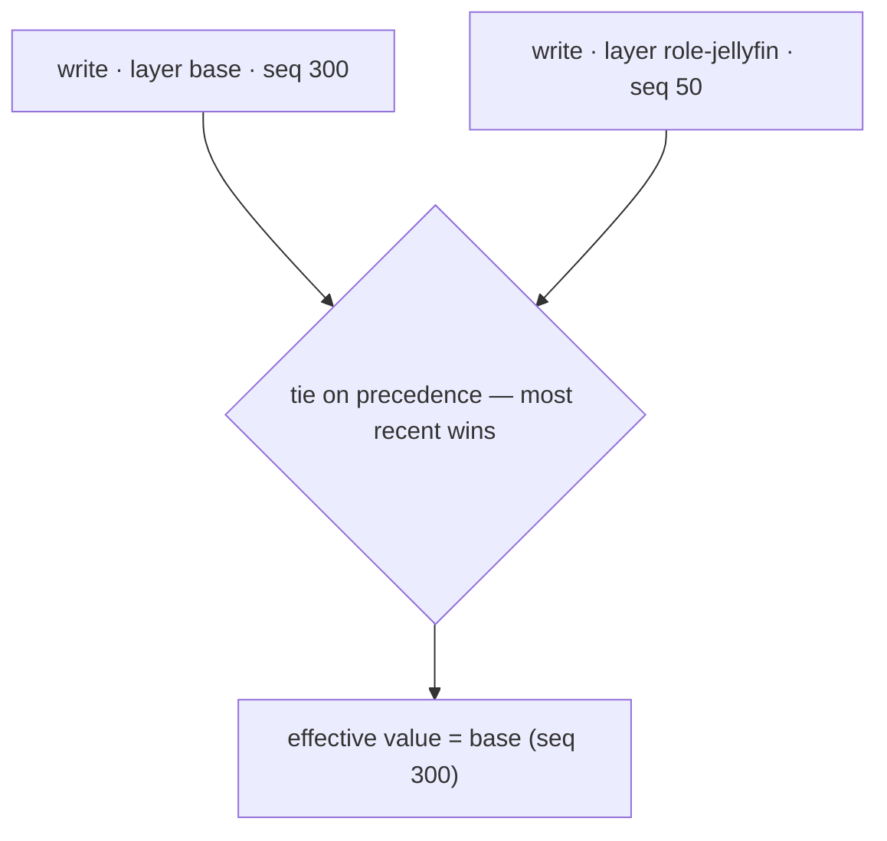

So far this topic has treated the registry as if each value had a single stored entry: you write it, you read it back. That was the *effective view* — true as far as it goes, and the right way to learn everything up to here. This page replaces it with what is actually underneath, because the registry is a **layered** store, and the layering is both the reason the subsystem exists and the part most likely to be misunderstood.

The misunderstanding is worth naming up front. It is natural to picture layers as a clean stack — sheets of glass, one above another, the top sheet's value showing through. That picture is wrong in the case that matters most, and unlearning it is most of this page.

## Layers, in one sentence

**A layer is a label stamped on a write and a handle for removing a group of writes together — not a position in a stack. The registry orders individual writes, not layers, and it chooses a winner separately for every single value.**

Hold onto both halves. First: the thing that has a position is the *write*, not the layer. Second: resolution is *per value* — the contest is run again, from scratch, for every value name.

## Every write is kept

When you write a value, the registry does not overwrite anything in place. It records your write, tagged with the layer you wrote it in. If a different layer writes the same value, that write is stored *alongside* yours, with its own tag. So a single value name can hold several stored writes at once — one for each layer that has ever written it. (Within one layer there is only ever one: writing a value again in the same layer replaces that layer's entry. One layer, one opinion per value.)

A read, though, returns exactly one value — the **effective value**. Several stored writes, one answer: there is a contest, and the rest of this page is its rules.

## How the winner is chosen

Each stored write carries two ordering keys:

- **precedence** — a number it inherits from its layer. Higher wins.
- **recency** — its place in a single, global, monotonic write-order counter. Later wins.

For one value, the registry gathers every active write to it and picks the winner by those keys **in order**: highest precedence first; among writes that tie on precedence, the most recent. That is the whole rule.

The subtlety is entirely in how those two keys play out in practice — because in practice, one of them almost never varies.

## Precedence is the exception; recency is the rule

Here is the fact that breaks the stack picture: **almost every layer has the same precedence.** The base layer is precedence 0. Role layers are precedence 0. Only a few things — chiefly domain policy — ever sit higher. So for the overwhelming majority of contests, precedence is a tie, and the winner is decided purely by **recency, value by value.**

That has a consequence the stack picture cannot express. Two layers at the same precedence have *no fixed pecking order between them*. For one value, layer A might win because it wrote that value most recently; for the value right beside it, layer B wins because it wrote *that* one last. Same two layers, same precedence, different winners — at the same instant.

A worked example. An administrator has made some manual edits (which land in the base layer) and has installed a role (`role-jellyfin`), both at precedence 0:

| Value | base wrote (seq) | role-jellyfin wrote (seq) | Effective value | Why |
|---|---|---|---|---|
| `MaxEventSize` | 300 | 50 | **base** | tie on precedence → most recent write wins |
| `BufferCapacity` | — | 250 | **role-jellyfin** | base never wrote it |
| `MaxNestingDepth` | 100 | 280 | **role-jellyfin** | role wrote it more recently |

There is no "top layer" here to point at. `base` owns one value, `role-jellyfin` owns two, and which is which is decided one value at a time by who wrote last. This is what "interwoven, not stacked" means, and it is the normal case, not an edge case.

So the stack-of-glass-sheets picture is only ever right when precedences genuinely differ — which is the minority. Drop it as your default image.

## A picture that fits

If you want one image to keep, use a **shared document where, for each cell, the last edit wins** — many editors, no locking, the most recent edit showing. That is the same-precedence case exactly: per-cell (per-value) last-write-wins, with no editor inherently above another. Precedence, when it appears, is an **administrator who can lock a cell**: once locked, that cell holds the locked value no matter who edits afterwards. Every metaphor leaks, but this one leaks in the right places — it foregrounds that resolution is per-cell and recency-driven, and casts precedence as the rare override it actually is.

## When precedence really does differ

When two writes have *different* precedence, recency stops mattering between them: **higher precedence always wins, even over a more recent lower-precedence write.** A value set by a precedence-1 layer long ago still beats one written to a precedence-0 layer a moment ago.

This is precisely what makes precedence worth having. Recency is fine for cooperating local configuration, but it cannot express "this setting must win even if someone writes it again later" — and that is exactly what policy needs. A domain **Group Policy** is delivered as a higher-precedence layer for this reason: a local administrator cannot defeat it by re-writing the value, because their write lands at precedence 0 and loses to the higher tier regardless of how recent it is. Precedence is the mechanism behind "you cannot override this locally". (Creating a layer that outranks others is itself a privileged action, so the tiering cannot be forged from below — more on that in [Access control](~peios/the-registry/access-control).)

## "Most recent" is write order, not the clock

One precision worth stating, because it is what makes the model trustworthy: recency is a **monotonic write-order counter**, not a wall-clock timestamp. Every write is handed the next number from a single counter that only ever increases. The registry does record a wall-clock "last write time" on each key, but only as human-facing metadata — it is never used to resolve a contest. So "most recent" means "later in the actual order of writes", which cannot be moved backwards or spoofed by a clock change.

## It is not only values

Everything above is framed around values, but the **same contest decides whether a key exists at a path.** Each layer can make its own claim about a name — "a key lives here" — and the winner is chosen by the same precedence-then-recency rule. A layer can even claim that *nothing* lives there, masking a key another layer provides. That is how a layer adds, replaces, or hides a key, and it resolves exactly as a value does. The markers that express absence — tombstones for values, hidden entries for keys — are the subject of the next page.

## Where to start

If you want the payoff — why all of this exists — read [What layers are for](~peios/the-registry/what-layers-are-for): the base layer, tombstones, the automatic-revert property, and how roles and Group Policy are built on it.

If you want the one thing layers do *not* revert — security — read [Access control on keys](~peios/the-registry/access-control). A security change made while a layer existed is *not* undone when the layer is removed, and the reason is worth understanding.

If you want to know how a watcher sees a layer change — it observes effective-state changes, with the layering made invisible — read [Watching for changes](~peios/the-registry/watches).
