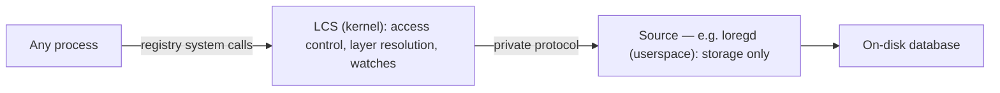

Every page until now has treated the registry as a single thing, and that was the right altitude to learn the model. This page pulls it apart, because at the implementation level "the registry" is two cooperating components — and the division between them is clean, deliberate, and worth knowing once the concepts are solid.

## The split, in one sentence

**The registry is a kernel subsystem (LCS) that is the sole authority for the data model, access control, layer resolution, and change notification — plus one or more userspace *sources* that do nothing but persist and return data; `loregd` is the first source, backing the `Machine` and `Users` hives.**

## Who does what

The dividing line is sharp, and it is the principle the whole design rests on: **the kernel decides meaning; sources only store.**

| The kernel subsystem (LCS) owns | A source owns |
|---|---|
| The data model — keys, values, types | Persisting entries to disk and returning them |
| Path resolution and routing | Nothing about *who* is asking |
| [Access control](~peios/the-registry/access-control) — running AccessCheck | No security decisions at all |
| [Layer resolution](~peios/the-registry/layers) — choosing the effective value | No idea which write is effective |
| [Watch](~peios/the-registry/watches) dispatch and transaction coordination | Executing storage operations it is told to |

A source never sees a caller's identity, never evaluates a security descriptor, and never resolves a contest between layers. It stores writes tagged with layer names and hands *all* of them back when asked; the kernel does the deciding. That is why earlier pages could say "the registry checks", "the registry resolves" — it is always the kernel doing it, never the store.

Userspace never talks to a source directly. Every registry operation goes through the kernel; the source talks only to the kernel, over a private protocol on a dedicated device. This is what lets the registry carry the same identity model, access control, and auditing as everything else — the kernel is unavoidably in the path.

## Why split it this way

Storage is a separable concern. Putting it in userspace means the backing store can be replaced, or different stores can back different hives, without changing the kernel — and the store can be developed, tested, and hardened as an ordinary (if privileged) service. The kernel keeps the parts that *must* be trusted and uniform — the data model and the security model — and delegates the part that is "just a database".

Hives are how the work is parcelled out: each hive is backed by exactly one source, and a source may back several hives. In practice `loregd` registers `Machine` and `Users`; other sources could register additional hives.

## The trust boundary

It is worth being blunt about the security boundary, the same way the rest of these docs are. **A source is part of the trusted computing base.** The kernel runs AccessCheck, but it runs it against the security descriptor the *source* hands back — so a compromised source can return a permissive SD for a key and cause access that should have been denied, or fabricate the precedence of a layer and tilt every contest in the system. The kernel validates that a source's responses are *structurally* well-formed and rejects malformed data, but it cannot detect a well-formed lie.

This is not a gap so much as a fact about where the boundary is: trusting the store to tell the truth about what it stores is inherent in having a userspace store at all. The mitigations are operational — a source runs with tightly scoped privileges, is protected by the security descriptors on its own service definition, and is managed as a critical service (with process-integrity protection where available). The honest summary is: the store is small, privileged, and trusted, and protecting it is part of protecting the system.

## Two operations the kernel coordinates

Two registry capabilities are the kernel *orchestrating a source* rather than features of the data model: atomic [transactions](~peios/the-registry/transactions), and [backup and restore](~peios/the-registry/backup-and-restore). In both, the source does the storage work — committing a batch atomically, or reading out and replacing a subtree — while the kernel coordinates it and enforces the rules around it. Each has its own page; the point here is only that the same division of labour holds: the kernel decides, the source stores.

## When a source goes away

Because the store is a separate process, it can crash or restart. When a source goes down its hives become unavailable: open key handles stay valid (they hold identity and a granted mask, neither of which needs the store), but operations that need to reach the store return an error until it is back. [Watches](~peios/the-registry/watches) stay armed across the outage, and when the source re-registers, watchers receive an overflow so they re-read and resynchronise. The registry treats a store restart as a disruption to recover from, not a reason to lose state.

## Where to start

You have now seen the whole model — data, meaning, layers, security, change notification, and the parts underneath.

For the tool you will reach for most when configuring a system — looking up what any key or value means — read [The registry manual (regman)](~peios/the-registry/regman).

Three advanced topics remain:

For grouping several writes into one all-or-nothing change — how a role installs without ever being half-applied — read [Advanced: transactions](~peios/the-registry/transactions).

For complete per-caller isolation — hives and layers visible only to one sandboxed process — read [Advanced: private hives and layers](~peios/the-registry/private-hives-and-layers).

For keys that point at other keys — the one place the registry follows a value — read [Advanced: registry links](~peios/the-registry/registry-links).
