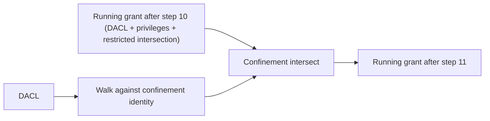

The confinement pass is the access-check step that enforces confinement policy. It fires at **step 11** of the pipeline, after the DACL walk and the restricted-token pass have produced their results. The kernel runs the DACL one more time against the confinement identity — `confinement_sid` plus `confinement_capabilities` — and intersects the result with what the rest of the pipeline has so far granted.

The intersection is absolute. Any bit not present in *both* the running grant and the confinement-only grant is dropped. This is what makes confinement different from the restricted-token pass: there is no "privileges are restored after the intersection" step. What confinement removes stays removed.

This page covers the mechanics of the pass — when it fires, what the secondary walk does, what bypasses it, and the role of `confinement_exempt` and `isolation_boundary`.

## When the pass fires

The confinement pass fires when:

- The token's `confinement_sid` is non-null, **and**
- The token's `confinement_exempt` flag is false.

If either is false, the pass is a no-op and the running grant passes through unchanged.

The pass is **per access check**. There is no caching of "this token always loses these bits" — the kernel runs the secondary walk every time, because the DACL on the object being accessed determines what the confinement identity would have been granted, and that varies per object.

## What the secondary walk does



The kernel runs a second DACL walk against the same DACL the normal walk ran against. But the matching identity is different:

| Element | Used in secondary walk |
|---|---|
| User SID | **Confinement SID**, in place of the token's `user_sid`. |
| Groups | **Confinement capabilities** (`confinement_capabilities` list), in place of the token's `groups`. Group attributes (enabled/disabled) are ignored — presence-based matching only. |
| Restricted SIDs | Ignored. The restricted-token pass already ran in step 10. |
| Owner SID | The object's owner SID, but **owner implicit rights are not applied**. A confined caller who happens to own the object does not get `READ_CONTROL | WRITE_DAC` for free. |
| Mandatory label | The MIC pre-decisions from step 5 are not re-evaluated. They were applied before the DACL walk; they remain applied. |

In strict mode (the token does not carry `ALL_APPLICATION_PACKAGES`), an ACE granting rights to `ALL_APPLICATION_PACKAGES` does **not** match. In normal mode it does. `ALL_RESTRICTED_APPLICATION_PACKAGES` matches in both modes.

The walk produces a `granted_confinement` mask. The pipeline then computes:

```
granted = granted & granted_confinement
```

Any bit not in both sides drops out. No restoration step follows.

## What confinement does *not* preserve

The intersection drops bits regardless of where they came from. Specifically:

- **Privilege-granted bits are dropped.** Bits granted by `SeBackupPrivilege`, `SeRestorePrivilege`, `SeSecurityPrivilege`, or `SeTakeOwnershipPrivilege` in steps 4 or 9 are subject to the intersection. If the confinement DACL would not have granted them, they are lost. This is the major distinction from the restricted-token pass.
- **Owner implicit rights are dropped if the confinement identity is not the owner.** Step 8 granted the owner `READ_CONTROL | WRITE_DAC`. The confinement secondary walk does not apply owner implicit rights to a non-matching identity — the confinement SID is what is being walked, and it is not the owner. So the owner's implicit rights are lost.

The owner-implicit-rights case is the surprising one. A confined application running as a user who owns an object cannot read or modify the SD of that object unless the DACL specifically grants the confinement identity those rights. The fact that the user is the owner does not help — the confined identity is what counts at step 11.

## What confinement does preserve

A handful of decisions are *not* re-evaluated in step 11:

- **MIC decisions from step 5.** Whatever MIC pre-decided as denied at step 5 stays decided. Confinement does not undo MIC; it adds on top.
- **PIP decisions from step 5.** Same.
- **The token's identity for non-AccessCheck purposes.** Confinement does not change `user_sid` or `groups` for any kernel API other than AccessCheck. A confined process still appears as its original user in `getpwuid`-style queries, in `/proc/<pid>/status`, and in any other identity-display surface.

The intersection is purely an AccessCheck mechanism. It does not change who the process *is*; it changes what *AccessCheck* lets the process do.

## confinement_exempt

The `confinement_exempt` flag on a token is the escape hatch. When true, step 11 is skipped entirely: the running grant from step 10 passes through unchanged. The token is still confined in the sense that `confinement_sid` is set — it just is not enforced.

The flag is set very rarely. The intended use case: a privileged helper that runs alongside a confined application and needs to step outside the confinement for specific operations. Both halves share the user identity; the helper has `confinement_exempt` set so it can reach resources the confined main application cannot.

`confinement_exempt` is set at token creation by authd and cannot be changed at runtime. Like every other token field, the flag is immutable once minted.

The flag does **not** affect the rest of the pipeline. Steps 0 through 10 run normally on a `confinement_exempt` token. The flag short-circuits only step 11. PIP, MIC, the DACL walk, restricted-token narrowing, and CAAP all still apply.

## isolation_boundary

The token has a fourth confinement-related field: `isolation_boundary`. It is **reserved in v0.20** — the kernel reads it but does not enforce it. The semantic the field is reserved for: an additional layer on top of confinement where objects *outside* the boundary are made **invisible** rather than just denied. A confined application with `isolation_boundary` set would see only objects whose policy granted to its boundary; everything else would appear not to exist (rather than appearing and being denied).

The distinction matters in two cases:

- Enumeration. A confined application listing the contents of a directory should see only objects in its boundary, not "denied" entries for objects outside.
- Existence checks. A confined application calling `stat` on a path outside its boundary should get "no such file" rather than "permission denied".

The full mechanics — what "outside the boundary" means, how it interacts with the FACS handle model, how object enumeration is filtered — are reserved for a future version. In v0.20, `isolation_boundary` is a no-op; the field is on the token for forward compatibility.

For now, treat it as unused. Tokens that need invisibility-instead-of-denial semantics will need an updated kernel to enforce them.

## Composition with other narrowing layers

A confined token can also be restricted, and can also be accessing a CAAP-bound object. All three narrowing layers (restricted at step 10, confinement at step 11, CAAP at step 12) fire in order. Each is a strict intersection. The final granted mask is the conjunction of:

1. Whatever the DACL walk + privileges produced (steps 4–9).
2. Whatever the restricted-token walk would have produced (step 10, if `restricted_sids` is non-empty).
3. Whatever the confinement walk would have produced (step 11, this page).
4. Whatever every applicable CAAP rule's effective DACL would have produced (step 12).

For each step that is active, the running grant is narrowed by the intersection. For each that is not, the grant passes through.

The order matters in one subtle way: privileges are restored after the restricted-token pass but **not** after the confinement pass. A bit that survived step 10 because privileges restored it can still be dropped at step 11 if confinement does not grant it. The privilege rescue is partial.

See [Narrowing layers](~peios/access-decisions/narrowing-layers) for the composition rules across all three intersections.

## A worked example

A service is deployed under confinement. Its token has:

- `user_sid = jellyfin_user_SID`
- `groups = [jellyfin_user_SID, BUILTIN\Users, Authenticated Users, Everyone]`
- `confinement_sid = S-1-15-2-1` (the package identity)
- `confinement_capabilities = [S-1-15-3-1 (internetClient), S-1-15-3-10 (removableStorage), S-1-15-2-1 (ALL_APPLICATION_PACKAGES — normal mode)]`
- `privileges = [SeChangeNotifyPrivilege, SeCreateSymbolicLinkPrivilege]` (default-grant set; nothing else)

The service tries to open `/var/lib/jellyfin/library.db` for reading. The file's SD:

- Owner: `jellyfin_user_SID`
- DACL:
  - ACE 1: `ACCESS_ALLOWED Authenticated Users GENERIC_READ`
  - ACE 2: `ACCESS_ALLOWED ALL_APPLICATION_PACKAGES GENERIC_READ`

The access check:

1. Steps 0–4: no impersonation issue, SD valid, generic mapping expands GENERIC_READ to FILE_READ_DATA | FILE_READ_ATTRIBUTES | FILE_READ_EA | READ_CONTROL, no privileges applicable.
2. Step 5: no MIC label (default Medium / NO_WRITE_UP — does not block read), no PIP label. Nothing pre-decided.
3. Step 6: virtual group injection. `OWNER RIGHTS` is added (the token owns the file). But the object's DACL has no OWNER RIGHTS ACE, so the implicit `READ_CONTROL | WRITE_DAC` will be granted at step 8.
4. Step 8: owner implicit grants READ_CONTROL | WRITE_DAC. The DACL walk grants FILE_READ_DATA et al. via ACE 1 (Authenticated Users match). The grant is comprehensive.
5. Step 10: restricted-token pass skipped (no restricted_sids).
6. Step 11: confinement pass. The secondary walk runs against the confinement identity.
   - The confinement SID matches no ACE (the SD has no ACE on the package SID).
   - The capability `internetClient` matches no ACE.
   - The capability `removableStorage` matches no ACE.
   - The capability `ALL_APPLICATION_PACKAGES` matches ACE 2, granting GENERIC_READ-expanded bits.
   - Owner implicit rights are **not** applied (the confinement identity is not the user_sid).
   - Result: `granted_confinement = {FILE_READ_DATA, FILE_READ_ATTRIBUTES, FILE_READ_EA, READ_CONTROL, SYNCHRONIZE}`.
   - The intersection with the running grant: the running grant had owner-implicit READ_CONTROL | WRITE_DAC plus the user-granted read bits. The intersection keeps the read bits and READ_CONTROL but drops WRITE_DAC (which the confinement identity would not have been granted).
7. Step 12: no CAAP.
8. Result: the service can read the file but cannot modify its DACL even though it owns the file. The owner implicit grant is gone because confinement does not preserve it.

This is the expected behaviour. The service runs as the user who owns its library file but does not get owner-style authority on the file because the confinement layer specifically removed it.
