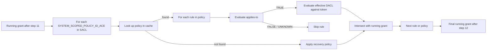

CAAP evaluation is **step 12** of the access-check pipeline. By this point the DACL walk has run, owner implicit rights have been applied, restricted-token and confinement passes have done their work, and the running grant is whatever survived. CAAP can only narrow this grant further — it never adds.

The mechanism is the same shape every narrowing layer uses: re-walk the DACL against a different identity (or DACL), intersect, move on. The difference for CAAP is what gets walked: each referenced policy's rules are evaluated, and each applicable rule's effective DACL is intersected with the running grant.

This page covers the evaluation flow, the no-recursion rule that prevents CAAP from referencing other CAAPs, and the composition with the rest of the pipeline.

## The evaluation flow

In code-shape order:

1. **Scan the object's SACL** for `SYSTEM_SCOPED_POLICY_ID_ACE` entries that are not inherit-only.
2. **For each such ACE**, take the SID and look it up in the kernel's policy cache.
3. **If the policy is not in the cache**, apply the recovery policy — a hardcoded fallback that grants `GENERIC_ALL` only to `BUILTIN\Administrators`, `SYSTEM`, and `OWNER_RIGHTS`. The intersection happens just like any other CAAP rule's would. See [Distribution and recovery](~peios/central-access-policies/distribution-and-recovery).
4. **If the policy is in the cache**, iterate through its rules.
5. **For each rule**, evaluate the `applies_to` expression against the caller's token, the object's resource attributes, and the local claims supplied by the caller. If the expression evaluates to TRUE, the rule applies; if FALSE or UNKNOWN, the rule is skipped.
6. **For each applicable rule**, evaluate the `effective_dacl` against the calling token. This is a recursive sub-AccessCheck — the rule's DACL is walked against the token the same way a regular DACL would be.
7. **Intersect** the rule's grant with the running grant. Bits not present in both are dropped from the running grant.
8. **Collect the rule's `effective_sacl`** for the eventual audit walk at step 14.
9. **Also evaluate the staged DACL/SACL** if present, in parallel. The staged evaluation does not affect the running grant — it only contributes to the staging mismatch flag if its result differs. See [Staged policies](~peios/central-access-policies/staged-policies).
10. **Move on** to the next rule (or, when all rules are evaluated, the next policy).
11. **After every applicable rule from every applicable policy**, the final running grant is what survives. This becomes the input to step 13.

The order does not affect the result. Intersection is commutative — two CAAP rules applied in either order produce the same final grant — so the kernel can evaluate rules in whatever order is convenient.

## The recursive sub-AccessCheck

When the kernel evaluates a rule's effective DACL, it constructs a **synthetic SD** to run the AccessCheck against:

- The synthetic SD's DACL is the rule's `effective_dacl`.
- The synthetic SD's owner is the object's actual owner. (Owner implicit rights still apply if the caller is the owner — a CAAP cannot suppress owner implicit grants.)
- The synthetic SD's primary group is the object's actual primary group.
- The synthetic SD's SACL is **stripped of any `SYSTEM_SCOPED_POLICY_ID_ACE` entries** before evaluation. This is the no-recursion rule.

The recursive AccessCheck then runs against this synthetic SD with the same token and the same desired mask. It produces a granted mask. That mask is what gets intersected with the running grant.

## The no-recursion rule

The synthetic SD's SACL has its `SYSTEM_SCOPED_POLICY_ID_ACE` entries stripped before evaluation. This is what stops a CAAP from referencing another CAAP.

Without this rule, a CAAP rule's effective DACL could contain — or its synthetic SD's SACL could imply — references to additional policies, which would themselves be evaluated, which could reference further policies, and so on. The chain has no natural bound. The kernel addresses this by simply refusing to follow any CAAP reference inside a CAAP evaluation: the synthetic SD's SACL has its scoped-policy ACEs erased, so the recursive AccessCheck sees no CAAP references.

A reasonable question: what if a CAAP author wants their policy to compose with another? The answer is to put both `SYSTEM_SCOPED_POLICY_ID_ACE` entries in the **object's** SACL, not nest them. The two policies will be evaluated as siblings — each is intersected with the running grant — and the order does not matter because intersection is commutative. The effect is the same as nesting would have produced but without the recursion concern.

## Composition with other narrowing layers

CAAP is the **last** narrowing layer in the pipeline. By the time it runs at step 12:

- The DACL walk (step 8) has produced the initial grant from the object's own DACL.
- The restricted-token pass (step 10), if active, has intersected against the restricted-SID-only view.
- The confinement pass (step 11), if active, has intersected against the confinement identity.

CAAP then intersects against each applicable rule's effective DACL. The running grant survives all four (the DACL walk plus three intersections) if and only if every layer permitted the bit.

The composition is conjunctive: each layer must independently grant the right for it to remain. Adding CAAP to a token already restricted and confined further narrows; it cannot bring back access the earlier layers stripped.

Privilege grants are subject to CAAP intersection, like other bits. A CAAP rule whose effective DACL does not grant a right will strip that right from the running grant even if a privilege had granted it in step 4 or step 9. CAAP is privilege-blind in the same way confinement is.

See [Narrowing layers](~peios/access-decisions/narrowing-layers) for the full composition.

## CAAP and audit

The audit contribution of CAAP — the `effective_sacl` of each applicable rule — is collected during step 12 but not consumed until step 14, the SACL audit walk. The audit ACEs in CAAP effective SACLs are added to the object's own SACL ACEs, and the audit walk treats the combined set as a single SACL for the purposes of deciding which events to fire.

Audit ACEs in a CAAP can target the same identities and produce the same kinds of events as regular SACL audit ACEs. The CAAP contribution does not get its own event type or its own audit log entry — the events look like any other audit events, except that the matched ACE happens to have come from a policy rather than the object's own SACL.

This means the audit pipeline does not need to know about CAAP specifically. From the perspective of an audit consumer, the events are the same. The provenance — which ACE matched, whether that ACE was on the object or in a CAAP — is recorded in the event's `trigger` field for consumers that care.

The full audit model is in [Auditing](~peios/auditing/overview).

## Errors during evaluation

A handful of failure modes can occur during CAAP evaluation. The kernel handles each one specifically:

| Condition | Behaviour |
|---|---|
| Referenced policy SID not in cache | Apply the recovery policy. The running grant is intersected with what the recovery policy would grant. The recovery policy is administrator-friendly: it grants `GENERIC_ALL` to Administrators, SYSTEM, and OWNER_RIGHTS only. |
| Policy in cache but malformed | The same as not in cache — recovery policy applies. (`kacs_set_caap` should reject malformed policies at ingestion, but defence in depth.) |
| Applies-to expression returns UNKNOWN | Rule is skipped. (Different from a deny-ACE's UNKNOWN, which would apply — see [Policies and rules](~peios/central-access-policies/policies-and-rules) for the asymmetry rationale.) |
| Effective DACL evaluation produces an error | Treated as "this rule denies everything except privilege-granted bits". The running grant is reduced to whatever privileges had pre-decided as granted. |

The pattern: errors fail-closed (i.e. they reduce the running grant, not extend it). A malformed policy or a corrupted effective DACL cannot accidentally grant access. The worst case is denial of access, with the recovery policy ensuring administrators retain a way back in.

## Check-at-open

CAAP evaluation runs only during AccessCheck calls. A handle that was opened ten minutes ago has its granted mask cached on the file descriptor; the access check that decided it ran at open time. A subsequent CAAP update does not retroactively affect that handle.

For FACS-managed objects (files, directories), the granted mask is cached on the open handle and used for subsequent operations against the handle. The mask is not recomputed. See [The handle model](~peios/file-access/the-handle-model).

For non-FACS objects that re-evaluate AccessCheck on each operation (some IPC endpoints, some token operations), the CAAP update would be visible immediately on the next operation.

The user-visible effect: changing a CAAP changes what new accesses see. It does not change what existing handles can do. Tools that need a CAAP update to be visible immediately need to coordinate session revocation or service restart — see [Distribution and recovery](~peios/central-access-policies/distribution-and-recovery).
