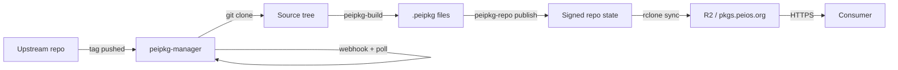

Peios distributes software as **`.peipkg` files** — signed, byte-deterministic archives served from a static HTTP repository. Producing those files and getting them in front of users is the job of three small tools that fit together into one workflow.

This page is the map. It shows how the pieces connect before you dive into any of them.

## The three tools

Each tool does exactly one thing.

| Tool | Responsibility | Audience |
|---|---|---|
| **`peipkg-build`** | Turn a recipe + source tree into a signed `.peipkg`. | Recipe authors. Anyone making a package. |
| **`peipkg-repo`** | Turn a directory of `.peipkg` files into a signed repository state (descriptor + indexes). | Repository operators. |
| **`peipkg-manager`** | Watch upstreams for new versions, drive `peipkg-build` and `peipkg-repo` automatically, sync the result to wherever the repo is hosted. | Build farm operators. |

The first two are pure functions: same input, same output bytes, every time. They have no daemon, no state, no network listeners. They exist as standalone binaries so a third party can build a single package without running farm infrastructure.

`peipkg-manager` is the daemon that ties them together. It owns the state (source caches, build queue, signing keys, R2 credentials, /status endpoint) and shells out to the byte-emitters when work needs doing.

## The data flow

Here is what happens when an upstream tags a new release:

1. **Upstream tags a new version.** `peipkg-manager` learns about it through a webhook (instant) or its periodic poll (worst-case, the configured interval — default 1h).
2. **Manager clones source.** `git clone --depth 1 --branch <tag>` into a per-build directory. The `.git/` directory is stripped so build scripts get a clean tree.
3. **Manager invokes `peipkg-build`.** The recipe (`peipkg.toml` plus `build.sh`) describes how to compile and which files end up in which output package. A multi-stanza recipe can produce several `.peipkg` files from one build (runtime, `-dev`, `-doc`).
4. **Manager invokes `peipkg-repo publish`.** The new `.peipkg` files are folded into the existing repository state. The active and archive indexes are regenerated, signed with the operator's Ed25519 key, and laid out at the conventional `<repo-base>/...` paths.
5. **Manager syncs the state to a remote.** `rclone sync` for R2, `git push` for GitHub Pages, `rsync` for a VPS. The remote is the public-facing repository.
6. **A consumer fetches the package.** Static HTTPS — no server-side computation needed.

## Where to start

If you are writing a recipe for a new package, start with [Build your first package](./build-your-first-package). It walks through `peipkg-build` end-to-end with a working example.

If you are operating a build farm — running the official Peios repository or a custom one — start with [Set up a build farm](./set-up-a-build-farm). It covers installation, configuration, signing keys, and hosting backends.

If you want the on-wire format details (what a `.peipkg` file contains, how indexes are signed, how versions compare), the **PSD-009** specification under `learn-new/specs/` is the normative reference. These docs explain how to *use* the system; the spec defines what it *is*.

## Why three tools instead of one?

The three tools have different lifecycles, different audiences, and different threat models.

`peipkg-build` and `peipkg-repo` are governed by the **PSD-009** specification: their output bytes must match across implementations, and their behaviour barely changes once the spec is locked. They are reusable in isolation: a third party can run `peipkg-build` to produce a `.peipkg` for their own internal package without deploying any farm infrastructure.

`peipkg-manager` is operational. It evolves with workflows: new hosting backends, new event sources, new monitoring needs. Wrapping the byte-emitters in one big binary would couple the spec-governed parts to the operational parts and force every change in one to risk regressions in the other.

In practice, the split also matches how operators deploy: `peipkg-manager` lives on a long-running build host with the signing key and webhook listener; `peipkg-build` and `peipkg-repo` are tiny static binaries it shells out to. A third-party recipe author can pull just `peipkg-build` and produce packages without ever touching the rest.
