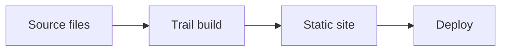
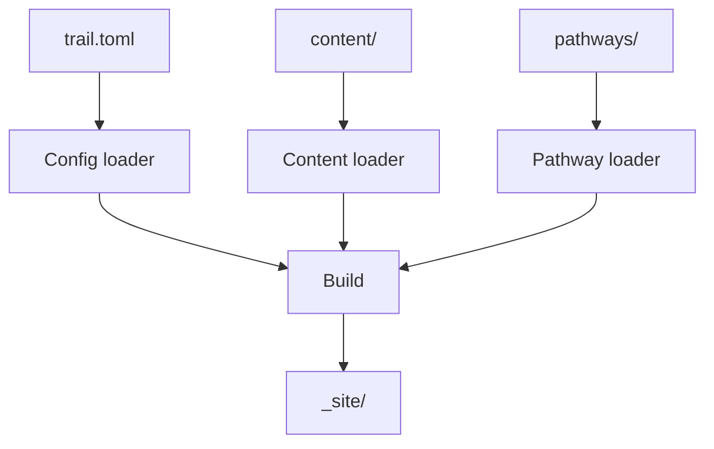
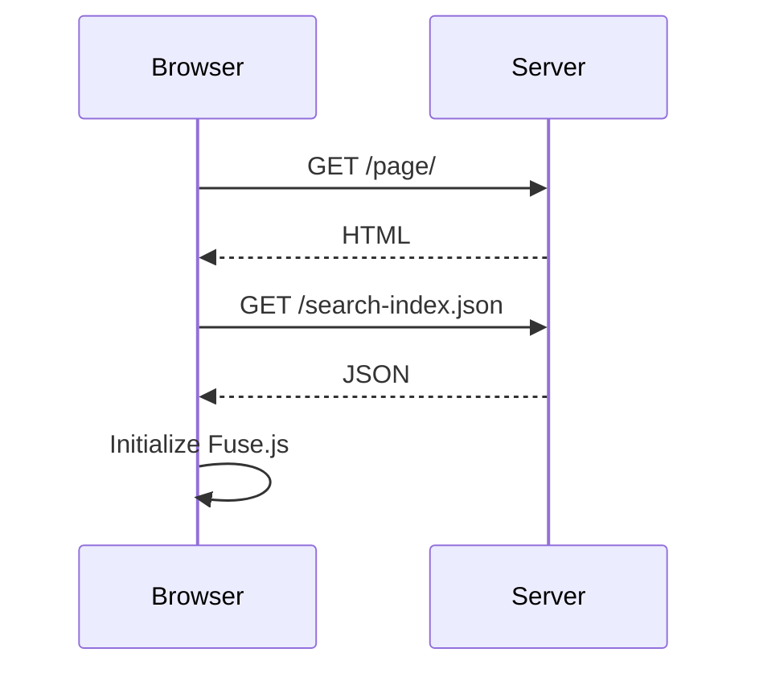

Trail supports Mermaid diagrams in fenced code blocks. Diagrams are rendered client-side by the Mermaid JavaScript library (loaded from CDN).

## Syntax

Use a fenced code block with the language tag `mermaid`:

````markdown

````

Trail detects the `mermaid` language tag and replaces the code block with a `<div class="mermaid">` element. Mermaid parses the diagram definition and renders it as an SVG.

## Supported diagram types

Trail does not restrict which Mermaid diagram types you use. Any diagram type supported by Mermaid 11 works, including:

| Diagram type | Mermaid keyword |
|---|---|
| Flowchart | `flowchart` or `graph` |
| Sequence diagram | `sequenceDiagram` |
| Class diagram | `classDiagram` |
| State diagram | `stateDiagram-v2` |
| Entity relationship | `erDiagram` |
| Gantt chart | `gantt` |
| Pie chart | `pie` |
| Git graph | `gitGraph` |
| Mindmap | `mindmap` |
| Timeline | `timeline` |

See the [Mermaid documentation](https://mermaid.js.org/) for the full syntax of each diagram type.

## Example: flowchart

````markdown

````

## Example: sequence diagram

````markdown

````

## Dark mode support

Trail initializes Mermaid with the correct theme based on the current color mode:

- **Light mode:** Mermaid uses the `default` theme.
- **Dark mode:** Mermaid uses the `dark` theme.

When the reader toggles dark mode, Trail re-renders all Mermaid diagrams with the new theme. This is done by storing the original diagram source in a `data-mermaid-src` attribute on each diagram element, restoring it on theme change, and re-running Mermaid.

## How it works

At build time, Trail's `transformMermaid` function finds code blocks with the `language-mermaid` class and replaces them with `<div class="mermaid">` elements containing the raw diagram text.

At page load, the Mermaid library (loaded from `cdn.jsdelivr.net`) initializes and renders all `.mermaid` elements. Before initialization, Trail saves each element's text content to a `data-mermaid-src` attribute so that diagrams can be re-rendered on theme toggle.
