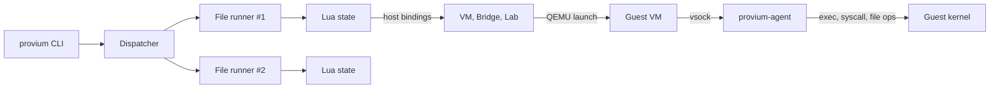

Provium is a test harness for software that needs a real operating system underneath it. It boots a VM per file, exposes a Lua API for driving the guest (commands, files, syscalls, networking, faults), and reports results through the same `passed`/`failed`/`skipped` shape any other test runner would.

It is the runner Peios uses for kernel-side and system-service tests, but there is nothing Peios-specific in the harness — any guest that ships the Provium agent binary works.

## Why Provium exists

Most kernel-adjacent code is hard to test. Unit tests can verify pure logic, but they cannot exercise:

- Driver behaviour against real hardware abstractions (disks, NICs, clocks).
- Networking behaviour under partition, latency, packet loss, or bandwidth caps.
- Multi-host topologies — two guests on the same bridge, three guests in a cluster.
- The boot path itself.
- Failure injection (EIO, slow I/O, link-down, kernel panic recovery).
- Snapshots, restores, and time travel.

The alternatives — containers, mock kernels, in-process simulators — each give up something important. Provium chooses the path of "use a real VM, make it cheap to spawn, and put a high-leverage API on top."

A single test file looks like this:

```lua
test("guest can ping its bridge peer", function(t)
    local lan = provium:bridge("lan")
    local a = provium:vm("a", "peios"):boot()
    local b = provium:vm("b", "peios"):boot()
    lan:attach({a, b})
    local r = a:run("ping -c 1 -W 1 b.lan")
    r:assert_ok()
end)
```

When the file runs, Provium boots two VMs, sets up a real Linux bridge with TAP interfaces, attaches both, runs `ping` inside `a`, and tears everything down at the end. No mocks, no shims.

## What Provium gives you

| Capability | What it does |
|---|---|
| **VM lifecycle** | Boot, snapshot, restore, pause, resume, reset, power-button. Snapshots survive across files via the fixture cache. |
| **Layer-1 ops** | `vm:run("cmd")`, `vm:read_file`, `vm:write_file`, `vm:stat`, `vm:mkdir` — the things you'd normally do over SSH, but driven through a vsock agent so they stay fast and self-contained. |
| **Layer-0 ops** | `vm:syscall`, `vm:ioctl` — direct invocations against the guest kernel, with byte-buffer support for in/out parameters. |
| **File handles** | Open, read, write, seek, tell, close, tail. Mirrors POSIX semantics. |
| **Async processes** | `vm:run_async` returns a `Process` userdata you can `:wait`, `:kill`, `:signal`, write `stdin` into, and stream `stdout`/`stderr` from. |
| **Workers** | `vm:spawn_worker()` lets a test concurrently exercise the guest from multiple agent connections without spinning up another VM. |
| **Networking** | Real Linux bridges with TAP interfaces. `bridge:partition`, `bridge:add_latency`, `bridge:drop_rate`, `bridge:bandwidth_limit`, `bridge:isolate`, `bridge:capture` (pcap), and uplink/NAT for outbound traffic. |
| **Disks** | Attach images, read sectors, write sectors, inject `eio_read` / `eio_write` / `slow` faults. |
| **Console** | Read the boot log, stream the chardev, write input. Useful for tests that exercise early-boot behaviour or interactive prompts. |
| **Clock control** | `vm:clock():set`, `:advance`, `:sleep`. Tests that depend on time can move time deterministically. |
| **Streams** | `Tail`/`Capture`/`Console` streams all share `next` / `read_until` / `expect` / `drain` / `close` / `eof` so log-watching, pcap-watching, and console-watching all feel the same. |
| **Fixtures** | `provium:vm_fixture("base")` builds a snapshot once, caches it on disk, and restores it for every test that asks for it. Lab fixtures (`provium:lab_fixture(...)`) cache whole multi-VM topologies the same way. |
| **Resource pool** | A scheduler with memory and CPU budgets. Test files declare what they need with `provium:claim({memory="2G", cpus=4})`; the scheduler runs as many in parallel as the budget allows. |
| **Observability** | Every host-side action emits a structured msgpack event. Pipe it to `provium-coverage`, save to a file, multiplex over a Unix socket, or just watch the human-readable summary. |
| **Determinism aids** | `boot_opts.rng_seed`, `boot_opts.initial_time`, fixture-cache keying that folds in kernel + initrd hashes. |

## How it compares

| | Provium | LXC / Docker | KUnit | Mocked I/O |
|---|---|---|---|---|
| **Real kernel** | Yes (per VM) | Shared with host | Yes (single test kernel) | No |
| **Driver-level testing** | Yes | Limited | Limited | No |
| **Network impairments** | Built-in | External tools | No | No |
| **Multi-host topologies** | Built-in | Compose / k8s | No | No |
| **Snapshot + restore** | Built-in (fixtures) | Manual | No | N/A |
| **Fault injection** | Built-in (`fault_inject`, `clock:advance`) | Limited | Limited | Yes |
| **Per-test isolation** | Fresh VM per file | Container per test | Test-binary boundary | Process |
| **Wire protocol exposed** | Yes (`vm:syscall`, `vm:ioctl`) | No | Direct in-kernel | N/A |
| **Test language** | Lua 5.4 | Shell / Go / Python | C | Any |
| **Dependencies** | QEMU, KVM, iproute2, nftables | Docker daemon, etc. | Kernel build | Test framework |

## How it works



When you run `provium tests/`, the CLI:

1. Walks `tests/` for `*.test.lua` files.
2. Hands each file to the dispatcher, which acquires resources from the pool.
3. Spins up a Lua state per file, installs the `provium` global, and executes the file.
4. Inside the file, calls like `provium:vm("a", "peios"):boot()` launch real QEMU processes and hand back userdata wrappers around them.
5. Operations against those VMs (`vm:run`, `vm:read_file`, `vm:syscall`) are dispatched over vsock to the `provium-agent` running in the guest.
6. At file end (or per-test if `provium.reset_between_tests = true`), the resource graph is walked in reverse-dependency order and every stream, process, file, worker, VM, and bridge is closed.

The whole loop is observable: every VM spawn, every file dispatched, every fixture cache hit, every test pass/fail, every pool-state snapshot becomes an event on the wire.

## What's not here

- **No browser / GUI testing.** Provium drives guests through agent ops, not graphical interfaces.
- **No Windows guests.** The agent is Linux-only in v1.
- **No live cluster orchestration.** Provium is a test harness, not Terraform.
- **No mock VMM.** Tests run against real KVM. The `--vmm local` mode exists for ad-hoc dev runs without KVM but does not boot a kernel — it just gives the host bindings something to dispatch against.
