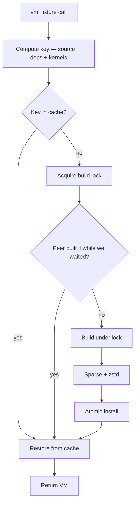

Fixtures are pre-built VM (or whole-lab) snapshots that test files restore from instead of re-doing setup work. This page covers the cache model end-to-end.

The exhaustive method reference is on [Lab](~provium/reference/lab) (`vm_fixture`, `lab_fixture`); the userdata is on [Snapshot](~provium/reference/snapshot).

## Discovery

A fixture is any `*.fixture.lua` file under one of the `roots` directories listed in `provium.toml`. Test files reference fixtures by their test-root-relative path with the `.fixture.lua` suffix omitted:

```
tests/
  fixtures/
    base.fixture.lua            -- referenced as "fixtures/base"
    cluster.fixture.lua         -- referenced as "fixtures/cluster"
  uses-base.test.lua
```

```lua
-- in uses-base.test.lua:
local vm = provium:vm_fixture("fixtures/base")
```

If the same name resolves under multiple roots, the first-listed root wins. Missing fixtures error at restore time with `fixture \`X\` not found in any test root`.

## Two fixture shapes

### Single-VM fixture (`vm_fixture`)

The chunk ends with `return vm:snapshot()`:

```lua
-- tests/fixtures/base.fixture.lua
local vm = provium:vm("base", "peios"):boot()
vm:run("apk add --no-cache curl"):assert_ok()
return vm:snapshot()
```

Cached as `<key>.snap` — a single sparse zstd-compressed file.

### Lab fixture (`lab_fixture`)

The chunk ends with `return provium:snapshot()`:

```lua
-- tests/fixtures/cluster.fixture.lua
local lan = provium:bridge("lan")
local a = provium:vm("a", "peios"):boot()
local b = provium:vm("b", "peios"):boot()
lan:attach({a, b})
return provium:snapshot()
```

Cached as `<key>.lab/` — a directory containing per-VM `.snap` files plus a `lab.json` index.

## What ends up in the cache key

The cache key is a SHA-256 of, in order:

1. The fixture file's source bytes.
2. Every transitively-referenced fixture's key (so `vm_fixture("derived")` calling `vm_fixture("base")` invalidates when `base` changes).
3. Every `require()`d helper's source bytes (recursively — helpers that require other helpers fold in too).
4. The kernel and initrd identifier of EVERY profile in `provium.toml` (sorted by name for determinism).
5. Every external host-file declared with `vm:push_file("…", …)` or `lab:depends_on_file("…")` (path + mtime + size). See [External host-file deps](#external-host-file-deps).

Edit any of those, and the next run rebuilds the fixture. This is intentional:

- A fixture builder editing the file → rebuild.
- A helper module the fixture requires gets edited → rebuild.
- A different fixture the fixture references gets rebuilt → rebuild this one too.
- A new kernel image is dropped in → every fixture rebuilds.

Multi-profile cache-key folding means a kernel change on profile B invalidates fixtures even if they only ever boot under profile A. This is a deliberate over-invalidation: it's safer than serving a fixture built against a now-stale kernel.

## External host-file deps

Fixtures routinely push host-side files — a freshly-built binary, a config template, a test corpus — into the guest. The cache key folds those host files in automatically so editing the file on the host invalidates the snapshot.

### `vm:push_file(host_path, guest_path, opts?)`

Reads `host_path` on the host and writes its bytes to `guest_path` in the guest. The host file's identifier (path + mtime + size) is folded into the fixture's cache key by default — rebuild the binary, get a fresh fixture next run.

```lua
-- tests/fixtures/uapi-ready.fixture.lua
local vm = provium:vm("uapi", "peios"):boot()
vm:push_file("../peios-uapi/target/release/peios-uapi", "/usr/bin/peios-uapi")
vm:run("/usr/bin/peios-uapi --setup"):assert_ok()
return vm:snapshot()
```

Relative `host_path` is resolved against the directory containing the fixture file (or the directory of the require'd helper that calls `push_file`), not the cwd at invocation time. That keeps things stable regardless of where `provium` was launched from.

To opt out for a specific call — e.g. a large test corpus you don't want included in the key — pass `auto_dep = false`:

```lua
vm:push_file("../big-corpus.tar", "/data.tar", {auto_dep = false})
```

The opt-out is detected by static source scanning, so the `auto_dep = false` must be a literal in the call site. A variable like `{auto_dep = x}` does NOT opt out (the default is to track).

### `lab:depends_on_file(host_path)`

Declares an external host-file as a fixture-cache dependency without doing any I/O. Useful when the fixture reads the file on the host side — e.g. a config template parsed in Lua, or a binary the build script invokes locally before pushing post-processed output.

```lua
provium:depends_on_file("../templates/sshd_config.in")
local rendered = render_template("../templates/sshd_config.in", {port = 2222})
vm:write_file("/etc/ssh/sshd_config", rendered)
return vm:snapshot()
```

`provium:` is the root lab; sub-labs (`provium:lab("dc1"):depends_on_file(...)`) work too. All declarations on any lab in the fixture fold into the same fixture-level cache key.

### Limits of static scanning

The fold is driven by scanning the fixture and its helpers for literal-string arguments to `push_file` and `depends_on_file`. Two cases fall outside that:

- **Variable host paths**: `vm:push_file(my_path, "/foo")` doesn't fold (the scanner can't resolve `my_path`). Either inline the literal or follow up with an explicit `lab:depends_on_file("…")`.
- **Generated paths**: `vm:push_file("build/" .. arch, "/bin/foo")` doesn't fold either.

The fix is the same in both cases: add a separate literal `lab:depends_on_file("…")` declaration alongside the dynamic call. If a fixture's deps genuinely can't be expressed as literals, fall back to `provium fixture rebuild <name>` after host-side changes.

## Cache layout

```
~/.cache/provium/fixtures/
  c5e6f8….snap            -- single-VM fixture snapshot (sparse, zstd)
  c5e6f8….snap.lock       -- per-key build lock
  abc123….lab/            -- lab-fixture directory
    lab.json
    a.snap
    b.snap
  abc123….lab.lock
```

Override the cache directory in `provium.toml`:

```toml
[provium]
cache_dir = "/var/cache/provium/fixtures"
```

Default: `~/.cache/provium/fixtures/`.

## Build flow

When a test calls `provium:vm_fixture("name")`:



Build under lock ensures only one process builds a given fixture even when 16 test files reference the same fixture. Other files queue on the lock and either restore from the freshly-installed cache (if the holder finished cleanly) or rebuild themselves (if the holder crashed).

`fixture_build_started` / `fixture_build_done` events frame each build. `fixture_build_waiting` fires when a file queues behind a peer; the payload includes `held_by_file` so dashboards can show "file X is waiting on file Y to build fixture Z."

## Atomic install

Lab fixtures use `renameat2(RENAME_EXCHANGE)` to swap the freshly-built `<key>.lab/` with any existing one. If the kernel doesn't support the syscall, falls back to a sibling-rename + cleanup.

Single-VM fixtures use plain `rename` after sparse + zstd compression. Both paths leave the cache in a coherent state — readers either see the old version or the new, never half-installed.

## Eviction

LRU eviction runs at every `provium` startup, before tests dispatch:

1. Sum file sizes under `cache_dir`.
2. Sort entries by access time (atime).
3. Delete oldest until total is ≤ `cache_max_size`.

Default `cache_max_size`: `20 GiB`. Override in `provium.toml`:

```toml
[provium]
cache_max_size = "100G"
```

Each successful restore bumps the entry's atime so frequently-used fixtures stay hot. Without the bump, relatime would let every entry's atime collapse together and eviction would degrade to filesystem order.

## Corrupt entries

If a restore fails (decompression error, version mismatch not caught by the key), the harness:

1. Prints a warning to stderr naming the fixture.
2. Evicts the entry.
3. Falls through to the rebuild path.

This is logged but not fatal — the next restore attempt builds fresh.

## CLI management

### `provium fixture list`

```
   23.45MiB  vm   c5e6f8…
   78.12MiB  lab  abc123…

2 entries, 101.57MiB
```

Each entry shows size, kind (`vm` or `lab`), and the cache key. Useful for "what's hot in my cache?"

### `provium fixture build <path>`

Force-build the named fixture. If the entry is already cached, prints `already built: <path>` and exits.

```
provium fixture build fixtures/base
```

Useful in CI to warm the cache before the test run.

### `provium fixture rebuild <path>`

Evict and rebuild. Useful when you know the fixture should change but the harness's cache key didn't catch it (rare):

```
provium fixture rebuild fixtures/base
```

### `provium fixture clean`

Wipe the entire cache directory:

```
provium fixture clean
```

The next run rebuilds everything from scratch. Slow but safe.

### `provium fixture stale`

List fixtures whose source / dep / kernel hash doesn't match any cached entry:

```
provium fixture stale
  tests/fixtures/base.fixture.lua

1 stale fixture(s)
```

Useful to check "what would the next `provium` run rebuild?" without running anything.

## Performance notes

Fixture restores are fast — typical single-VM snapshot restore is < 1 second on warm caches because:

1. The snapshot file is sparse-zstd compressed at build time, so reading and decompressing is dominated by kernel buffer cache hits.
2. The harness uses `renameat2(RENAME_EXCHANGE)` for atomic install (no observable in-between state for readers).
3. Each successful restore bumps atime, so popular fixtures stay LRU-hot.

Fixture builds are slow — they involve actually booting a VM, doing the setup, and snapshotting. Build them once per cache-key change and amortise across every test that references them.

## Common patterns

### "Make a clean baseline available everywhere"

```lua
-- tests/fixtures/clean.fixture.lua
local vm = provium:vm("clean", "peios"):boot()
return vm:snapshot()
```

Then every test starts from a fresh boot without paying the boot cost:

```lua
test("…", function(t)
    local vm = provium:vm_fixture("fixtures/clean")
    -- … fresh-boot semantics …
end)
```

### "Stack fixtures to amortise expensive setup"

```lua
-- tests/fixtures/with-curl.fixture.lua
local vm = provium:vm_fixture("fixtures/clean")
vm:run("apk add --no-cache curl"):assert_ok()
return vm:snapshot()
```

`with-curl` is keyed off `clean`'s key — when `clean` rebuilds, `with-curl` rebuilds too. When `clean` is a cache hit, `with-curl` only pays the curl-install cost.

### "Cache a multi-VM topology"

```lua
-- tests/fixtures/two-node-cluster.fixture.lua
local lan = provium:bridge("lan")
local a, b = provium:vm("a", "peios"):boot(), provium:vm("b", "peios"):boot()
lan:attach({a, b})
return provium:snapshot()
```

```lua
test("…", function(t)
    local cluster = provium:lab_fixture("fixtures/two-node-cluster")
    cluster.a:run("ping -c 1 -W 1 b.lan"):assert_ok()
end)
```

The whole topology — bridge, both VMs, partition state, attached disks, everything — is one cached unit.

### "Pre-warm the cache in CI"

Add to your CI script:

```sh
provium fixture build fixtures/clean
provium fixture build fixtures/with-curl
provium fixture build fixtures/two-node-cluster
provium tests/  # now every test sees cache hits
```

Without pre-warming, the first test to reference each fixture pays the build cost serially.

## What can invalidate the cache

| Change | Invalidates |
|---|---|
| Edit `<fixture>.fixture.lua` | That fixture only. |
| Edit a helper that the fixture `require`s | The fixture and every fixture that references it. |
| Edit a fixture that another fixture references via `vm_fixture`/`lab_fixture` | Both. |
| New kernel or initrd image (any profile) | Every fixture. |
| Change `[profiles.<name>].kernel` or `.initrd` path | Every fixture. |
| Edit a file declared with `vm:push_file` or `lab:depends_on_file` | The fixture (and any fixture that references it). |
| `provium fixture rebuild` / `clean` | Per command. |

Adding a new profile invalidates the cache (the new profile's kernel/initrd are folded in even if no test uses the new profile). This is by design.

## See also

- [Lab reference](~provium/reference/lab) — `vm_fixture`, `lab_fixture`.
- [Snapshot reference](~provium/reference/snapshot) — what fixture builders return.
- [provium.toml reference](~provium/configuration/provium-toml) — `cache_dir`, `cache_max_size`.
- [The CLI](~provium/running-tests/the-cli) — `provium fixture …` subcommands.
