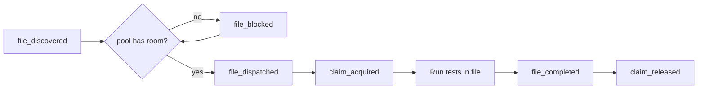

Provium's dispatcher runs multiple test files in parallel against a shared resource pool. Each file declares what it needs (or accepts the per-file overhead default), and the dispatcher schedules as many as fit. This page covers how to think about that for your test corpus.

## The pool

When `provium` starts, it builds one pool with two budgets:

| Budget | Default | Override |
|---|---|---|
| Memory | 80 % of host RAM | `--mem 16G` |
| vCPUs | host online CPUs | `--cpus 8` (then `--cpu-overcommit <multiplier>`) |

The pool tracks total and available; every dispatch takes from available, every release returns. A `pool_state` event fires every second with `{used, available}` so dashboards see live utilisation.

If you want to be conservative on a busy host:

```
provium tests/ --mem 8G --cpus 4
```

If you have a beefy CI box and want maximum throughput:

```
provium tests/ --mem 64G --cpus 32 --cpu-overcommit 1.5
```

`--cpu-overcommit` is clamped to `[0.5, 8.0]`. Default `1.0` (strict — no oversubscription). `1.5` or `2.0` allows oversubscription if the workload tolerates scheduling jitter.

## Per-file claims

Each test file may declare what it needs:

```lua
provium:claim({memory = "4G", cpus = 4})

test("…", function(t) end)
test("…", function(t) end)
```

The claim is taken at file dispatch and released at file completion. A second `:claim` errors with `claim already taken`.

Without a claim, the dispatcher uses the per-file overhead default (50 MiB memory, 0 CPU). A file that boots 3 VMs at 1 GiB each but doesn't claim anything gets through the pool gate immediately and then might OOM the host because the overhead default is way under the actual demand.

**Rule of thumb:** claim memory equal to the sum of expected VM memory budgets plus a small buffer; claim CPUs equal to the sum of expected VM vCPU budgets.

```lua
-- 3 VMs × (2G memory, 2 CPUs each):
provium:claim({memory = "7G", cpus = 7})  -- 6G VMs + 1G buffer; 6 vCPUs + 1
```

## File dispatch flow



Files queue at the pool until their reservation fits. The order is stable — the dispatcher takes files in discovery order, so a file that doesn't fit blocks subsequent files (FIFO). For now there's no priority or backfill; if you need a specific file to run first, list its path explicitly.

## PSI throttling

On Linux hosts with `/proc/pressure/cpu` available, Provium spawns a PSI monitor at startup. When CPU pressure crosses the threshold (default 50 % some-pressure averaged over 10 seconds), the dispatcher pauses new file dispatches until pressure drops.

Tunable via the harness source — the constants are `DEFAULT_PSI_THRESHOLD_PCT` and `DEFAULT_PSI_INTERVAL` in `provium-host/src/scheduler/psi.rs`. There's no CLI flag yet (under discussion).

Files that are already in flight continue. The throttling only delays new dispatch.

When PSI throttling is the cause of a `file_blocked`, the event's `reason` field is `psi_pressure` (versus `pool_full` for "the pool can't afford this file's claim").

## KSM tuning

Kernel Same-page Merging deduplicates identical pages across VMs. When you boot many VMs from the same kernel + initrd, KSM can reclaim significant memory. Provium tunes `/sys/kernel/mm/ksm/*` at startup unless `--no-ksm` is passed.

The KSM tuning runs once per `provium` invocation. Best-effort: a one-line summary goes to stderr.

```
provium: ksm tuned (run = on, pages_to_scan = 1000, sleep_millisecs = 100)
```

If your host is shared with non-Provium workloads, pass `--no-ksm` so Provium doesn't change global tuning.

## What blocks parallelism

Several things prevent unlimited parallelism even when the pool has room:

| Thing | Why |
|---|---|
| Fixture build lock | One process at a time per fixture key. Other files queue on `fixture_build_waiting`. |
| Pool reservation | A file with a 16 G claim won't run alongside other big files until pool has 16 G free. |
| PSI pressure | High CPU pressure pauses new dispatches. |
| `--fail-fast` | Stops new dispatch after the first file failure. |

Of these, fixture build lock is the most common surprise. If 16 test files all reference `fixtures/base` and the cache is cold, all 16 queue on the build lock; only one builds, the rest wait. Pre-warm with `provium fixture build fixtures/base` to amortise.

## Inspecting parallelism in a run

The event stream gives you the full picture:

```
provium tests/ --save-events events.msgpack
```

Then walk the stream:

- `file_discovered` events at the start tell you the universe.
- `file_dispatched` events tell you what actually ran in parallel (count of in-flight = `file_dispatched - file_completed`).
- `file_blocked` events with `reason` tell you why something queued.
- `pool_state` events at 1 Hz give you a usage timeline.

`provium-coverage` summarises this in its run report; for ad-hoc debugging, parse the msgpack with the snippet in [events and coverage](~provium/running-tests/events-and-coverage).

## Tuning patterns

### "I want to maximise throughput"

```
provium tests/ --cpus $(nproc) --mem $(awk '/MemTotal/ {printf "%dG", $2/1024/1024 - 4}' /proc/meminfo)
```

Use everything except 4 GiB of RAM and overcommit CPUs gently:

```
provium tests/ --cpu-overcommit 1.5
```

### "I want to be conservative on a shared host"

```
provium tests/ --cpus 4 --mem 8G --no-ksm
```

### "I want to detect over-subscription"

Watch the `pool_state` and `file_blocked` event streams. Frequent `file_blocked` with `reason = pool_full` means files are claiming more than the pool can serve in parallel — either the pool is too small or claims are too generous. Frequent `file_blocked` with `reason = psi_pressure` means the host is genuinely overloaded — raise the PSI threshold or reduce parallelism.

### "I want to debug a slow run"

```
provium tests/ --save-events events.msgpack
```

Parse the msgpack for the longest `file_completed.duration_ns`. Then look at that file's `test_started` / `test_passed` events to see which test(s) are slow. Cross-reference with `vm_spawned` events to see how many VMs were involved.

### "I want to test for resource leaks"

The pool's available budget should return to its full value after each `claim_released`. Watch `pool_state` over time — if available is drifting down monotonically, something is leaking. The most common culprits:

- A test that exits via panic without releasing a claim — but the dispatcher releases on `file_completed` regardless of how it ended, so this shouldn't happen.
- A bug in the harness — file an issue with the event stream.

## VMs vs files

A common confusion: the pool tracks per-file resources, not per-VM. The dispatcher reserves the file's full claim at dispatch and holds it until file completion, regardless of how many VMs the file actually boots concurrently.

```lua
-- This file claims 4G, but only ever has one VM live at a time:
provium:claim({memory = "4G"})

test("a", function(t)
    local vm = provium:vm("v", "peios"):boot()
    vm:shutdown()  -- VM gone, but claim still held
end)

test("b", function(t)
    local vm = provium:vm("v", "peios"):boot()
end)
```

The claim doesn't release between tests. If you want fine-grained reservation, you'd need a smaller claim and rely on the dispatcher's per-file overhead — but the trade-off is potential OOM if the claim is too small for the actual peak.

For the typical case, claim for the file's worst-case peak.

## See also

- [The CLI](~provium/running-tests/the-cli) — `--mem`, `--cpus`, `--cpu-overcommit`, `--no-ksm`.
- [Lab reference](~provium/reference/lab) — `lab:claim`.
- [Events](~provium/reference/events) — `pool_state`, `file_blocked`, `claim_acquired`, `claim_released`.
- [Fixtures and dependencies](~provium/running-tests/fixtures-and-dependencies) — fixture build lock as a parallelism limiter.
