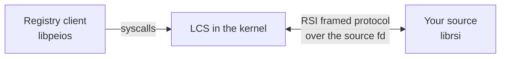

A **registry source** is a storage backend for the [LCS registry](~peios-sdk/registry/overview). It is the other half of the registry story: where a [client](~peios-sdk/registry/overview) opens keys and reads values, a *source* is what actually holds those keys and values and answers the kernel when it needs them. If you are implementing a place for registry data to live — a file-backed store, a database adapter, an in-memory provider for tests — you are writing a source, and **librsi** is the library for it.

This is a different library from libpeios, for a different audience. libpeios is the registry *client*; librsi is the registry *source*. They share the SDK's [conventions](~peios-sdk/getting-started/library-conventions) and substrate, but you link `librsi` (`-lrsi`, `<rsi.h>`) to write a source.

## How it works

A source talks to the kernel over the **RSI** protocol — the Registry Source Interface — on a single file descriptor:



The flow is:

1. **Register.** Your process declares which *hives* (registry subtrees) it backs and registers with the kernel, receiving a **source fd**. This needs `SeTcbPrivilege`.
2. **Serve.** The kernel sends your source **requests** — "look up this child", "store this value", "begin this transaction" — as framed messages you `read(2)` from the source fd. You decode each one, do the work against your storage, and `write(2)` back a framed **response**.
3. **Repeat** until the source fd reaches EOF (the source is closing).

When a client reads or writes a key in one of your hives, the kernel turns that into RSI requests to *you*. Your source is the source of truth; the kernel mediates, enforces security, and resolves layer precedence on top of what you report.

## The serve loop

Every source is, at heart, this loop:

```c
for (;;) {
    ssize_t n = rsi_read_request(src_fd, buf, sizeof buf);   /* read a frame */
    if (n == 0) break;                                       /* EOF: closing */
    if (n < 0) { /* errno */ break; }

    struct rsi_request req;
    rsi_parse_request(buf, n, &req);                         /* split header/payload */

    switch (req.op_code) {                                   /* dispatch */
        case RSI_LOOKUP:     /* decode, resolve, rsi_respond_lookup */    break;
        case RSI_SET_VALUE:  /* decode, store,   rsi_respond_status */    break;
        /* … one case per op you support … */
    }
}
```

The three headers map onto the three steps:

- **[`<rsi/source.h>`](~peios-sdk/reference/rsi-source)** — registering and getting the source fd.
- **[`<rsi/request.h>`](~peios-sdk/reference/rsi-request)** — reading and decoding requests.
- **[`<rsi/response.h>`](~peios-sdk/reference/rsi-response)** — building and sending responses.

## What the kernel handles, and what you handle

The division of labour matters, because it keeps a source simple:

- **The kernel** handles security (access checks against key SDs), layer precedence resolution, transaction coordination across sources, and the client-facing syscall surface. It also assigns the global sequence numbers.
- **Your source** handles durable storage: it stores the name→GUID entries, the key metadata records, and the layered values, and it reports them back faithfully when asked. It honours transaction boundaries (buffer, then commit or abort) and compare-and-swap guards on writes.

You do **not** implement precedence, access control, or the client protocol — you store data and answer questions about it. That's why a source's serve loop is mostly a dispatch table over storage operations.

## Requests come in families

The [request reference](~peios-sdk/reference/rsi-request) groups the operations, and it helps to hold the shape in mind:

- **Path/entry ops** — the name→GUID hierarchy (`LOOKUP`, `CREATE_ENTRY`, `HIDE_ENTRY`, `DELETE_ENTRY`, `ENUM_CHILDREN`).
- **Key ops** — key metadata records (`CREATE_KEY`, `READ_KEY`, `DROP_KEY`, `WRITE_KEY`).
- **Value ops** — the typed values on a key (`QUERY_VALUES`, `SET_VALUE`, `DELETE_VALUE_ENTRY`, `SET_BLANKET_TOMBSTONE`).
- **Transaction ops** — atomic grouping (`BEGIN`/`COMMIT`/`ABORT_TRANSACTION`).
- **Layer ops** — `DELETE_LAYER`, `FLUSH`.

Most reply with a simple status; five carry data back on success.

## Where to go in this section

- **[Registering a source](~peios-sdk/registry-sources/registering-a-source)** — declare your hives and get the source fd.
- **[Serving requests](~peios-sdk/registry-sources/serving-requests)** — the read/parse/dispatch/decode loop in full.
- **[Building responses](~peios-sdk/registry-sources/building-responses)** — status-only and payload-bearing replies.
