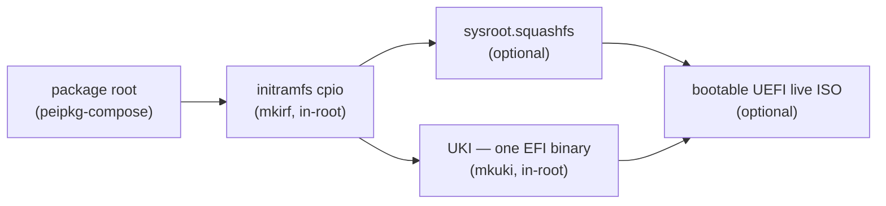

**`peiso`** is the Peios image builder. Given a declarative spec, it builds a bootable Peios image tree from scratch: it takes a release's worth of packages and produces an artifact that a machine can boot.

It is a **v1** tool with a deliberately narrow scope. It does not resolve packages, fetch payloads, or lay out a root — that is [`peipkg-compose`](~peios/package-management/composing-a-root)'s job, and peiso calls it for exactly that work. peiso owns everything above the package root: the boot machinery that turns a directory of installed software into something bootable.

This page explains what a package root is versus what a bootable image is, the chain of artifacts peiso emits between the two, how you invoke it, and the limits of its v1 scope.

## Where peiso sits — above compose

The two tools split the work at a well-defined boundary.

`peipkg-compose` builds the **package root**: a directory tree with every package's payload laid out at its installed paths, a seeded peipkg state database, and each repository written back as a `.repo` file. The result is a valid peipkg system that can manage itself — but it is only that. Compose's contract stops at delivering a valid peipkg root: no bootloader, no packed initramfs, no kernel image, no live-boot wiring. Those belong to whatever assembles the image around it. See [Composing a root](~peios/package-management/composing-a-root) for the full contract.

peiso is that outer assembler. It **shells out to `peipkg-compose build`** to produce the root, then layers boot machinery on top of it. The division of responsibility is:

- **compose = the package stage.** Resolve, verify, and lay out software into a root directory. Offline, deterministic, no boot concerns.
- **peiso = the bootable-image stage.** Take that root and produce an initramfs, a squashable rootfs, a kernel image, and a bootable medium.

Because the boot stage runs Peios' own applets — and runs them inside the composed root — peiso needs privilege where compose needs none. This requirement is covered below.

## The output chain

peiso builds an image as a chain of artifacts, each consuming earlier ones. The initramfs cpio is packed inside the composed root, so both the squashfs (a squash of the whole root) and the UKI (kernel + cpio + cmdline) contain it; the ISO then carries the UKI and the squashfs side by side.



1. **Package root.** peiso calls `peipkg-compose build` on the spec's manifest. A single multi-root manifest can compose both the main system root and a nested initramfs root in one pass. (An older spec form gave the initramfs root its own separate manifest to compose; that form is transitional — prefer the single multi-root manifest.)

2. **Initramfs cpio.** peiso chroots into the composed root and runs the root's own **[`mkirf`](~peios/boot-and-trust-establishment/mkirf)** applet to pack the initramfs root into a cpio archive. Running the shipped mkirf in its native environment means the tool that builds the initramfs is the same one the running system uses — no divergence between what is tested and what runs. (Before this step, extra files may be dropped straight into the initramfs root via the spec's file `inject` list — a temporary bypass of packaging, used for things like the live-boot hook until they are properly packaged.)

3. **Squashfs sysroot (optional).** peiso squashes the whole composed root into a read-only `sysroot.squashfs` image. squashfs **preserves existing extended attributes** — where [KACS security descriptors](~peios/security-descriptors/overview) ride — so the live rootfs is byte-identical to an installed system. The image is written outside the root tree so it can never contain itself.

4. **UKI (optional).** peiso chroots in again and runs the root's **[`mkuki`](~peios/boot-and-trust-establishment/mkuki)** applet to bundle the kernel, the initramfs cpio, and the kernel command line into a **Unified Kernel Image** — one EFI binary that UEFI firmware boots directly, with no separate bootloader.

5. **Bootable ISO (optional).** peiso emits `peios.iso`: a UEFI-bootable live image carrying the UKI on an EFI System Partition (ESP) and the squashfs sysroot in its data area, so the running system reads the OS off the medium rather than fitting the whole thing in RAM.

Steps 3, 4, and 5 are optional and driven by the spec — a build can stop at the packed root plus initramfs, or run all the way to an ISO.

### What lands on disk

A full build leaves, among other things:

- the composed `root/` tree (the package root plus the packed initramfs cpio inside it);
- `sysroot.squashfs` — the read-only rootfs image, written beside `root/`, not inside it;
- the UKI at its ESP fallback path, e.g. `boot/efi/EFI/BOOT/BOOTX64.EFI`;
- `peios.iso` — the bootable UEFI live medium.

## How you run it

peiso has a single verb:

```
sudo peiso build [spec.toml]
```

It is driven by a **`peiso.toml`** spec (schema `1`) that declares the whole image in one file — the manifest to compose, how the initramfs is packed, and the optional squashfs, UKI, ISO, registry-seed, and feature stages. The spec path defaults to `peiso.toml`.

The build **must run as root** — it chroots into the composed root to run the Peios-native applets (mkirf, mkuki), and chroot is privileged; the full rationale is in [Running a build](~peiso/building-images/running-a-build).

See [Running a build](~peiso/building-images/running-a-build) for the command in detail, and [The build spec](~peiso/reference/the-build-spec) for every field of `peiso.toml`.

## Scope and v1 caveats

peiso is at **v1**, and this page describes its current behaviour; the surface is not frozen and may change.

- **Distribution / live-image focused.** The chain above is built around producing a bootable live image (UKI + off-RAM squashfs on a UEFI-bootable ISO). This is the path v1 supports.
- **A single spec schema.** One `schema = 1` spec shape, parsed strictly.
- **Optional stages.** squashfs, UKI, ISO, registry seeds, and feature enablement are each opt-in through their spec sections; a minimal build composes the root and packs the initramfs and stops.
- **Transitional mechanisms exist.** The file-`inject` packaging bypass and the older separate-compose initramfs manifest are both temporary mechanisms on the way to fully-packaged inputs. They are documented where they are used, and labelled as temporary.

Note that v1 does **no signing**: peiso layers boot machinery; it does not create keys or sign binaries. Security properties come from the packages and their preserved security descriptors, not from anything peiso adds.

## Where to go next

- To understand each stage in order — the composes, the chroot, the layering that lets the squashfs embed the initramfs and the ISO carry both the UKI and the squashfs — read [The build pipeline](~peiso/building-images/the-build-pipeline).
- To run a build — the command, root requirement, and how peiso finds `peipkg-compose` — read [Running a build](~peiso/building-images/running-a-build).
- For every field of `peiso.toml`, section by section, read [The build spec](~peiso/reference/the-build-spec).
- For the package stage beneath peiso — how the root is resolved, verified, and laid out — read [Composing a root](~peios/package-management/composing-a-root).
