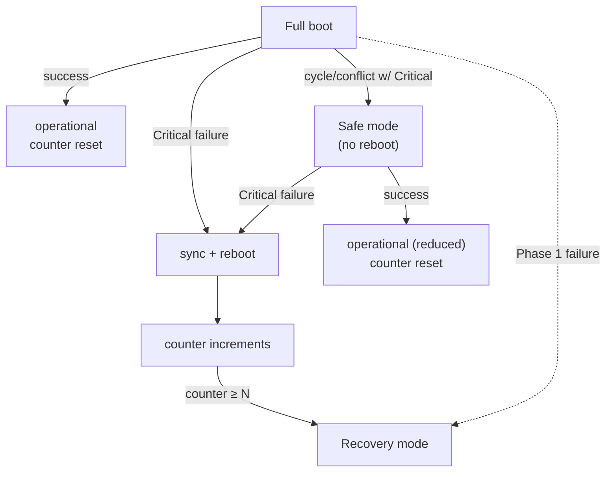

On a running machine, use `svctl boot` or **System Settings › Startup & Shutdown** to see the mode, why it was chosen, and whether the boot has been confirmed successful.

- **Full** starts the normal boot-triggered set.
- **Safe** starts a reduced boot-triggered set. Use the reported graph error or requested-mode reason to decide what to repair.
- **Recovery** provides an unrestricted SYSTEM shell on the console and skips Phase 2 services. `svctl boot` is not available there.

> [!IMPORTANT]
> Recovery needs physical, IPMI, or serial console access; there is no remote recovery service. Confirm that access before a change that may leave the machine unable to boot. Recovery offers no TCB guarantee.

## How this boot went

`svctl boot` asks peinit, and so does **System Settings**, at the top of its **Startup & Shutdown** section:

```
$ svctl boot
boot: full
reason: normal
unconfirmed boots before this one: 0 (recovery at 3)
confirmed: yes
grace: 30s
```

- **boot** is the mode, and **reason** why: `normal`, `requested` (`peios.safemode=1`), or a Safe mode peinit chose itself because a full boot couldn't be planned, with what stopped it.
- **unconfirmed boots before this one** is the boot-attempt counter as this boot found it, and the threshold at which the machine starts in Recovery.
- **confirmed** says whether this boot has counted as a success yet: every Critical service holding for `BootSuccessGrace`, and the counter put back to 0. Until then it names what it is waiting for.

Recovery mode never answers: it runs a recovery shell and no Phase 2 services or peinit control interface. Registryd may already be running, but there is no control socket to ask. Anyone signed in may ask; see [who can manage a service](~peios/services-and-jobs/who-can-manage-a-service) for the descriptor.

## The three boot modes

The three modes form an escalation path from normal operation to last-resort maintenance.



### Full mode

The default. All boot-triggered services start in dependency order. A boot is **successful** — and the [boot-attempt counter](#the-boot-attempt-counter) resets to 0 — when every Critical service has reached and *held* a dependent-satisfying state (Active, Completed, or Skipped) for a grace period (`BootSuccessGrace`, default 30 s). The criterion is "satisfying," not "Active," so that a Critical Oneshot that reaches Completed can still mark the boot good.

### Safe mode

Safe mode starts a **reduced** set of boot-triggered services and rebuilds the graph from scratch using only those, dropping dependencies on excluded services. Two categories are eligible:

- **Critical services** (`ErrorControl=Critical`) — must start; a Critical failure here still follows the normal reboot path.
- **SafeMode services** (`SafeMode=1`) — best-effort; if they fail, Safe mode carries on without them.

Everything else is skipped. Safe mode is entered when:

- graph validation finds a **cycle involving a Critical service**, or
- an **unresolvable conflict involving a Critical service**, or
- the kernel command line says `peios.safemode=1`.

The first two are *configuration* errors — rebooting would just hit them again — so peinit downgrades **without** rebooting. Safe mode is **not** entered by a Critical service *crashing at runtime*; that follows the reboot path. And it is purely a boot-sequencing concern: once booted, you can start any service by hand exactly as in Full mode. It is the mode for "the configuration is broken but the TCB is healthy."

> [!NOTE]
> `SafeMode=1` and `ErrorControl=Critical` are *filters within the boot-triggered set*. They do not make a demand-only service auto-start in Safe mode — a service with no `boot` trigger stays demand-only regardless.

On a machine with the dynamic-boot feature, **System Settings › Startup & Shutdown › Always Start in Safe Mode** puts `peios.safemode=1` on the command line the next boot image is made from. It holds for every boot until it is turned off again, and while the machine is in Safe mode because of it, System Settings says so.

### Recovery mode

Recovery mode is the last resort, and it offers **no TCB guarantee** — the administrator gets an unrestricted SYSTEM shell on the console and must treat it with corresponding care. It is a maintenance *environment*, not a degraded boot.

In Recovery, peinit completes the Phase 1 basics and starts registryd only if that boot has not already attempted it; a failed registryd start is not repeated. Registryd failure does not prevent the shell. peinit skips all Phase 2 services and execs a SYSTEM shell on `/dev/console` (`/bin/recsh` if present, else `/bin/sh`), respawning it if it exits. It is entered when:

- the **boot-attempt counter reaches N** (default 3),
- the kernel command line says `peios.recovery=1`, or
- **registryd fails during Phase 1** — entered immediately, without rebooting, because there is no Phase 2 to attempt. The counter has already been incremented for this attempt.

Preserve the console failure reason and any source startup diagnostics first. Identify the installed [registryd provider](#registryd-and-loregd), its version, hive declarations and database paths. Recovery does not establish that the registry source is stopped: a source started or attempted earlier in the boot may still be active. **Do not start a second source against the same hive files.**

Offline inspection or repair needs a procedure supported by that provider and version. The [source-checked loregd implementation](~peios/loregd/startup/command-line#unsupported-recovery-switches) has no offline repair switches and [does not create an automatic startup backup](~peios/loregd/startup/startup-sequence#backup-and-repair-limits). Its orphan cleanup is not corruption repair or backup restoration; the references identify the checked revision. Verify the existence and coverage of any recovery copy before planning to replace data.

Follow [Recovery troubleshooting](~peios/services-and-jobs/troubleshooting#booted-into-recovery-mode) for the evidence to collect and the point to involve the administrator or provider. If the source can serve the required operations, the supported [Backup and restore](~peios/registry-administration/backup-and-restore) workflow can recover a subtree; it depends on that working source and is not offline source repair. Restore replaces data and permissions. Role definitions can re-supply service configuration but do not restore all registry data.

> [!IMPORTANT]
> Recovery mode requires console access — physical, IPMI, or serial. There is no remote recovery in the current design (emergency SSH and registry historical reversion are noted as post-v1 work). Plan console access for any machine you need to be able to recover.

## The boot-attempt counter

The counter can escalate repeated unconfirmed boots to Recovery when peinit reaches the increment and can persist it. It is a plain integer in a file at `/.peinit/boot-attempts` — *not* in the registry, because the registry may be the very thing that is broken. A confirmed boot resets the count; the counter does not guarantee that every reboot loop ends in Recovery.

- peinit **reads** it at startup, before choosing a mode. The Recovery threshold (`counter ≥ N`) is checked against this pre-increment value, so the default N of 3 admits exactly three attempts before Recovery. A missing file counts as 0; a corrupt or unreadable one → Recovery. Override N with `peios.bootattempts=N` on the kernel command line, or set it to `0` to disable the check when the counter is itself the fault.
- peinit **increments** it once per boot after the root, mount, seed, machine-ID and clock steps, before registryd starts. A registryd startup failure therefore still consumes an attempt. An earlier failure that enters Recovery before this point does not increment it.
- `peios.recovery=1` forces Recovery but does not suppress the increment once that point is reached.
- The counter is **reset to 0** on a successful Full or Safe boot (after the grace period).
- If the counter file cannot be *written* (disk full), peinit treats it as 0 and continues — a write failure must not by itself trigger Recovery.

A [Critical service](~peios/services-and-jobs/supervision) exhausting its restart budget — at boot or at runtime — triggers a sync and reboot. Repeated boots that never complete the success grace accumulate attempts until the counter reaches N and peinit enters Recovery. A failure after a confirmed boot still reboots the machine, but that boot already reset the counter: repeated late failures can therefore continue without reaching the Recovery threshold. Use `svctl boot` to distinguish these cases. The counter deliberately does *not* try to catch a peinit too broken to reach its own increment; that is a binary-integrity problem, not a boot-loop problem. See the [TRM counter cycle](~peios/advanced-peios/peinit/boot/the-boot-attempt-counter#the-cycle) for the exact increment boundary.

## Boot configuration

| Key | Default | Controls |
|---|---|---|
| `Machine\System\Boot\MaxParallelStarts` | 10 | Services starting concurrently (must be > 0; invalid → Recovery). |
| `Machine\System\Boot\BootSuccessGrace` | 30 | Seconds a Critical service must hold a satisfying state before boot counts as successful. |
| `Machine\System\Boot\ShutdownTimeout` | 90 | Maximum seconds for the whole [shutdown](~peios/services-and-jobs/shutdown) sequence. |
| `Machine\System\Boot\PostKillTimeout` | 5 | Seconds a service cgroup may take to drain after SIGKILL before it counts as stuck. |
| `Machine\System\Boot\SettleTimeout` | 5 | Seconds peinit waits for the boot service set to settle before starting `boot:settled` services anyway. |

All but `ShutdownTimeout` are read at boot, so a change applies at the next one; `ShutdownTimeout` applies the next time peinit re-reads its configuration (`svctl reload-config`). **System Settings** shows and changes them in its **Startup & Shutdown** section, under **Timeouts**: **Apply** and **Undo** appear once one has been edited. Changing them needs write access to `Machine\System\Boot` — as shipped, Administrators.

## The kernel command line

peinit reads the following `peios.*` tokens. They are deliberately few: everything peinit can read *after* registryd is serving belongs in the registry instead, where it can be inspected, secured and changed without editing a boot entry. What is left is either a per-boot mode decision or a Phase 1 value — one peinit needs before there is a registry to ask.

| Token | Effect |
|---|---|
| `peios.safemode=1` | Force [Safe mode](#safe-mode). |
| `peios.recovery=1` | Force [Recovery mode](#recovery-mode), whatever the counter says. |
| `peios.bootattempts=N` | Override the boot-attempt threshold; `0` disables the check. |
| `peios.notifysocket=PATH` | Move the sd_notify socket. Phase 1, because registryd is the first service to use it and it must be bound before registryd starts. |
| `peios.quiet=N` | How much peinit may write to the console: `0` write everything, `1` (default) stay out of a terminal a service owns, `2` also drop ordinary progress. See below. |

### Console noise: `peios.quiet`

peinit reports its progress to `/dev/console`, and so does any service that claims that terminal with [`TTYPath`](~peios/services-and-jobs/execution-environment). Two writers, one device: a login prompt started while peinit is still narrating gets written over, and the reader cannot tell input from log. `peios.quiet` decides who yields.

It sets **two independent rules**, which is why it is a level and not a flag:

| | Terminal a service owns | Everywhere else |
|---|---|---|
| `peios.quiet=0` | peinit writes anyway | everything |
| `peios.quiet=1` *(default)* | only messages that mean the machine is about to be lost | everything |
| `peios.quiet=2` | only messages that mean the machine is about to be lost | errors only |

The rules **stack rather than scale**: errors are never less visible at `2` than at `1`. An error overrides a requested blackout — silence was a preference, and an error is news — but it does not override terminal ownership, which is not peinit's to override. Only losing the machine (dropping to [Recovery](#recovery-mode), halting with no shell, a Critical service about to force a reboot) is worth one corrupted line of somebody else's session.

[prelude](~peios/boot-and-trust-establishment/initramfs-stage) honours `peios.quiet=2` as well, since it writes to the same console. The other two levels mean nothing there — prelude exits before the first service starts, so no terminal has an owner yet.

> [!WARNING]
> Suppressed messages are **dropped, not stored**. Until peinit can forward them to [eventd](~peios/auditing/overview), `peios.quiet=1` means you lose peinit's narrative from the moment a login prompt appears. On a machine you are debugging, boot with `peios.quiet=0`.

A few lines escape all of this: whatever peinit and prelude print *before* they have read the command line. Neither can honour a preference it has not seen yet, and those lines are also the only evidence either started at all.

> [!NOTE]
> `peios.quiet` governs what **peinit** writes, and nothing else. The **kernel's** own console output is governed separately by the standard `loglevel` parameter, which shipped images set to `4` — errors and worse — so that peinit's narrative is not buried under the kernel's. The two are independent: setting `peios.quiet=0` to debug a boot does not bring the kernel's messages back, and `loglevel=7 ignore_loglevel` does not make peinit any louder. Note also that raising `loglevel` alone will not undo a shipped `ignore_loglevel`, and that the image ships no `dmesg`, so at the default a kernel warning is not recoverable after the fact.

### Seeing and changing it

**System Settings** shows the command line this boot was started with, under **Kernel Command Line** in the **Startup & Shutdown** section, and the one the next boot image will be made from, `/lcl/etc/boot/cmdline`, where they differ.

On an installed machine the command line is part of the boot image, which is made when Peios is installed or upgraded, so editing that file changes nothing on its own. With the dynamic-boot feature installed, its `mkuki-watch` service makes the boot image again whenever the file changes; then System Settings offers `peios.bootattempts` and `peios.quiet` as choices — how many boots may fail before Recovery, and what peinit writes on the console — and writes them into the file with **Apply at Next Boot**, which appears once one has been changed. Nothing else on the line is offered: a mistake there can leave a machine that doesn't boot. Writing the file needs write access to it, which as shipped only Administrators have.

Unknown `peios.*` tokens are ignored, as is a malformed value on a valued token — this parser runs before anything exists to report a diagnostic to, and refusing to boot over a typo in a tuning knob is the worse outcome.

> [!NOTE]
> There is no token that selects services. Which services start is decided entirely by what is defined under `Machine\System\Services` — see [Defining a service](~peios/services-and-jobs/defining-a-service). A console shell or a login prompt is an ordinary service definition with a [`TTYPath`](~peios/services-and-jobs/execution-environment), not a boot flag.

## Where peinit takes over

peinit is PID 1, but it is not the *first* thing that runs. The [initramfs](~peios/boot-and-trust-establishment/initramfs-stage) assembles and mounts the real root — decryption, RAID/LVM, the root filesystem itself — and then hands control to peinit. The contract peinit relies on is narrow:

- The real root is already mounted **read-write**, and `/proc`, `/sys`, `/dev` are mounted and moved into it.
- peinit is exec'd as PID 1 from a fixed path on the real root.

peinit **does not** assemble, decrypt, repair, or even re-mount the root — those need tools and configuration that belong to the initramfs. It also does not `fsck` the root or mount non-root storage (a data partition is mounted by an ordinary Oneshot service, not by peinit). For the trust and identity side of this handoff — signatures, the SYSTEM token peinit inherits — see [peinit at PID 1](~peios/boot-and-trust-establishment/peinit-pid-1).

## Phase 1: the hardcoded bootstrap

Phase 1 is compiled into peinit. It cannot change at runtime and touches no registry. It does the minimum to make Phase 2 possible:

1. **Confirm the root is writable** with a single probe write. registryd's storage needs a writable root even for reads, so a read-only root cannot support Phase 2 → Recovery.
2. **Mount the remaining virtual filesystems** — `/dev/pts`, `/dev/shm`, `/run`, `/sys/fs/cgroup` — mounting each only if absent. A failure here → Recovery.
3. **Restore the persisted random seed** from `/var/state/peinit/random-seed`, mixing it into the kernel's entropy pool early so anything that needs randomness during boot gets it. A missing seed is normal — first boots and stateless live boots have none — so peinit just carries on; a seed problem is never fatal and never sends boot to Recovery.
4. **Establish the machine-id** from `/lcl/etc/machine-id` — a stable, opaque identifier for this install (used for log correlation, instance identity, and software compatibility). It is *not* a security principal: it is not a SID, an account, or a credential, and no authorisation decision depends on it. If the file is missing, empty, or malformed, peinit generates a fresh 128-bit ID. If it cannot persist the ID, boot continues with a warning and an ID valid only for this boot; failure to obtain random bytes sends boot to Recovery.
5. **Set the clock from the hardware RTC**, so early timestamps and the boot counter are meaningful. A failure here → Recovery.
6. **Start registryd** and wait for it to signal readiness, then **probe-read** the schema-version key to confirm it is actually serving reads. Any failure → Recovery — there is no Phase 2 without a registry.
7. **Provision boot-time paths.** With registryd up and before Phase 2 starts, peinit applies the entries under `Machine\System\Init\ProvisionedPaths\` — the registry-driven equivalent of tmpfiles.d, creating directories and files (with Peios security descriptors) that no single service owns. Best-effort entries that fail are logged and skipped, but an entry marked `Required=1` that cannot be provisioned sends boot → Recovery. The individual keys are cataloged in the [registry key reference](~peios/services-and-jobs/registry-key-reference).
8. **Infrastructure setup** — create the [control socket](~peios/services-and-jobs/controlling-services) and the [jobs socket](~peios/services-and-jobs/jobs-and-operations), and bring up the loopback interface. A control-socket or jobs-socket failure → Recovery; a loopback failure is logged as a warning and boot continues.

Most Phase 1 failures are fatal to a normal boot, because none of the later machinery can run without this foundation — the only outcome is [Recovery mode](#recovery-mode). The exceptions are the fail-soft steps called out above: a missing or unusable random seed, a regenerated machine-id, and best-effort provisioned paths all let boot continue.

> [!CAUTION]
> Packaged images, VM templates, and live ISOs must not ship a populated `/lcl/etc/machine-id` or a `/var/state/peinit/random-seed` file. A shipped machine-id gives every clone the same identity, and a shipped seed is a public value that is not acceptable entropy. Clone and reset tooling should remove or truncate `/lcl/etc/machine-id` so peinit generates a fresh ID on the next boot, and should never bake a seed into the image — if you need strong first-boot randomness for a stateless image, provide a real kernel entropy source (hardware RNG or virtio-rng) instead.

### registryd and loregd

`registryd` is an **interface**, not a specific program. It is the path peinit execs to get a registry source daemon — the component that implements the registry's persistent storage and answers peinit's reads. The *implementation* behind that interface can vary; by default it is **loregd**.

The distinction matters when diagnosing source failures: peinit's `registryd` role does not define a storage-repair interface. Check which provider and version the installation uses before choosing recovery instructions. The default provider's database paths come from its startup hive declarations, not registry settings. See [LCS and sources](~peios/registry-administration/lcs-and-sources) for source availability checks and the [Recovery-mode limits](#recovery-mode) before direct storage work.

## Phase 2: the registry-driven boot

With registryd serving reads, peinit boots the rest of the system from the registry:

1. **Read all definitions** under `Machine\System\Services\`. (A registry read timing out here → Recovery.)
2. **Build and validate the dependency graph** from the boot-triggered services and their transitive [dependency closure](~peios/services-and-jobs/dependencies). Validation runs *before* anything starts.
3. **Start services in dependency order**, in [parallel](~peios/services-and-jobs/dependencies) up to `MaxParallelStarts`, with [readiness gating](~peios/services-and-jobs/the-service-lifecycle) releasing each service's dependents as it becomes satisfied.

Only services with a `boot` trigger are start candidates; demand-only services are pulled in only if something boot-triggered depends on them, and [Disabled](~peios/services-and-jobs/triggers-and-timers) services are excluded from the graph (but kept in the model for on-demand start). The whole boot runs against one [snapshot](~peios/services-and-jobs/defining-a-service) — mid-boot registry edits do not perturb it.

The installed service graph determines the platform order. `registryd` and `authd` use the SYSTEM bootstrap path; standard eventd and lpsd deployments use `Identity=Service` and obtain tokens through authd. See [Service identity](~peios/services-and-jobs/identity-and-privileges). A non-SYSTEM service’s authority dependency is derived from its identity rather than left to an administrator to remember.

Do not infer readiness or shutdown order from a fixed list of daemon names. Check the installed definitions and the service status. The [boot implementation](~peios/advanced-peios/peinit/boot/phase-2) describes graph construction and validation.

## Where to start

To understand the graph validation and parallel start that drive Phase 2, read [Dependencies and ordering](~peios/services-and-jobs/dependencies).

To understand the Critical-failure reboot path that feeds the boot counter, read [Keeping services running](~peios/services-and-jobs/supervision).

For the trust and token side of early boot, read [peinit at PID 1](~peios/boot-and-trust-establishment/peinit-pid-1).
