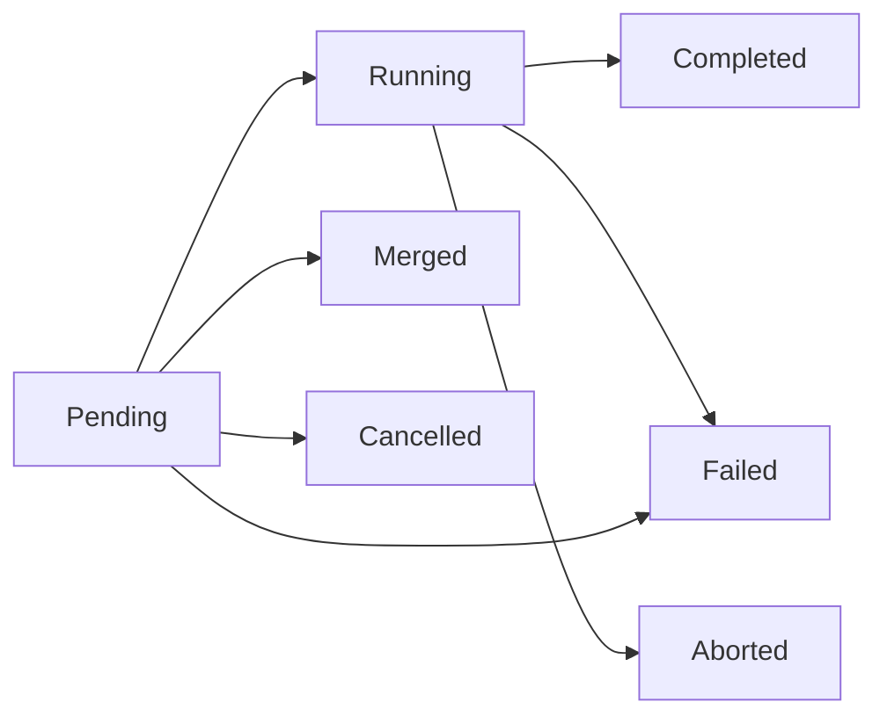

A [service](~peios/services-and-jobs/defining-a-service) is a long-lived *definition*. But when you read a status output or query the [event log](~peios/auditing/overview), two shorter-lived objects show up alongside it: the **job** (one process execution) and the **operation** (one requested action). They are what make peinit observable — every run and every command carries a GUID you can follow. This page covers both, and the special case of **submitted jobs**.

## Jobs: what actually ran

Every time peinit forks a process — a service's main binary, a [pre- or post-hook](~peios/services-and-jobs/execution-environment), a [health check](~peios/services-and-jobs/supervision), or a [submitted job](#submitted-jobs) — that single execution is a **job**, with its own GUID and exit result. If a service is the *what*, a job is *what actually ran*. A restart does not reuse a job; it creates a **new** one. The service always tracks its *current* job GUID, and a `status` query reports it.

Jobs come in five types:

| Type | Created for |
|---|---|
| `ServiceMain` | A service's main process. |
| `PreExecHook` | One `ExecStartPre` command. |
| `PostExecHook` | One `ExecStartPost` command. |
| `HealthCheck` | One health-check run. |
| `Submitted` | A program [submitted](#submitted-jobs) over the jobs socket. |

Their lifecycle is simpler than a service's, because a job only tracks a process — not policy:

| State | Meaning |
|---|---|
| `Created` | The job object exists but the process is not forked yet (pre-hooks may be running). |
| `Running` | The process is alive. |
| `Completed` | The process exited successfully. |
| `Failed` | The process failed — or peinit classified the job failed before fork (a parent-side setup error). |
| `Abandoned` | The process survived SIGKILL (D-state). |

A job record carries the things you would want for forensics: the resolved identity and a token summary, the image path and arguments, created/started/ended timestamps, the exit code or signal, the cgroup, the [failure cause](~peios/services-and-jobs/the-service-lifecycle), and the `operation_id` that created it (`null` for submitted jobs). The clean division of ownership is: the **service** owns policy (restart, dependencies, health schedule, current state); the **job** owns the execution facts (PID, exit, timestamps, identity, cgroup, log correlation).

### Retention and log correlation

peinit keeps only *active* jobs in memory. When a job reaches a terminal state it **emits a structured event** (through KMES) carrying the full record, then drops the job. peinit keeps **no** job history — [eventd](~peios/auditing/overview) is the historian, consuming those events from the kernel ring buffer. The lifecycle events are `job.created`, `job.started`, and `job.ended`; a submitted job also emits `job.status` as its progress changes.

Separately, all of a job's `stdout`/`stderr` is [forwarded to eventd](~peios/services-and-jobs/output-and-logging) tagged with the job's GUID. That is what lets a query like "show me the logs for job X" return exactly that execution's output — not interleaved with the run before or after it.

## Submitted jobs

A **submitted job** is a program peinit runs once, under supervision, because a process asked it to — not because a definition in the registry said so. Two situations motivate it:

- A **task on a client's behalf.** `backupd` takes a request from a user, and wants the backup to run *as that user*, in its own cgroup, with a timeout, reporting progress, visible in `job list` — but supervised by peinit rather than by `backupd` itself.
- A **session.** A logon service (say, a web front-end) has authenticated a user and wants a long-lived per-logon process running as them, with a socket it can talk to, that it can stop when the session ends.

Both are the same mechanism: a **jobs socket** at `/run/services/peinit/jobs.sock`, separate from the [control socket](~peios/services-and-jobs/controlling-services). A submitter connects, sends a job definition, and gets back the job's view and — while the job runs — a handle to its process.

### Who may submit

**Being able to connect is the permission.** peinit performs no access check of its own on a submission; the check is the one the kernel performs against the socket file's [security descriptor](~peios/security-descriptors/overview) when a process connects. The default descriptor gives SYSTEM and Administrators full control and **Authenticated Users** the write right that connecting requires — so out of the box, any logged-on principal may submit, and an administrator narrows or widens that by changing the socket's descriptor, not by configuring peinit.

What limits an over-eager submitter is a **quota**: at most `MaxJobsPerSubmitter` live jobs per submitting SID (default 64; SYSTEM is exempt). A submission that would exceed it is refused with `QUOTA_EXCEEDED` and creates nothing. A job stops counting the moment it ends.

### What a job runs as

There is **no identity field**. A submitter cannot name an identity for its job; it can only run the job as an identity it already holds:

- **Nothing attached** — the job runs as the submitting *process's own primary token*, exactly as a child of the submitter would. This is the common case for a tool or a service running something as itself.
- **A token attached** — the submitter attaches a token to the submit message, and the kernel (through [KACS](~peios/access-decisions/overview)) gates the attach: it verifies the submitter could act as that identity, at that impersonation level, at that moment. peinit turns the attached token into the job's primary token. This is how `backupd` runs a backup as its client, or a logon service starts a session as the user who just authenticated — the same [impersonation](~peios/impersonation/overview) machinery, with the kernel as the only judge. A job whose session must convey Delegation needs the submitter to set its jobs connection to Delegation level first; a job started at Impersonation cannot be raised later.

A token below Impersonation level, or one peinit cannot duplicate, is refused with `BAD_TOKEN`. peinit never refuses a token because of *who* it names — that decision was the kernel's.

Two identities are recorded on every job, and the view shows both: the **submitter** (who asked — the identity the connection was made under) and the **identity** (who it runs as), plus the identity's **logon session**.

### The definition

A submission carries the whole job in one message: `image_path` (absolute; required), `arguments`, `environment`, `working_directory` (default `/`), `description`, `timeout` (seconds; `0`, the default, is no limit), `stop_timeout` (default 10 s), `readiness` (`none` or `notify`, to wait for `READY=1`), `readiness_timeout` (default 30 s), `success_exit_codes`, a list of named `descriptors` to hand the job, an `output` flag, and optionally a `security_descriptor` for the job itself. There are deliberately **no policy fields** — no restart, dependencies, health check, or trigger. A program that needs those is a service.

peinit does not check that the program exists or is executable when it accepts the submission; that is decided at `execve`, by the job's own token, and a program that cannot be run becomes a *failed job* rather than a refused submission. The submit is answered only once the job has **left `created`** — the process confirmed its exec, or starting it failed. A `readiness: notify` job is answered when it is *running*, not when it is ready; a submitter that wants to block until readiness follows with a `wait`.

Descriptors a submitter attaches are handed to the job from descriptor 3 with `LISTEN_FDS`, `LISTEN_FDNAMES` and `LISTEN_PID` set — the same convention a service uses to adopt [stored descriptors](~peios/services-and-jobs/execution-environment), so a program written for one adopts them from the other unchanged. This is what makes a session job possible: the submitter keeps one end of a `socketpair` and attaches the other.

### Who may manage a job

Every job carries its own security descriptor from the moment it exists. By default it is owned by the submitter and grants **`JOB_ALL_ACCESS`** to the submitter, SYSTEM, and Administrators — and to nobody else. In particular the **job identity gets nothing**: a process running as U cannot see or stop a job that happens to run as U, unless the submitter's descriptor says so. A submitter may supply its own descriptor (in SDDL) and peinit uses it exactly as given — including a descriptor that locks the submitter out of its own job.

| Right | Grants |
|---|---|
| `JOB_QUERY` | Read the job view; wait on it; see it in `job list`. |
| `JOB_STOP` | Stop the job. |
| `JOB_SIGNAL` | Send a signal to the job's main process. |

These rights govern both the jobs socket's own commands (`status`, `wait`, `stop`, `signal`) and the control socket's `job-status`, `job-list`, `job-stop`. As with services, `job list` **filters** rather than denies: you see the jobs you hold `JOB_QUERY` on, and a job you cannot query is indistinguishable from one that does not exist.

### The job view

Whether you ask on the jobs socket or with `job status`, you get the same view: the job `id`, `type` (`submitted`), `state` and `cause`, `submitter` and `identity` SIDs, `logon_session`, `description`, `image_path`, `pid` (while running), `ready` (`null` for a `readiness: none` job, otherwise whether `READY=1` has arrived), `status_text`, `progress`, the exit code or signal, and the `created_at`/`started_at`/`ended_at` timestamps.

`status_text` and `progress` come from the job itself, through the same [sd_notify](~peios/services-and-jobs/service-types) socket a service uses. A job sends `STATUS=Backing up /data/media` for a human-readable line and `PROGRESS=` in one of three forms:

| Form | Meaning | Shown as |
|---|---|---|
| `PROGRESS=N` | Counting, with no end in sight. | A rising count. |
| `PROGRESS=N/` | Counting towards an end that exists but is not yet known. | A rising count, awaiting a bound. |
| `PROGRESS=N/T` | `N` of `T`. | A bar. |

`PROGRESS_UNIT=bytes|items|percent` says what the numbers are. peinit keeps the latest accepted values and emits a `job.status` event when they change, rate-limited to at most one per job per second so a chatty job cannot flood the event stream — the *view* always has the latest value regardless.

### Stopping, timeouts, and the end of a job

A job ends when its process exits, when its `timeout` elapses, when its `readiness_timeout` elapses without `READY=1`, when someone stops it, or at shutdown. A stop — whichever of those triggers it — is a service stop in miniature: SIGTERM to the main process (skipped if the job already said `STOPPING=1`), then after `stop_timeout` a SIGKILL of everything in the job's cgroup, and if that survives, the job is `Abandoned` after the post-kill grace with cause `process_unkillable`.

`cause` records why peinit ended a job, and is `null` when the process ended of its own accord:

| Cause | Meaning |
|---|---|
| `parent_setup_failure` | peinit could not prepare the launch — no token, no cgroup, no fork. No process existed. |
| `pre_exec_failure` | Setup between fork and exec failed, or `execve` did. |
| `readiness_timeout` | A `notify` job never sent `READY=1` in time. |
| `timeout` | The job ran longer than `timeout`. |
| `explicit_stop` | A `stop` or `job stop` was issued. |
| `shutdown` | The system was shutting down. |
| `process_unkillable` | The process survived SIGKILL. |

State follows the exit, not the cause: a stopped job whose process handled SIGTERM and exited `0` is **`Completed` with cause `explicit_stop`** — peinit asked, the process agreed, and both facts are recorded. One that died to the signal is `Failed` with `exit_signal` set. A `signal` command is the raw mechanism, by contrast: `SIGKILL` sent that way produces a `Failed` job with a `null` cause, because peinit did not decide to end it.

A terminal job is **retained for 60 seconds** — long enough for a submitter polling once a second to read the result — then dropped; after that its GUID answers `UNKNOWN_JOB`, and the durable record is in [eventd](~peios/auditing/overview).

### Shutdown

At [shutdown](~peios/services-and-jobs/shutdown), every live submitted job is stopped **at once**, in no particular order — jobs have no dependencies, so there is nothing to order — and a job still queued to launch is cancelled with cause `shutdown`. Shutdown does not complete while a live job remains, bounded by the global `ShutdownTimeout` like everything else. Submissions during shutdown are refused with `INVALID_STATE`.

### Output

A job's `stdout` and `stderr` are captured and forwarded to [eventd](~peios/services-and-jobs/output-and-logging) tagged with the job's GUID, unconditionally — a submitter cannot turn that off. A submitter that wants a live copy attaches one extra descriptor and sets `output: true`: peinit then writes each line it reads to that **output sink** as well. The copy is best-effort — a sink that is not being drained never slows the job or peinit; lines that would block are dropped *for the sink only*, still recorded in eventd, and the drop is reported once per job as an `output.dropped` event.

Submitted jobs **bypass the operation model entirely** — there is no service to "start," so the submission creates a job directly. The job *is* the whole lifecycle.

## Operations: what was requested

An **operation** is a first-class object representing a *requested state-machine action* on a service. Rather than letting [control commands](~peios/services-and-jobs/controlling-services) mutate state directly, peinit turns each one into an operation that is validated, queued, and executed by its event loop. This is what gives concurrent callers — admin tools, automated triggers, dependency propagation — explicit, observable conflict resolution instead of races.

There are five operation types — `Start`, `Stop`, `Restart`, `Reload`, `Reset` — and each carries a **source** recording *why* peinit created it:

| Source | Created by |
|---|---|
| `Admin` | A control client. |
| `Boot` | The Phase 2 boot lifecycle. |
| `Shutdown` | The shutdown lifecycle. |
| `DependencyPropagation` | A start pulling in a [dependency](~peios/services-and-jobs/dependencies). |
| `RestartPolicy` | An automatic [restart](~peios/services-and-jobs/supervision). |
| `Timer` | A [timer](~peios/services-and-jobs/triggers-and-timers) firing. |
| `BindsToRecovery` | A bound target returning to Active. |
| `BindsToPropagation` | A bound target stopping. |
| `ConflictResolution` | A `Conflicts` eviction. |
| `OnFailure` | A failed service's fallback handler. |

The source is why a `status` showing `current_operation.source: "restart_policy"` tells you the service is being auto-restarted, while `"admin"` tells you a person asked.

### Operation lifecycle

| State | Meaning |
|---|---|
| `Pending` | Validated and queued, waiting on a precondition (e.g. a prior stop to finish). |
| `Running` | Executing — the service is transitioning. |
| `Completed` | Achieved its goal (start reached Active/Completed; stop reached Inactive/Failed). |
| `Failed` | Did not achieve its goal — including timing out while still Pending. |
| `Merged` | Folded into an identical operation already in flight (records the survivor's GUID). |
| `Cancelled` | Terminated while still Pending — never ran. |
| `Aborted` | Terminated while Running — interrupted in progress. |

`Cancelled` and `Aborted` are the same idea at two points: cancelled never ran, aborted was running. The *reason* (admin action, supersession) is a property of the event, not the state.

### Conflict resolution and merging

When a command arrives for a service that already has an operation in flight, peinit resolves the collision deterministically — the same logic the [command × state matrix](~peios/services-and-jobs/controlling-services) summarises:

- **Same type** (start over start, stop over stop, reload over reload) → **merge**. The new caller transparently receives the existing operation's GUID; from their side, their request is in progress.
- **Stop wins over start.** An explicit stop cancels a pending start or aborts a running one. The admin said stop.
- **Later supersedes earlier**, and a start while a stop is in flight is **queued** to run after the stop.

### Timeout and retention

An operation inherits its target's timeout as its maximum lifetime — `StartTimeout` for start/reload/reset, `StopTimeout` for stop, and the sum of both legs for restart. Crucially, **the clock starts at operation creation, including queue time** — from the caller's perspective they have been waiting since they sent the command, so a long queue can time an operation out before it even runs.

Terminal operations are emitted as events (`operation.requested`, `.started`, `.completed`, `.failed`, `.cancelled`, `.merged`, `.aborted`) and dropped from memory after a short grace (default 60 s — long enough for a polling client to read the result). As with jobs, peinit keeps no operation history; eventd does.

## How they surface

You meet jobs and operations in three places:

- **`status`** — `current_job` and `current_operation` give the GUIDs of the service's active execution and active action (or `null`).
- **`operation-status <id>`** — polls one operation to a terminal state; a `--wait` lifecycle command does this for you under the hood.
- **`job list` / `job status <id>`** — the submitted jobs you may query, and one job's view.
- **[eventd](~peios/auditing/overview)** — the durable history. Every job and operation lifecycle transition lands there as a structured event, which is how you reconstruct what happened after the objects themselves are gone from peinit's memory.

## Where to start

To create and poll operations from the command line, read [Controlling services](~peios/services-and-jobs/controlling-services).

To understand the service states an operation drives a service through, read [The service lifecycle](~peios/services-and-jobs/the-service-lifecycle).

To query the durable job and operation history, read [Auditing](~peios/auditing/overview).
