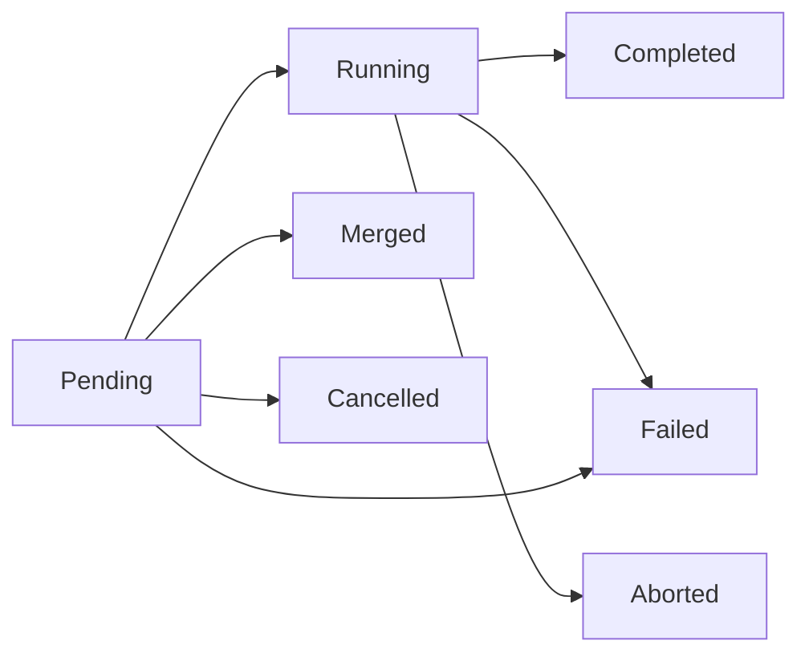

A [service](~peios/services-and-jobs/defining-a-service) is a long-lived *definition*. But when you read a status output or query the [event log](~peios/auditing/overview), two shorter-lived objects show up alongside it: the **job** (one process execution) and the **operation** (one requested action). They are what make peinit observable — every run and every command carries a GUID you can follow. This page covers both, and the special case of **ad-hoc jobs**.

## Jobs: what actually ran

Every time peinit forks a process — a service's main binary, a [pre- or post-hook](~peios/services-and-jobs/execution-environment), a [health check](~peios/services-and-jobs/supervision), or an [ad-hoc run](#ad-hoc-jobs) — that single execution is a **job**, with its own GUID and exit result. If a service is the *what*, a job is *what actually ran*. A restart does not reuse a job; it creates a **new** one. The service always tracks its *current* job GUID, and a `status` query reports it.

Jobs come in five types:

| Type | Created for |
|---|---|
| `ServiceMain` | A service's main process. |
| `PreExecHook` | One `ExecStartPre` command. |
| `PostExecHook` | One `ExecStartPost` command. |
| `HealthCheck` | One health-check run. |
| `AdHoc` | A process submitted via [JFS](#ad-hoc-jobs). |

Their lifecycle is simpler than a service's, because a job only tracks a process — not policy:

| State | Meaning |
|---|---|
| `Created` | The job object exists but the process is not forked yet (pre-hooks may be running). |
| `Running` | The process is alive. |
| `Completed` | The process exited successfully. |
| `Failed` | The process failed — or peinit classified the job failed before fork (a parent-side setup error). |
| `Abandoned` | The process survived SIGKILL (D-state). |

A job record carries the things you would want for forensics: the resolved identity and a token summary, the image path and arguments, created/started/ended timestamps, the exit code or signal, the cgroup, the [failure cause](~peios/services-and-jobs/the-service-lifecycle), and the `operation_id` that created it (`null` for ad-hoc jobs). The clean division of ownership is: the **service** owns policy (restart, dependencies, health schedule, current state); the **job** owns the execution facts (PID, exit, timestamps, identity, cgroup, log correlation).

### Retention and log correlation

peinit keeps only *active* jobs in memory. When a job reaches a terminal state it **emits a structured event** (through KMES) carrying the full record, then drops the job. peinit keeps **no** job history — [eventd](~peios/auditing/overview) is the historian, consuming those events from the kernel ring buffer. The lifecycle events are `job.created`, `job.started`, and `job.ended`.

Separately, all of a job's `stdout`/`stderr` is [forwarded to eventd](~peios/services-and-jobs/output-and-logging) tagged with the job's GUID. That is what lets a query like "show me the logs for job X" return exactly that execution's output — not interleaved with the run before or after it.

## Ad-hoc jobs

An **ad-hoc job** is an arbitrary process a *service* asks peinit to run on behalf of one of its clients. It is not tied to a persistent definition — it runs once, reports its result, and is cleaned up. The motivating case: a service has [impersonated](~peios/impersonation/overview) a user and wants a process run *as that user*, but supervised centrally by peinit rather than by the service itself.

The obstacle is identity delegation: a service cannot simply forward an impersonation token over a socket. **JFS** (the Job Forwarding Subsystem) solves this in the kernel — it captures the caller's effective token and delivers it to peinit along with the job request. peinit forks, installs that captured token, and supervises the result like any other job.

> [!IMPORTANT]
> An ad-hoc job runs with **the submitter's own (possibly impersonated) token** — there is no identity field in an ad-hoc request. A caller cannot name an arbitrary identity; it can only pass through a token it already holds. This is what prevents escalation: a service cannot manufacture a job running as an identity it does not already possess.

An ad-hoc request carries a deliberately small subset of the service fields — `ImagePath`, `Arguments`, `Environment`, `WorkingDirectory`, `Timeout`, `Description`. A couple are worth pinning down: `Timeout` is in **seconds**, and `0` means *no limit* (the job runs for as long as it needs). `WorkingDirectory` defaults to `/` when you leave it out. The policy fields (restart, dependencies, health checks, `ErrorControl`, triggers) are **not** available — those belong to persistent definitions. An ad-hoc job runs once in its own cgroup, routes its output to eventd, and on exit emits `job.ended` and is dropped. If it overruns its `Timeout`, peinit escalates SIGTERM → SIGKILL exactly as a service stop does.

Ad-hoc jobs **bypass the operation model entirely** — there is no service to "start," so the request creates a job directly. The job *is* the whole lifecycle.

> [!NOTE]
> JFS is a kernel subsystem with its own byte-level interface, still being specified. peinit is its consumer; the *shape* of the protocol is settled, but the wire details are owned by JFS, so this path is not fully implementable from the peinit specification alone.

## Operations: what was requested

An **operation** is a first-class object representing a *requested state-machine action* on a service. Rather than letting [control commands](~peios/services-and-jobs/controlling-services) mutate state directly, peinit turns each one into an operation that is validated, queued, and executed by its event loop. This is what gives concurrent callers — admin tools, automated triggers, dependency propagation — explicit, observable conflict resolution instead of races.

There are five operation types — `Start`, `Stop`, `Restart`, `Reload`, `Reset` — and each carries a **source** recording *why* peinit created it:

| Source | Created by |
|---|---|
| `Admin` | A control client. |
| `Boot` | The Phase 2 boot lifecycle. |
| `Shutdown` | The shutdown lifecycle. |
| `DependencyPropagation` | A start pulling in a [dependency](~peios/services-and-jobs/dependencies). |
| `RestartPolicy` | An automatic [restart](~peios/services-and-jobs/supervision). |
| `Timer` | A [timer](~peios/services-and-jobs/triggers-and-timers) firing. |
| `BindsToRecovery` | A bound target returning to Active. |
| `BindsToPropagation` | A bound target stopping. |
| `ConflictResolution` | A `Conflicts` eviction. |
| `OnFailure` | A failed service's fallback handler. |

The source is why a `status` showing `current_operation.source: "restart_policy"` tells you the service is being auto-restarted, while `"admin"` tells you a person asked.

### Operation lifecycle

| State | Meaning |
|---|---|
| `Pending` | Validated and queued, waiting on a precondition (e.g. a prior stop to finish). |
| `Running` | Executing — the service is transitioning. |
| `Completed` | Achieved its goal (start reached Active/Completed; stop reached Inactive/Failed). |
| `Failed` | Did not achieve its goal — including timing out while still Pending. |
| `Merged` | Folded into an identical operation already in flight (records the survivor's GUID). |
| `Cancelled` | Terminated while still Pending — never ran. |
| `Aborted` | Terminated while Running — interrupted in progress. |

`Cancelled` and `Aborted` are the same idea at two points: cancelled never ran, aborted was running. The *reason* (admin action, supersession) is a property of the event, not the state.

### Conflict resolution and merging

When a command arrives for a service that already has an operation in flight, peinit resolves the collision deterministically — the same logic the [command × state matrix](~peios/services-and-jobs/controlling-services) summarises:

- **Same type** (start over start, stop over stop, reload over reload) → **merge**. The new caller transparently receives the existing operation's GUID; from their side, their request is in progress.
- **Stop wins over start.** An explicit stop cancels a pending start or aborts a running one. The admin said stop.
- **Later supersedes earlier**, and a start while a stop is in flight is **queued** to run after the stop.

### Timeout and retention

An operation inherits its target's timeout as its maximum lifetime — `StartTimeout` for start/reload/reset, `StopTimeout` for stop, and the sum of both legs for restart. Crucially, **the clock starts at operation creation, including queue time** — from the caller's perspective they have been waiting since they sent the command, so a long queue can time an operation out before it even runs.

Terminal operations are emitted as events (`operation.requested`, `.started`, `.completed`, `.failed`, `.cancelled`, `.merged`, `.aborted`) and dropped from memory after a short grace (default 60 s — long enough for a polling client to read the result). As with jobs, peinit keeps no operation history; eventd does.

## How they surface

You meet jobs and operations in three places:

- **`status`** — `current_job` and `current_operation` give the GUIDs of the service's active execution and active action (or `null`).
- **`operation-status <id>`** — polls one operation to a terminal state; a `--wait` lifecycle command does this for you under the hood.
- **[eventd](~peios/auditing/overview)** — the durable history. Every job and operation lifecycle transition lands there as a structured event, which is how you reconstruct what happened after the objects themselves are gone from peinit's memory.

## Where to start

To create and poll operations from the command line, read [Controlling services](~peios/services-and-jobs/controlling-services).

To understand the service states an operation drives a service through, read [The service lifecycle](~peios/services-and-jobs/the-service-lifecycle).

To query the durable job and operation history, read [Auditing](~peios/auditing/overview).
