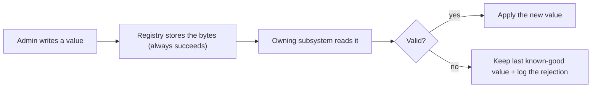

A registry value is a type tag and a pile of bytes. The registry stores it, returns it on request, and protects it with a [security descriptor](~peios/registry-security/access-control) — but it never asks what the value *means*. As [Keys, values, and types](~peios/registry-concepts/keys-values-and-types) put it, the registry is typed but opaque: it knows the tag, not the meaning. This page is about what follows from that, because it is the single most counterintuitive thing about the registry and the thing that most often trips people up.

## Configuration and meaning, in one sentence

**The registry holds configuration; it does not understand it. Meaning lives in the subsystem that reads the value and in `regman`, the manual that documents it — never in the registry itself.**

Every config system you have used before bundles storage and meaning together: the file holds the setting *and* the program that parses the file knows what the setting means, in one place. The registry splits them on purpose. Storage is the registry's job. Meaning lives in two other places.

## Where meaning lives

**In the subsystem that owns the value.** The code that reads `Machine\System\KMES\BufferCapacity` is the thing that knows it must be a power of two, knows the compiled-in default, and knows what to do when it changes. That knowledge is in KMES, not in the store. Ask the registry "is this a sensible buffer capacity?" and it has no answer — it was never told what the value is for.

**In [`regman`](~peios/registry-administration/regman), for a human.** `regman` is the registry's manual — the `man` of the registry. Give it a path and it tells you what a key or value actually does:

```
$ regman Machine\System\KMES BufferCapacity

  Type     REG_QWORD
  Default  4194304  (4 MB)
  Valid    65536–268435456 bytes (64 KB–256 MB), power of two
  Applies  live — ring-buffer swap

Per-CPU ring buffer capacity, in bytes. Must be a power of two; values
that are not are treated as invalid and ignored.
```

`regman` is shipped documentation that lives *beside* the registry, not inside it — because the registry cannot describe itself, the manual has to sit next to it. This is the backbone of configuring a Peios system: before you touch a knob, `regman` is how you find out what it is, what values are legal, and what changing it will cost you (the `Applies` line — live, on restart, or on reboot). `regman` reads its own shipped docs; it does not read the live registry, so it tells you what a setting *is*, not what it is currently set to.

## Reject-or-keep

Because the store never validates, validation happens where the value is *read*. This produces the rule that surprises people:

**A write the registry accepts is just stored bytes. The subsystem that owns the value validates it on read — and a value it judges invalid is ignored, not applied.** The subsystem keeps its last known-good value. It never clamps the bad value to the nearest legal one, and never silently corrects it.



KMES is the worked example. Write a `BufferCapacity` that is not a power of two and the write *succeeds* — the registry has no opinion about powers of two. When KMES reads it, it rejects the value, keeps the capacity it was already using, and emits an event naming the key, the value it rejected, and the value it is still running on.

## Written versus used

That leaves two sources of truth that can legitimately disagree:

- **The registry shows what was *written*.** Read the key back and you see the value the admin set — including a rejected one, sitting there looking authoritative.
- **The log shows what is actually *in use*.** When a subsystem rejects a value and keeps its previous one, it says so in the event log. That record, not the registry read, is the truth about what the system is running on.

So "what is this subsystem actually configured to right now?" is not always answered by reading the registry. If a change does not seem to have taken effect, the registry will happily show you the value you wrote; the [audit and event log](~peios/auditing/overview) is where you find out it was refused and why. This is why observability matters here: the registry is the *intent*, the log is the *reality*, and they are allowed to differ.

## The registry does this to itself

The cleanest demonstration is the registry subsystem configuring itself. It reads its own tuning parameters from `Machine\System\Registry\` and applies exactly this discipline to them: a valid value is hot-swapped into effect; an invalid one (out of range, wrong type) is ignored, the previous known-good value is retained, and an audit event is emitted naming the key, the rejected value, and the value still in force. Values are never clamped. The subsystem that owns the entire registry treats its *own* configuration as "stored bytes I must validate before I trust" — see [How the registry boots and configures itself](~peios/registry-administration/bootstrap-and-self-configuration).

## There is no invalid registry

Put plainly: a value is never "invalid" at the registry level, because the store has no standard to judge it against. **Validity is a verdict, and the reader makes it.** The same bytes could be valid to one subsystem and meaningless to another; the registry holds them either way.

So "is this configuration valid?" is not a question you ask the registry. You ask the subsystem that owns the value — or you read the log to see what verdict it already reached.

## Why it is built this way

Briefly, because it is worth knowing the trade rather than dwelling on it: keeping the store meaning-free keeps it small and uniform, lets it hold a value for a subsystem that is not running yet or a key nobody has read, and lets configuration be delivered from outside — a domain Group Policy, say — without the kernel needing a built-in schema for every subsystem on the machine. The price is that the store cannot tell you whether a value is sensible. That price is paid by `regman` (which documents what *should* be there) and the logs (which record what the system actually did).

## Where to go next

If you want to see how a subsystem *notices* a configuration change so it can re-validate and re-apply, read [Watching for changes](~peios/registry-concepts/watches).

If you want the registry's own bootstrap and self-configuration story — the purest example of reject-or-keep — read [How the registry boots and configures itself](~peios/registry-administration/bootstrap-and-self-configuration).

If you are ready for the layered model beneath the single value you read, read [Layers](~peios/registry-layers/layers).
