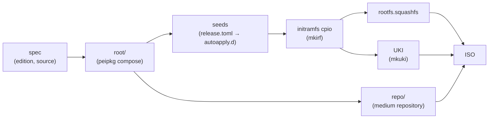

**`peiso`** is the Peios image builder. Given a spec of a few lines — which edition, where its packages come from, a couple of flags — it produces a bootable installation medium: a UEFI ISO carrying a live Peios and everything needed to install it onto a disk.

It is a user-facing tool. Building a slightly customised Peios image is meant to be an ordinary thing to do, not a project: you should never have to list packages, name registry seeds, or run anything as root.

## The release is a package

The thing peiso builds *from* is not a list. A Peios release is an **edition package** — `peios-experimental` today — whose version is the OS version, whose dependency closure is the base system (kernel, initramfs, services, firmware, the installer), and which ships the system's identity (`/usr/lib/os-release`) and a small data file, `release.toml`, stating what the release asks of a system beyond its packages. [Editions](~peios/peiso/editions-and-upgrades/editions) explains that package in full.

peiso's job is therefore small: resolve that one package, compose its closure, and add what makes the result a *medium* rather than an installed system. An installed system moves to the next release by upgrading the same package, through [`upgrade-peios`](~peios/peiso/editions-and-upgrades/upgrading-peios).

## What peiso adds to an edition

An edition describes an installed Peios. A live medium needs three more things, and they are peiso's, not the edition's:

- **The boot flavour.** `first_boot = "live"` (the default) adds `live-boot`, whose initramfs hook finds the medium and mounts the live root from it. An installed system carries `disk-boot` instead; the installer swaps one for the other on the target. Neither belongs in the edition, because which one a system carries is a property of the medium it boots from.
- **The medium repository.** The installer takes the target's boot packages from a small signed repository carried on the ISO. peiso publishes it per build, with a throwaway signing key.
- **Devtools.** `dwe = true` adds the [Developer Workstation Environment](~peios/dwe/what-dwe-is): `dwed` running as SYSTEM, reachable over vsock. It makes the image ownable, which is why it is a property of a *development* medium and can never be installed as a mere package.

Everything else in the image comes from the edition.

## Where the stages happen

The root is composed by peipkg's compose library — the same code as [`peipkg-compose`](~peios/package-management/composing-a-root), driven in-process. The initramfs and the UKI are packed by [`mkirf`](~peios/boot-and-trust-establishment/mkirf) and [`mkuki`](~peios/boot-and-trust-establishment/mkuki), the applets *shipped inside the root*, so the tools that build the boot artifacts are the ones the running system carries. [The build pipeline](~peios/peiso/building-images/the-build-pipeline) walks every stage.

## No privilege

Nothing in a peiso build runs as root. The old builder chrooted into the composed root to run the shipped applets; peiso runs them on the host under the root's own dynamic loader instead. Where a package would have a `security.*` attribute set on a file — the kernel's firmware signature, `security.peios.sig` — compose hands the signature to peiso and peiso writes it into the squashfs directly, where placing an attribute needs no capability. The composed `root/` on the build host is only an intermediate; the image is the artifact, and the image is complete.

That property is what lets a build run on any machine, in CI, or by any user, and it is why `sudo` appears nowhere in this anthology.

## What it is not

peiso does not build packages (that is [pekit](~pekit/getting-started/what-is-pekit)), does not resolve or fetch them itself (compose does), and does not decide what a Peios contains (the edition does). A spec can add packages on top of the edition, add or remove registry seeds, and choose the boot flavour and devtools; anything beyond that is a change to the edition package, which is where it belongs.
