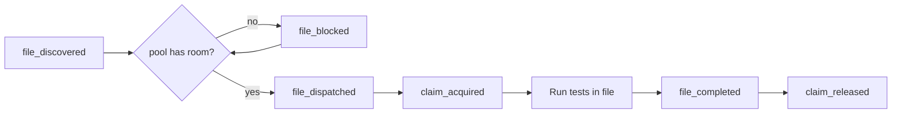

Provium's dispatcher runs multiple test files in parallel against a shared resource pool. Each file declares what it needs (or accepts the per-file overhead default), and the dispatcher schedules as many as fit. This page covers how to think about that for your test corpus.

## The pool

When `provium` starts, it builds one pool with two budgets:

| Budget | Default | Override |
|---|---|---|
| Memory | 80 % of host RAM | `--mem 16G` |
| vCPUs | host online CPUs | `--cpus 8` (then `--cpu-overcommit <multiplier>`) |

The pool tracks total and available; every dispatch takes from available, every release returns. A `pool_state` event fires every second with `{used, available}` so dashboards see live utilisation.

If you want to be conservative on a busy host:

```
provium tests/ --mem 8G --cpus 4
```

If you have a beefy CI box and want maximum throughput:

```
provium tests/ --mem 64G --cpus 32 --cpu-overcommit 1.5
```

`--cpu-overcommit` is clamped to `[0.5, 8.0]`. Default `1.0` (strict — no oversubscription). `1.5` or `2.0` allows oversubscription if the workload tolerates scheduling jitter.

## Per-file claims

Each test file may declare what it needs:

```lua
provium:claim({memory = "4G", cpus = 4})

test("…", function(t) end)
test("…", function(t) end)
```

The claim is reserved whole, when the call runs, and released at file completion. A second `:claim` errors — `lab claim already held; one-shot per lab`.

A claim is the file's whole VM budget. Every `vm:boot()` in the file — at file scope, inside a test, in a sub-lab — takes its memory and vCPUs out of the claim and touches the pool not at all, so a claimed file never queues once its claim is in. A boot the claim cannot cover fails at once, with `needs … but the file's claim is … with … already in use; raise provium:claim to the file's peak`, rather than falling back to the pool and waiting.

Without a claim, the dispatcher admits the file on the per-file overhead default (50 MiB memory, 0 CPU) and every boot reserves from the pool on its own, at boot time. That is the only way an unclaimed file is kept from oversubscribing the host, and it has a cost, explained under [Deadlock](#deadlock) below.

**Rule of thumb:** claim the file's peak — the most VMs it ever has alive at once — as the sum of their memory budgets plus 100 MiB of VMM overhead each, and the sum of their vCPUs. Nothing is gained by claiming more, and a boot past the claim fails.

```lua
-- Never more than 3 VMs alive at once, each 2G and 2 CPUs:
provium:claim({memory = "6300M", cpus = 6})  -- 3 × (2G + 100M overhead); 3 × 2 vCPUs
```

## Deadlock

A file that reserves per boot holds what it has while it waits for more. Picture a testset where every file boots one VM at file scope and then, inside a test, boots a second: once enough files are running to hold the pool's whole CPU budget between them, every one of them is waiting for a second VM and none will ever release its first. That is a hold-and-wait deadlock, and it is what a large unclaimed testset does on a host with fewer cores than files. Every chapter passes when run alone, because a few files can never exhaust the pool; the whole set stalls.

The pool sees this coming. It knows what every file holds and whether that file is parked waiting, so when a boot would leave every holder waiting with nothing free that any of them could use, that boot fails immediately instead of parking:

```
vm `second`: cannot boot: the pool is deadlocked: 12 files hold 13.2 GiB and 12 cpus of its
25.5 GiB and 12 cpus and every one of them is waiting for more, while the 12.3 GiB and 0 cpus
still free serves none of the 12 waiting requests (this one wants 1.1 GiB and 1 cpu); declare
this file's peak with provium:claim so it is scheduled whole and no boot waits mid-file
```

The file whose boot closed the cycle takes the failure; the others are served as it winds down. The remedy is the one the message names: claim. A claimed file reserves everything it will need before it boots anything, so it is never a holder waiting for more.

Without the verdict, a deadlocked run only ends when the per-file timeouts fire and `lab.shutdown()` kills the VMs the stalled files were holding — which shows up as a cascade of `VM is shutdown; create a new one` failures in the tests that follow, and looks like host contention rather than scheduling. With `--timeout 0` it never ends at all.

## File dispatch flow



Files queue at the pool until their reservation fits. The order is stable — the dispatcher takes files in discovery order, so a file that doesn't fit blocks subsequent files (FIFO). For now there's no priority or backfill; if you need a specific file to run first, list its path explicitly.

## PSI throttling

On Linux hosts with pressure stall information (PSI) available, Provium spawns a pressure monitor at startup. It polls CPU and memory pressure once a second; when either crosses the threshold (10 % some-pressure averaged over 10 seconds), the dispatcher pauses new file dispatches until pressure drops.

The threshold and poll interval are fixed — they are not configurable from the CLI.

Files that are already in flight continue. The throttling only delays new dispatch.

When PSI throttling is the cause of a `file_blocked`, the event's `reason` field is `psi_pressure` (versus `pool_full` for "the pool can't afford this file's claim").

## KSM tuning

Kernel Same-page Merging deduplicates identical pages across VMs. When you boot many VMs from the same kernel + initrd, KSM can reclaim significant memory. Provium tunes `/sys/kernel/mm/ksm/*` at startup unless `--no-ksm` is passed.

The KSM tuning runs once per `provium` invocation, setting `run = 1`, `pages_to_scan = 1000`, and `sleep_millisecs = 20`. Best-effort: a one-line summary goes to stderr.

```
provium: ksm: tuned (3 knobs)
```

If your host is shared with non-Provium workloads, pass `--no-ksm` so Provium doesn't change global tuning.

## What blocks parallelism

Several things prevent unlimited parallelism even when the pool has room:

| Thing | Why |
|---|---|
| Fixture build lock | One process at a time per fixture key. Other files queue on `fixture_build_waiting`. |
| Pool reservation | A file with a 16 G claim won't run alongside other big files until pool has 16 G free. |
| PSI pressure | High CPU pressure pauses new dispatches. |
| `--fail-fast` | Stops new dispatch after the first file failure. |

Of these, fixture build lock is the most common surprise. If 16 test files all reference `fixtures/base` and the cache is cold, all 16 queue on the build lock; only one builds, the rest wait. Pre-warm with `provium fixture build fixtures/base` to amortise.

## Inspecting parallelism in a run

The event stream gives you the full picture:

```
provium tests/ --save-events events.msgpack
```

Then walk the stream:

- `file_discovered` events at the start tell you the universe.
- `file_dispatched` events tell you what actually ran in parallel (count of in-flight = `file_dispatched - file_completed`).
- `file_blocked` events with `reason` tell you why something queued.
- `pool_state` events at 1 Hz give you a usage timeline.

`provium-coverage` summarises this in its run report; for ad-hoc debugging, parse the msgpack with the snippet in [events and coverage](~provium/running-tests/events-and-coverage).

## Tuning patterns

### "I want to maximise throughput"

```
provium tests/ --cpus $(nproc) --mem $(awk '/MemTotal/ {printf "%dG", $2/1024/1024 - 4}' /proc/meminfo)
```

Use everything except 4 GiB of RAM and overcommit CPUs gently:

```
provium tests/ --cpu-overcommit 1.5
```

### "I want to be conservative on a shared host"

```
provium tests/ --cpus 4 --mem 8G --no-ksm
```

### "I want to detect over-subscription"

Watch the `pool_state` and `file_blocked` event streams. Frequent `file_blocked` with `reason = pool_full` means files are claiming more than the pool can serve in parallel — either the pool is too small or claims are too generous. Frequent `file_blocked` with `reason = psi_pressure` means the host is genuinely overloaded — reduce parallelism (`--cpus`, `--mem`) or move other workloads off the host.

### "I want to debug a slow run"

```
provium tests/ --save-events events.msgpack
```

Parse the msgpack for the longest `file_completed.duration_ns`. Then look at that file's `test_started` / `test_passed` events to see which test(s) are slow. Cross-reference with `vm_spawned` events to see how many VMs were involved.

### "I want to test for resource leaks"

The pool's available budget should return to its full value after each `claim_released`. Watch `pool_state` over time — if available is drifting down monotonically, something is leaking. The most common culprits:

- A test that exits via panic without releasing a claim — but the dispatcher releases on `file_completed` regardless of how it ended, so this shouldn't happen.
- A bug in the harness — file an issue with the event stream.

## VMs vs files

A claimed file is accounted per file: the claim is held whole from the moment it is taken until file completion, however many VMs are alive at any moment, and each boot draws from it rather than from the pool.

```lua
-- This file claims 2G, and only ever has one VM live at a time:
provium:claim({memory = "2G", cpus = 1})

test("a", function(t)
    local vm = provium:vm("v", "peios"):boot()
    vm:shutdown()  -- its share goes back to the claim, which the pool still holds whole
end)

test("b", function(t)
    local vm = provium:vm("v", "peios"):boot()  -- draws from the claim again
end)
```

The claim doesn't release between tests. An unclaimed file is accounted per VM instead — each boot reserves from the pool and each shutdown releases — which is finer-grained but is what makes a deadlock possible when many such files run together.

For the typical case, claim for the file's worst-case peak.

## File timeouts and queueing

The per-file timeout (`--timeout`, default five minutes) is a budget for the file's own work. Time a file spends parked in the pool — at its claim, or at a boot when it has no claim — is excused: the deadline moves out by exactly as long as the file has waited, a wait still in progress included. A file is never killed for queueing, only for being slow once it has what it asked for.

## See also

- [The CLI](~provium/running-tests/the-cli) — `--mem`, `--cpus`, `--cpu-overcommit`, `--no-ksm`.
- [Lab reference](~provium/reference/lab) — `lab:claim`.
- [Events](~provium/reference/events) — `pool_state`, `file_blocked`, `claim_acquired`, `claim_released`.
- [Fixtures and dependencies](~provium/running-tests/fixtures-and-dependencies) — fixture build lock as a parallelism limiter.
