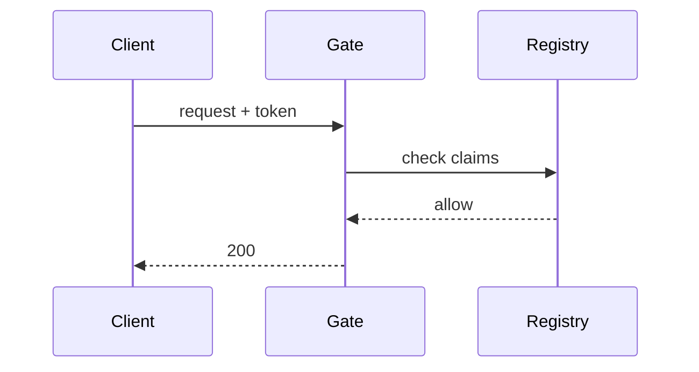

Three constructs on top of ordinary markdown handle the things prose alone does badly: setting something apart, showing the same instruction several ways, and drawing.

## Admonitions

Admonitions use GitHub's alert syntax — a blockquote whose first line is a marker:

```markdown
> [!IMPORTANT]
> **Pekit supersedes the old `peipkg-build` recipe system.** A pekit recipe
> is the current and only supported way to build a package.
```

Five kinds exist, and no others:

| Marker | Renders as | For |
|---|---|---|
| `> [!NOTE]` | Note | An aside worth knowing, not worth interrupting for. |
| `> [!TIP]` | Tip | A shortcut or a better way. |
| `> [!IMPORTANT]` | Important | Something a reader who skims will regret missing. |
| `> [!WARNING]` | Warning | Something that will go wrong. |
| `> [!CAUTION]` | Caution | Something that will go irreversibly wrong. |

The body is full markdown — lists, code blocks, links, all of it.

A blockquote whose first line looks like a marker but is not one of the five is a **build error**, not silently-rendered text:

```text
unknown admonition type '[!WARN]' (expected NOTE, TIP, IMPORTANT, WARNING or CAUTION)
```

That is deliberate. A typo'd marker renders as a quotation with `[!WARN]` sitting at the top of it, which nobody proofreading their own page ever notices.

An ordinary blockquote — no marker — is still an ordinary blockquote.

## Tab groups

Tab groups show the same instruction several ways, so a page does not have to repeat itself per platform, per shell, or per package manager.

````markdown
:::tabs
:::tab Linux
Install with your package manager:

```sh
sudo apt install trail
```

:::tab macOS

```sh
brew install trail
```

:::
````

The grammar is three markers, each alone on its own line:

| Marker | |
|---|---|
| `:::tabs` | Opens a group. |
| `:::tab <label>` | Starts a tab. The label is everything after the marker. |
| `:::` | Closes the group. |

The first tab is shown; the rest are hidden until selected. Each panel's body is full markdown, so a tab can hold code blocks, lists, admonitions and images.

Rules, all of them enforced at build time:

- A group must be closed — an unclosed `:::tabs` is an error.
- A group must contain at least one `:::tab`, and each `:::tab` needs a label.
- Nothing but blank lines may appear between `:::tabs` and its first `:::tab`.
- Groups cannot nest.
- `:::tab` outside a group, or `:::` with no group open, is an error.

Markers inside fenced code blocks are left alone, which is how this page can show the syntax without triggering it.

> [!NOTE]
> Tab panels are hidden with the `hidden` attribute, so a reader searching the page with their browser's find-in-page will not see text in the tabs they have not opened. The site's own [search](~trail/building/the-reading-experience) indexes all of it. When printed, every panel is expanded and the buttons are dropped, so nothing is lost on paper.

## Diagrams

A code block tagged `mermaid` is rendered as a diagram in the browser:

````markdown

````

Any [mermaid](https://mermaid.js.org) diagram type works — flowcharts, sequence diagrams, state diagrams, ER diagrams, Gantt charts, and the rest.

The mermaid library is a large script, so **it is only shipped to pages that actually contain a diagram**. A site with no diagrams anywhere never emits it at all.

The diagram is drawn in the reader's current theme, light or dark, chosen when the page loads. Switching theme afterwards re-styles the rest of the page but leaves already-drawn diagrams as they were until the page is reloaded.

### Diagram or image?

Prefer mermaid when the diagram is boxes, arrows and labels. It is plain text in your source: diffable, reviewable, editable by whoever is next in the file, and it follows the reader's theme.

Reach for an [image](~trail/writing/images) when the thing is genuinely pictorial — a screenshot, a photograph, an illustration, or a diagram whose layout matters more than mermaid will let you control.
